```{=html}
<style>
.reveal .slides section { text-align: left; }
.reveal h2 { letter-spacing: -0.02em; }
.reveal .big { font-size: 1.32em; line-height: 1.25; }
.reveal .small { font-size: .72em; color: #475569; }
.reveal .center { text-align: center; }
.reveal .fullfig {
  display: block;
  margin: 0 auto;
  width: 100%;
  max-height: 82vh;
  object-fit: contain;
}
.reveal .tallfig {
  display: block;
  margin: 0 auto;
  width: auto;
  max-width: 100%;
  max-height: 82vh;
  object-fit: contain;
}
.reveal .overlay-note {
  position: absolute;
  left: 4%;
  bottom: 5%;
  width: 54%;
  background: rgba(255,255,255,.92);
  border-left: 8px solid #2e7d32;
  padding: .6em .8em;
  font-size: .72em;
  box-shadow: 0 8px 28px rgba(0,0,0,.18);
}
.reveal .overlay-note.right { left: auto; right: 4%; }
.reveal .overlay-note.wide { width: 72%; }
.reveal .keyline {
  border-left: 8px solid #1f6f5b;
  padding-left: .8em;
  margin-top: .8em;
}
.reveal .process {
  font-size: 1.2em;
  line-height: 1.55;
  padding: .7em .9em;
  border: 2px solid #1f6f5b;
  border-radius: 16px;
  background: #f6fbf7;
}
.reveal .framebox {
  padding: .75em .9em;
  border-radius: 16px;
  background: #f8fafc;
  border: 1.5px solid #cbd5e1;
}
.reveal code { font-size: .88em; }
</style>
```

## Warum dieses Beispiel?

Der „perfekte Gipfel“ ist kein fertiges GIS-Problem. Er beginnt als unscharfe Alltagsfrage und muss erst in messbare räumliche Kriterien übersetzt werden.

::: {.fragment .keyline}
Das Beispiel zeigt den gesamten Rahmen eines kleinen GIS-Projekts: Problem verstehen, Frage schärfen, Kriterien bilden, Daten auswählen, Operationen planen, Umsetzung dokumentieren und Ergebnisgrenzen benennen.
:::

## Vom Problem zur Handlung

```text
Problem / Interesse
→ Fragestellung
→ fachliche Kriterien
→ Datenmodell
→ GIS-Operationen
→ Ergebnis
→ Interpretation und Grenze
```

::: {.fragment .keyline}
Nicht das Werkzeug steht am Anfang, sondern die Entscheidung, welche räumliche Eigenschaft überhaupt bestimmt werden soll.
:::

## Ausgangspunkt: Was ist ein „perfekter Gipfel“?

::: {layout-align="center"}
[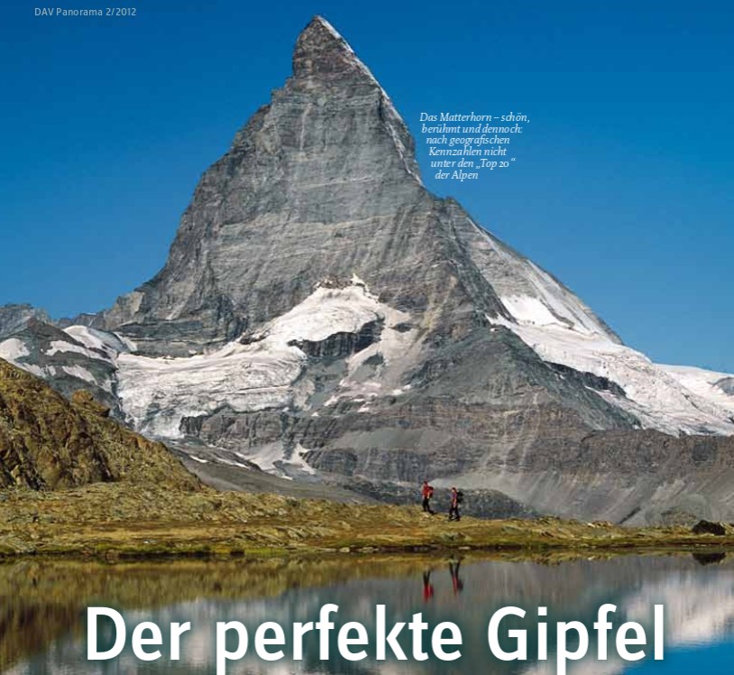{.tallfig}](../assets/pdf/DAV_Panorama_2_2012.pdf)
:::

::: {.fragment .overlay-note .wide}
Die Ausgangsfrage ist absichtlich unscharf. Genau daran lässt sich zeigen, wie aus einem sprachlichen Qualitätsurteil ein räumlich berechenbares Problem wird.
:::

## Erste Zerlegung des Problems

Ein Gipfel wirkt nicht nur durch seine absolute Höhe.

::: {layout-ncol="2" layout-valign="center"}

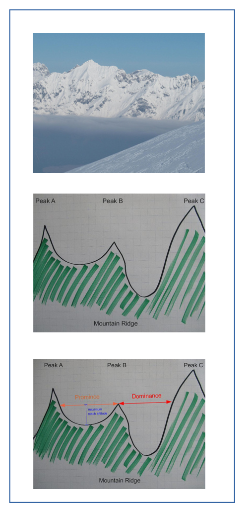{.tallfig}

::: {.framebox}
Entscheidend werden mehrere räumliche Eigenschaften:

```text
Höhe und Position
Dominanz
Prominenz / Schartenhöhe
Eigenständigkeit
```

:::

:::

::: {.fragment .overlay-note .wide}
Das ist der erste methodische Schritt: Ein unpräziser Begriff wird in prüfbare Kriterien zerlegt.
:::

## Formale Abstraktion

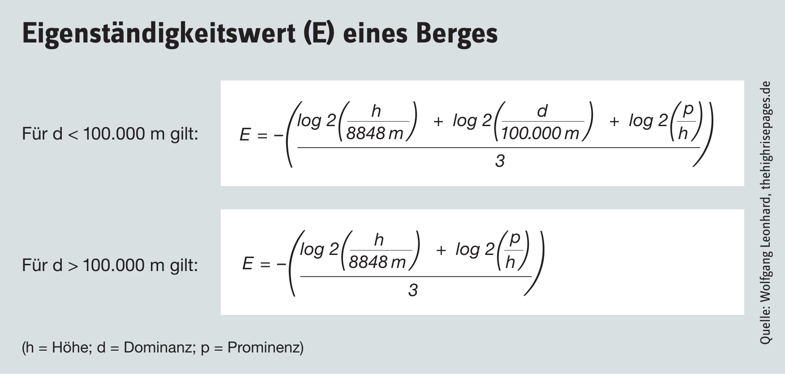{.fullfig}

::: {.fragment .overlay-note .right}
Die Formel ist nicht der Anfang des Projekts. Sie ist das Ergebnis einer begrifflichen Entscheidung: Welche Eigenschaften zählen und wie werden sie verrechnet?
:::

## Vom Begriff zum Modell

::: {layout-ncol="2" layout-valign="center"}

{.fullfig}

::: {.framebox}
Für ein GIS-Projekt muss geklärt werden:

```text
Welche Objekte?      → Gipfelpunkte
Welche Fläche?       → Höhenmodell
Welche Beziehungen?  → Distanz, Höhe, Verbindung, Trennung
Welche Ausgabe?      → Rang, Prominenz, Eigenständigkeit
```

:::

:::

## Problemlösung als dokumentierbarer Prozess

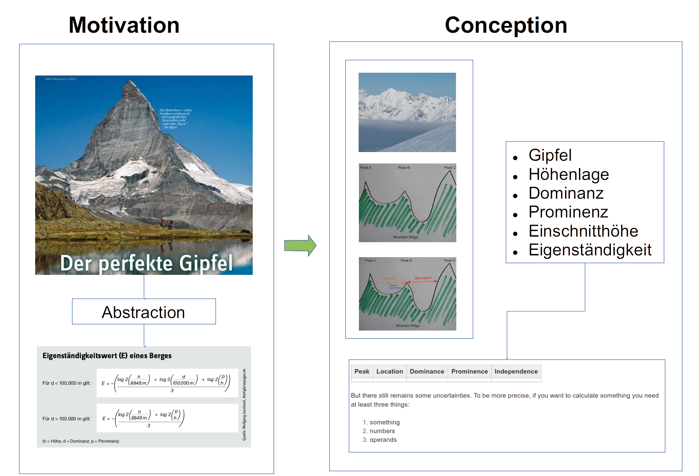{.fullfig}

::: {.fragment .overlay-note}
Die Folie gehört in den Projektrahmen: Sie macht sichtbar, dass GIS-Arbeit nicht nur Bedienung ist, sondern Problemlösung unter technischen und fachlichen Randbedingungen.
:::

## Das Problemlösungs-Handwerk

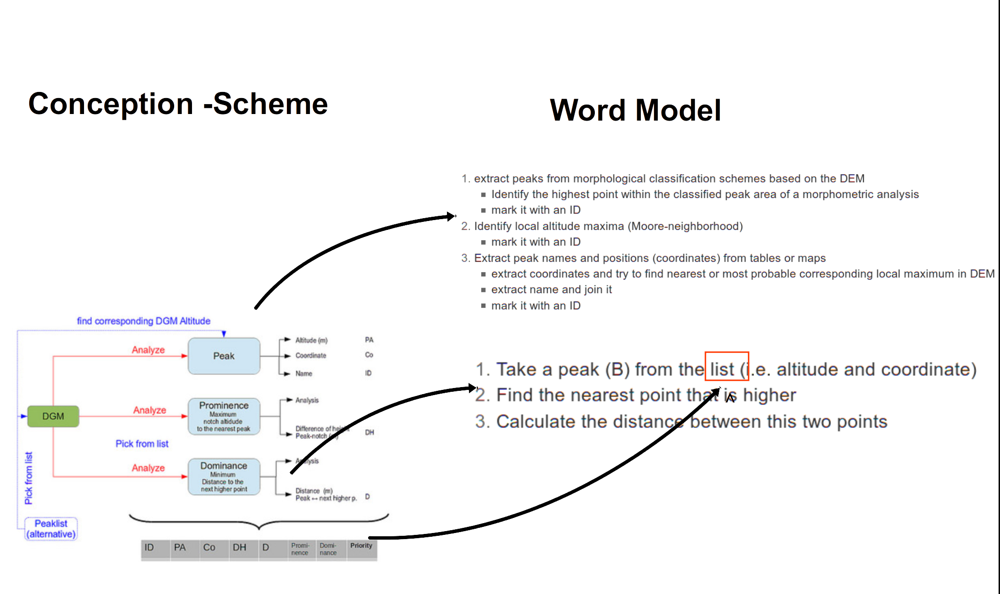{.fullfig}

::: {.fragment .overlay-note .right}
Für die Dokumentation zählt nicht jede Mausbewegung. Dokumentiert werden die entscheidenden Übersetzungen: Kriterium, Datenbasis, Operation, Parameter und Ergebnislayer.
:::

## Drei Umsetzungsformen

::: {layout-ncol="3"}

### Interaktiv

QGIS-Werkzeuge, visuelle Prüfung, schnelle Varianten.

### Kommandozeile

Wiederholbare Aufrufe, Parameter werden sichtbar.

### Skript

Workflow wird reproduzierbar, variierbar und dokumentierbar.

:::

::: {.fragment .keyline}
Die drei Formen sind keine Hierarchie von „richtig“ und „falsch“. Sie unterscheiden sich vor allem darin, wie gut der Arbeitsweg wiederholbar und überprüfbar wird.
:::

## Interaktives GI-Handwerk

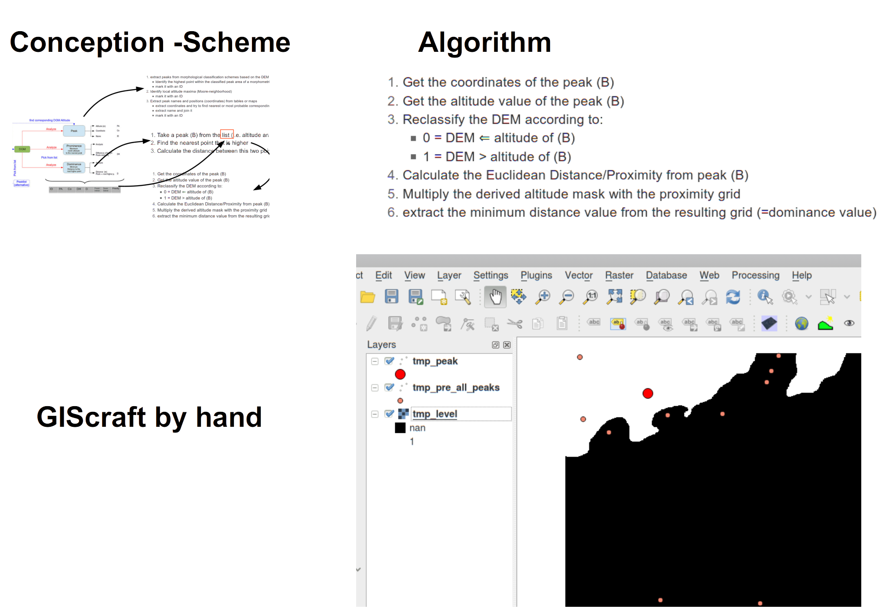{.fullfig}

::: {.fragment .overlay-note}
Interaktive Arbeit ist für Exploration stark. Für eine Abgabe muss aber festgehalten werden, welche Schritte wirklich zum Ergebnis geführt haben.
:::

## Kommandozeilen-GI-Handwerk

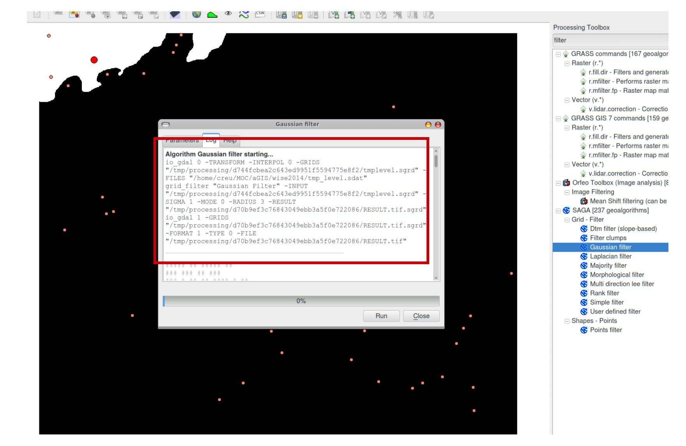{.fullfig}

::: {.fragment .overlay-note .right}
Die Kommandozeile macht Parameter expliziter. Dadurch wird der Schritt leichter überprüfbar als eine rein visuelle Bediensequenz.
:::

## Programmierung für Nicht-Programmierer*innen

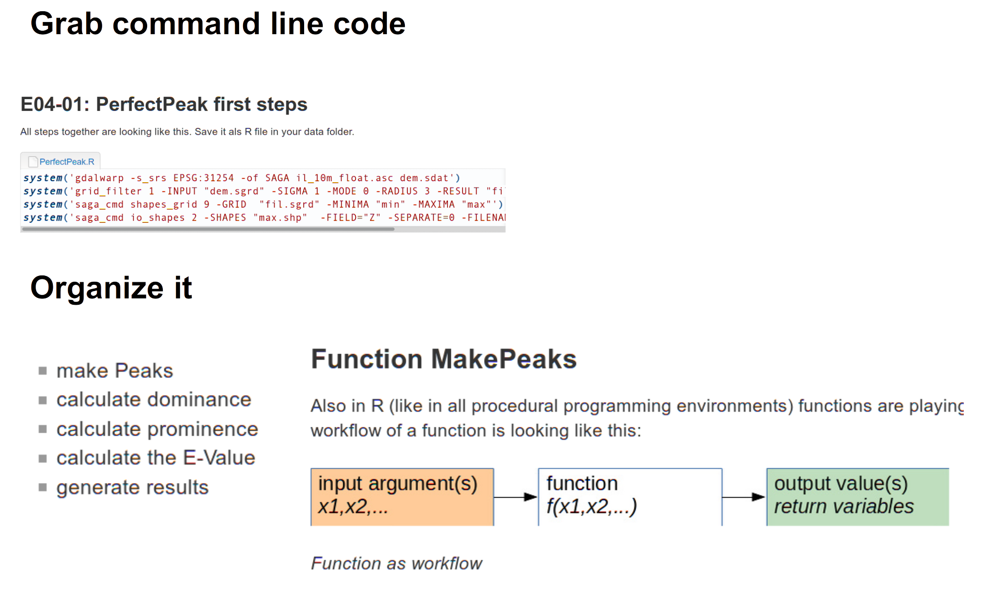{.fullfig}

::: {.fragment .overlay-note}
Skripte sind hier kein Selbstzweck. Sie sichern eine nachvollziehbare Folge von Verarbeitungsschritten.
:::

## Übersetzung in technische GI-Erfordernisse

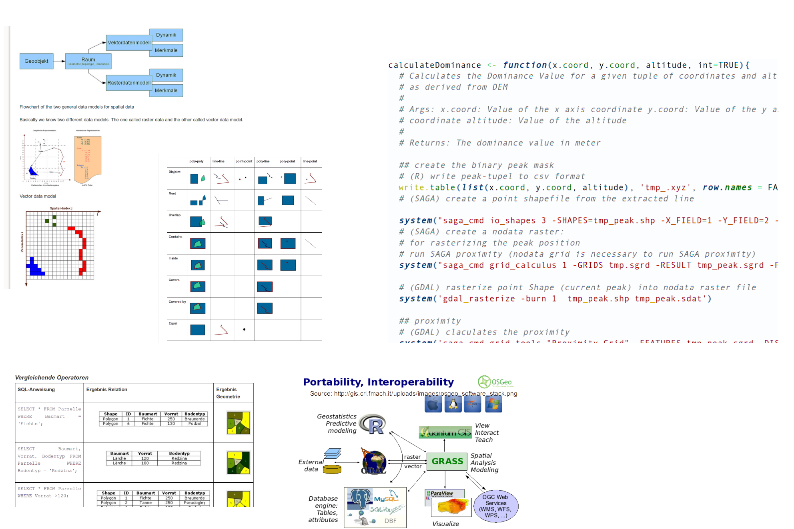{.fullfig}

::: {.fragment .overlay-note .wide}
Hier liegt der Kern der Projektarbeit: Die fachliche Frage wird in Datenstrukturen, Operationen, Parameter und Ergebnisprodukte übersetzt.
:::

## Wie soll das gehen?

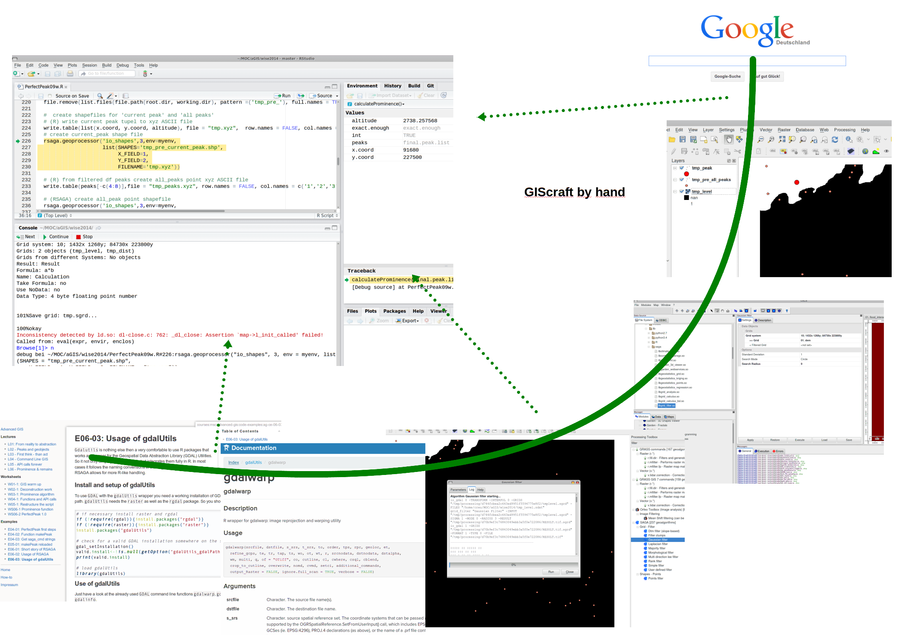{.fullfig}

::: {.fragment .overlay-note .right}
Ein komplexes Problem wird nicht „auf einmal“ gelöst. Es wird in Teilentscheidungen zerlegt, die einzeln prüfbar und dokumentierbar sind.
:::

## Beispiel: Prominenz durch Fluten denken

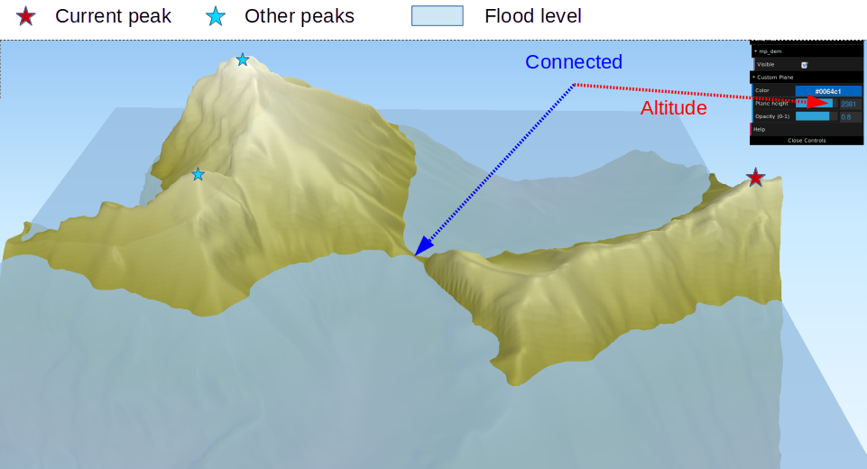{.fullfig}

::: {.fragment .overlay-note .wide}
Prominenz lässt sich als Trennungsproblem im Relief verstehen: Bei welchem „Flutniveau“ bleibt der aktuelle Gipfel noch als eigene Einheit von anderen Gipfeln getrennt?
:::

## Suchstrategie statt stumpfer Wiederholung

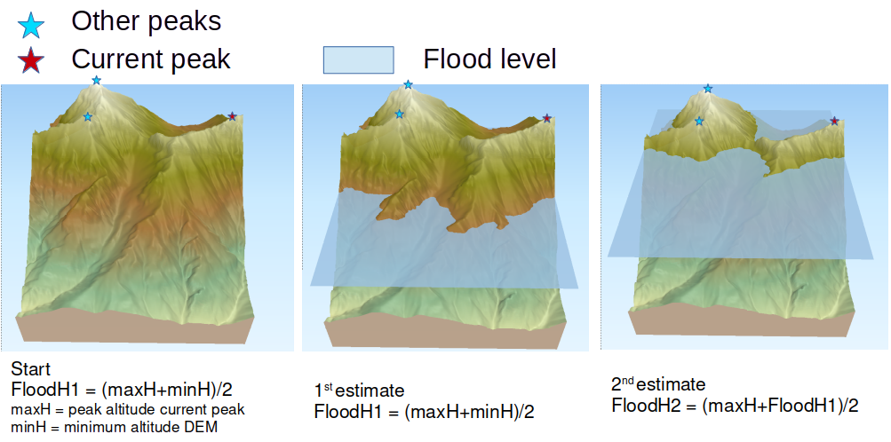{.fullfig}

::: {.fragment .overlay-note}
Der erste naive Lösungsweg wäre schrittweises Fluten. Effizienter ist eine Suchstrategie, die den Höhenbereich systematisch eingrenzt.
:::

## Binäre Suche und Abbruchkriterium

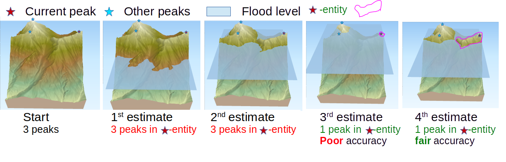{.fullfig}

::: {.fragment .overlay-note .right}
Die Umsetzung braucht ein Abbruchkriterium. Genau solche Entscheidungen gehören in die Workflow-Dokumentation: Wie genau genug ist genau genug?
:::

## Dokumentation am Beispiel „Prominenz“

```text
Projektfrage:
Wie eigenständig ist ein Gipfel im Verhältnis zu benachbarten Gipfeln?

Datenbasis:
Digitales Höhenmodell und Gipfelpunkte.

Kriterium:
Prominenz / Schartenhöhe.

Operationelle Idee:
Flutniveau variieren und prüfen, wann Gipfelbereiche verbunden werden.

Umsetzung:
Iteratives Fluten, effizienter über binäre Suche.

Ergebnis:
Schwellenhöhe bzw. Prominenzwert.

Grenze:
Ergebnis hängt von DEM-Auflösung, Gipfelerkennung und Abbruchkriterium ab.
```

## Anschluss an das Mini-Projektpaket

Das Beispiel zeigt, was Studierende für ihre eigenen Projekte leisten sollen:

::: {.process}
Fragestellung schärfen → Kriterien ableiten → Daten wählen → Operationen planen → Umsetzung dokumentieren → Ergebnis kritisch begrenzen
:::

::: {.fragment .keyline}
Die Workflow-Dokumentation ist keine vollständige History. Sie hält die fachlich entscheidenden Schritte fest.
:::

## Übertrag auf eigene GIS-Projekte

Ein eigenes Mini-Projekt muss nicht algorithmisch so komplex sein. Die Struktur ist aber dieselbe:

```text
Siedlungsferne      → Distanzraster     → Reklassifikation
Hangneigung         → DGM-Ableitung      → Eignungsklasse
Waldanteil          → Landbedeckung      → Flächenkriterium
Schutzgebiet        → Overlay / Maske    → Ausschluss oder Kontext
```

::: {.fragment .keyline}
Wichtig ist nicht die Anzahl der Werkzeuge, sondern die begründete Kette zwischen Frage, Kriterium, Operation und Ergebnis.
:::

## Prüfregel für die Dokumentation

Für jeden Hauptschritt muss eine fremde Person verstehen können:

```text
Warum dieser Schritt?
Welche Daten?
Welche Operation?
Welche Parameter?
Welcher Ergebnislayer?
Welche Aussagegrenze?
```

::: {.fragment .big .keyline}
Das Gipfelbeispiel ist deshalb kein Sonderfall, sondern ein gutes Muster: Es zeigt, wie aus einer unscharfen Idee ein dokumentierbarer GIS-Workflow wird.
:::
