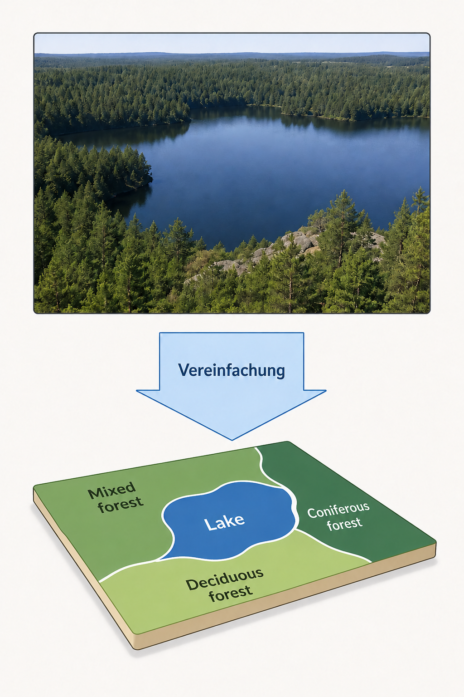
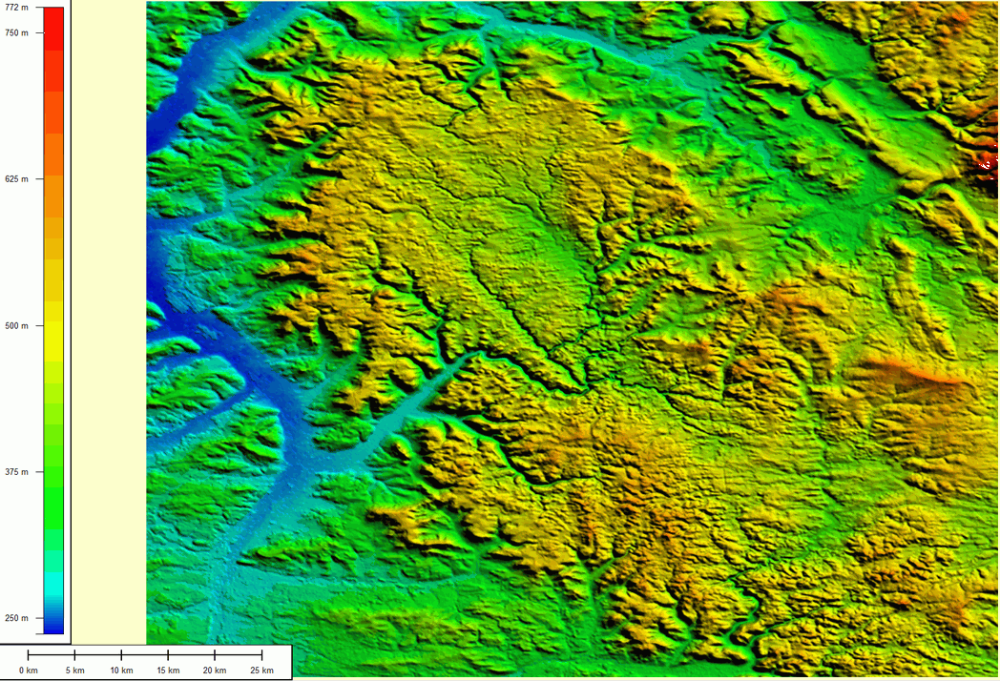
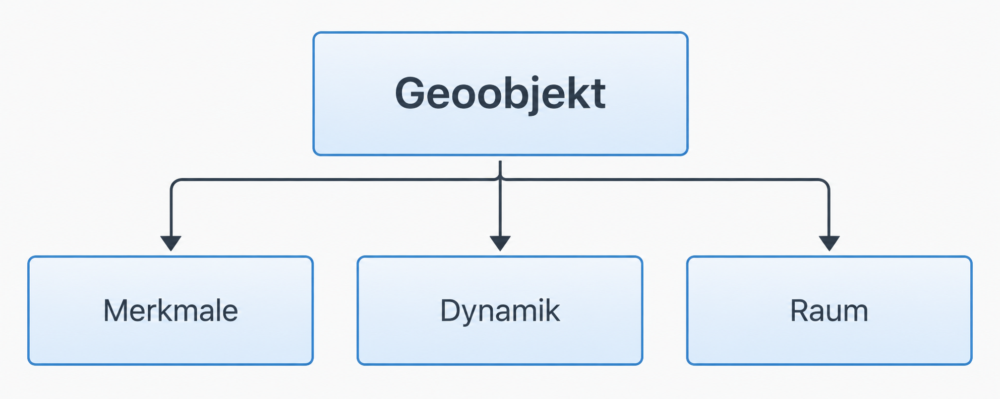
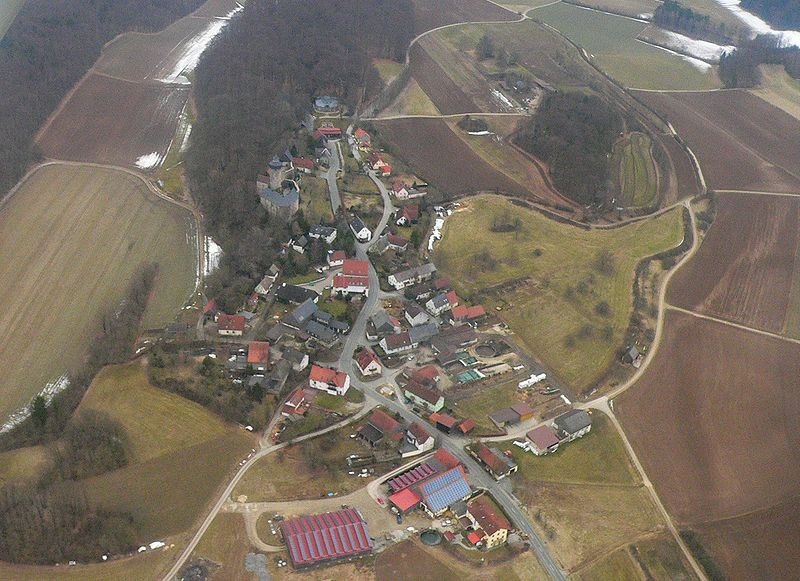

## Leitfrage der Sitzung

GIS beginnt nicht mit Software.

GIS beginnt mit der Frage, wie räumliche Wirklichkeit so **abstrahiert**, **codiert** und **interpretiert** wird, dass sie digital bearbeitbar wird.

```text
Wahrnehmung → Abstraktion → Geodatensatz → Analyse → Interpretation
```

Der Kern der Sitzung ist deshalb:

> Wie wird aus räumlicher Erfahrung eine formale Geoinformation?

## Lernziele

Nach der Sitzung sollten Sie erklären können,

- warum GIS immer mit Abstraktion und Modellbildung arbeitet,
- warum Karten und Geodaten keine direkten Abbilder der Wirklichkeit sind,
- wie diskrete Objekte und kontinuierliche Felder unterschieden werden,
- welche Rolle Raum, Zeit und Attribute in Geodaten spielen,
- warum Geodaten immer zweck-, maßstabs- und interpretationsabhängig sind.

## Raum ist relevant

Räumliche Fragen entstehen nicht erst in GIS.

Sie sind Teil alltäglicher Orientierung, Planung und Entscheidung:

::: {layout-ncol="2"}

### Alltag

Welchen Weg nehme ich?

Wo ist der nächste Bahnhof?

Wie erreiche ich ein Ziel möglichst schnell?

### Planung und Analyse

Wo entsteht Infrastruktur?

Welche Standorte sind geeignet?

Welche Muster treten räumlich gehäuft auf?

:::

GIS macht solche räumlichen Fragen formal bearbeitbar.

## Geographische Kompetenz

Viele räumliche Probleme lösen wir intuitiv.

GIS zwingt dazu, diese Intuition explizit zu machen:

```text
Was ist der relevante Raum?
Welche Objekte oder Felder interessieren?
Welche Eigenschaften werden gespeichert?
Welche Beziehungen sind wichtig?
Welche Vereinfachungen sind zulässig?
```

Geographische Kompetenz bedeutet hier: räumliche Fragen in überprüfbare Daten- und Analysekonzepte zu übersetzen.

## Karte: Bild oder Modell?

Eine Karte ist kein neutrales Abbild der Wirklichkeit.

Sie zeigt eine Auswahl, Vereinfachung und symbolische Übersetzung eines Ausschnitts der Erdoberfläche.

::: {layout-ncol="2" layout-valign="center"}

{width="85%"}

::: {.fragment}
Karten zeigen nicht einfach, „wie die Welt ist“.

Sie zeigen, wie ein Ausschnitt der Welt unter bestimmten Annahmen, Interessen und Darstellungsregeln verständlich gemacht wird.
:::

:::

## Kartographie als Abstraktion

Nach klassischer Definition ist eine Karte ein orientiertes, verkleinertes und geebnetes Grundrissbild eines Ausschnitts der Erdoberfläche.

Die wichtige Einschränkung ist: Sie zeigt nicht alles, sondern das als wesentlich Ausgewählte.

```text
Ausschnitt → Auswahl → Vereinfachung → Symbolisierung → Interpretation
```

Karten müssen deshalb gelesen werden wie Modelle: mit Blick auf Zweck, Auswahl, Maßstab und Darstellungsregeln.

## Intention und Verzerrung

Karten sind autorisierte und gestaltete Informationssammlungen.

Sie können durch Unwissen, Interessen, Ideologie oder technische Begrenzungen verzerrt sein [vgl. @monmonier1991].

Das gilt auch für digitale Karten und Web-GIS.

> Digitale Darstellung macht eine Karte nicht automatisch objektiv.

## Geographische Abstraktion

Geographie arbeitet mit räumlicher Interpretation der Welt.

Dazu müssen reale Situationen in Modelle übersetzt werden.

::: {layout-ncol="2" layout-valign="center"}

{width="95%"}

::: {.fragment}
Ein Modell ist keine Kopie der Wirklichkeit.

Es ist eine zweckgebundene Konstruktion, mit der bestimmte Eigenschaften bearbeitbar werden.
:::

:::

## Daten brauchen Interpretationsregeln

Daten sind noch keine Information.

Information entsteht erst, wenn Daten mit Bedeutung, Kontext und Interpretationsregeln verbunden werden.

```text
Daten + Kontext + Regeln → Information
```

Für GIS heißt das:

```text
Koordinate + Zeit + Attribut + Bedeutung → Geoinformation
```

## Tobler und räumliche Nähe

Ein wichtiges Grundmuster räumlicher Analyse ist Nachbarschaft.

Toblers erstes Gesetz lautet sinngemäß:

> Alles hängt mit allem zusammen, aber nahe Dinge hängen stärker zusammen als entfernte Dinge [@tobler1970].

Das ist für viele physisch-räumliche Phänomene nützlich, aber nicht universal.

Soziale, administrative, politische oder technische Räume können anders funktionieren.

## Räume sind nicht nur Container

Räume können durch Nähe, durch Grenzen, durch Handlungen, durch Namen oder durch Zuständigkeiten entstehen.

Benno Werlen betont etwa, dass Räume auch sozial durch Handeln konstruiert werden können [vgl. @werlen1993].

Damit ist Raum in GIS nie nur ein leerer Behälter.

Er ist immer auch ein Ergebnis von Modellierung und Deutung.

## Diskrete Objekte und kontinuierliche Felder

GIS muss zwei Grundformen räumlicher Phänomene abbilden.

::: {layout-ncol="2"}

### Diskrete Geoobjekte

Gebäude, Straßen, Flurstücke, Messstationen.

Sie lassen sich abgrenzen, zählen und mit Geometrien modellieren.

### Kontinuierliche Felder

Höhe, Temperatur, Niederschlag, Konzentrationen.

Sie variieren räumlich kontinuierlich und werden häufig als Raster beschrieben.

:::

## Beispiel: Fränkische Schweiz

Ein Raum wie die „Fränkische Schweiz“ ist nicht einfach gegeben.

Er kann landschaftlich, touristisch, kulturell, morphologisch oder administrativ anders abgegrenzt werden.

::: {layout-ncol="2" layout-valign="center"}

{width="90%"}

::: {.fragment}
Die Frage ist nicht nur: Wo liegt dieser Raum?

Sondern auch: Nach welcher Logik wird er abgegrenzt?
:::

:::

## Diskretisierung: Kontinua werden bearbeitbar

Kontinuierliche Phänomene müssen für GIS häufig in diskrete Einheiten überführt werden.

Ein Höhenfeld wird zum Raster.

Eine Landnutzung wird zu Polygonen.

Ein unscharfer Landschaftsraum wird durch Grenzen oder Klassifikationen operationalisiert.

```text
kontinuierliche Wirklichkeit → diskrete Repräsentation → digitale Analyse
```

## Maßstab und Zweck entscheiden

Ob etwas als Objekt oder Feld modelliert wird, hängt von Fragestellung und Maßstab ab.

Ein Wald kann sein:

```text
Polygon im Landnutzungsdatensatz
Rasterklasse in einem Satellitenbild
Habitatfläche in einem Modell
Verwaltungseinheit im Forstkataster
```

Die Repräsentation ist nicht „wahr“ oder „falsch“, sondern mehr oder weniger passend zum Zweck.

## Was sind Geodaten?

Geodaten sind maschinenlesbare, räumlich referenzierte Repräsentationen.

Sie verbinden mindestens:

```text
Ort + Attribut
```

häufig zusätzlich:

```text
Ort + Zeit + Attribut + Bedeutung
```

Ein Geodatensatz ist deshalb nie nur eine Zahlentabelle. Er trägt immer einen räumlichen Bezug und eine Interpretationsregel.

## Beispiel: Wetterangabe als Geodatum

Aussage:

> Die Temperatur am Flughafen Havanna betrug am 17.09.2009 um 08:00 Uhr Ortszeit 23,0 °C.

Als Geodatum codiert:

```text
22° 59′ 21″ N
82° 24′ 33″ W
64 m ü. NN
17.09.2009, 08:00 Uhr LT
Havanna Airport
Temperatur = 23,0 °C
```

Erst die Verbindung aus Ort, Zeit und Attribut macht die Angabe geographisch auswertbar.

## Namen sind auch Kodierungen

Auch scheinbar nicht-geographische Aussagen können geographisch werden.

Beispiel:

```text
K2
= Name eines Berges
= Verweis auf einen Gipfel
= Koordinate
= Höhe
= kulturell und alpinistisch codierte Bedeutung
```

Geodaten entstehen also nicht nur durch Koordinaten, sondern auch durch Namens-, Objekt- und Bedeutungsregeln.

## Geoobjekt: Raum, Zeit und Inhalt

Ein Geoobjekt verbindet räumliche, zeitliche und thematische Information.

::: {layout-ncol="2" layout-valign="center"}

{width="95%"}

::: {.fragment}
Ein Geoobjekt ist nicht das reale Objekt.

Es ist eine formale Repräsentation des Objekts für einen bestimmten Zweck.
:::

:::

## Eigenschaften von Geoobjekten

Attribute können sehr unterschiedlich sein:

```text
Name | Höhe | Temperatur | Eigentum | Nutzung | Kategorie | Zeitstempel | Zustand
```

Sie können nominal, ordinal, metrisch oder zeitlich strukturiert sein.

Entscheidend ist: Attribute werden nicht einfach gesammelt, sondern für eine Fragestellung ausgewählt.

## Das Problem der Abstraktion

Die Welt ist beliebig komplex.

Computer speichern aber nur formal definierte Merkmale.

Deshalb muss jede geographische Repräsentation reduzieren:

```text
Was wird aufgenommen?
Was wird weggelassen?
Welche Skala gilt?
Für welchen Zweck reicht die Vereinfachung?
```

Abstraktion ist damit kein Fehler, sondern Voraussetzung für Analyse.

## Daten sind abstrahierte Wirklichkeit

Geodaten charakterisieren Geoobjekte oder räumliche Felder zweckorientiert.

Sie sind formale Kodierungen von Eigenschaften und Interpretationen realer Objekte oder Phänomene.

Der entscheidende Satz:

> Geodaten sind nicht die räumliche Wirklichkeit. Sie sind eine begründete, formale und begrenzte Repräsentation dieser Wirklichkeit.

## Von GI zu GIS

Geoinformation entsteht aus räumlich strukturierter Abstraktion.

Geographische Informationssysteme stellen dafür technische Werkzeuge bereit:

```text
Daten erfassen
Daten strukturieren
Daten analysieren
Daten visualisieren
Daten interpretieren
```

GIS ist damit nicht nur Auskunftssystem, sondern ein Werkzeug zur kontrollierten Konstruktion räumlicher Information.

## Abschluss: kontrollierte Abstraktion

GIS-Arbeit heißt, räumliche Wirklichkeit bewusst zu übersetzen.

```text
Realwelt
→ Wahrnehmung
→ Auswahl
→ Modell
→ Geodaten
→ Analyse
→ Interpretation
```

Der zentrale Punkt:

> Jede GIS-Analyse steht und fällt mit der Qualität ihrer Abstraktion.

## Arbeitsauftrag

Betrachten Sie ein Luftbild oder eine Webkarte eines bekannten Ortes.

Beschreiben Sie kurz:

- Welche Objekte oder Felder werden erkennbar?
- Welche Eigenschaften würden Sie als Attribute speichern?
- Welche Repräsentation liegt nahe: Punkt, Linie, Polygon oder Raster?
- Welche Informationen gehen durch die Abstraktion verloren?
- Für welche Fragestellung wäre Ihre Modellierung geeignet?

::: {layout-valign="center"}

{width="65%"}

:::
