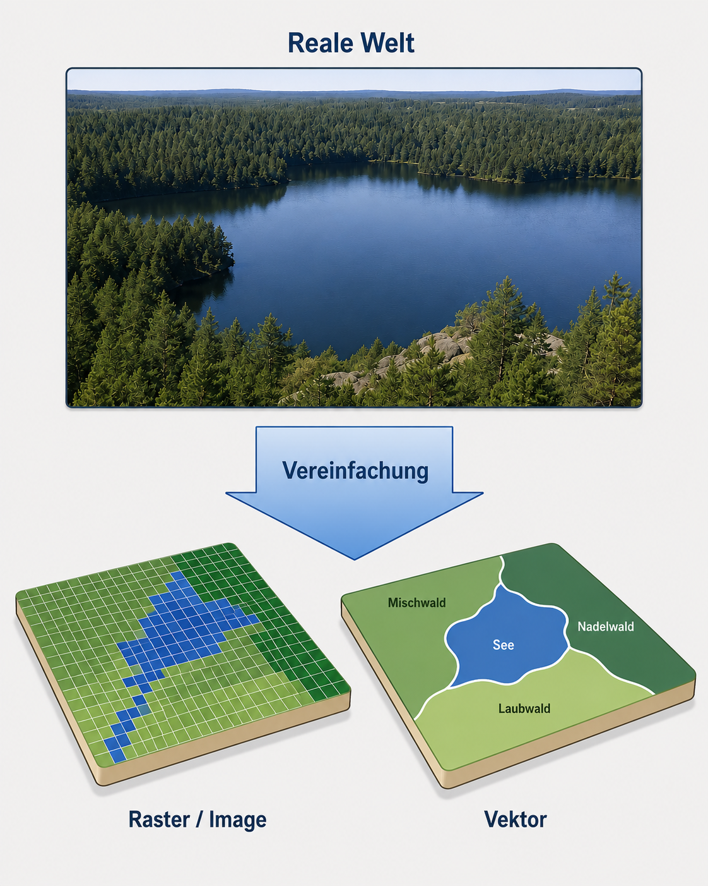
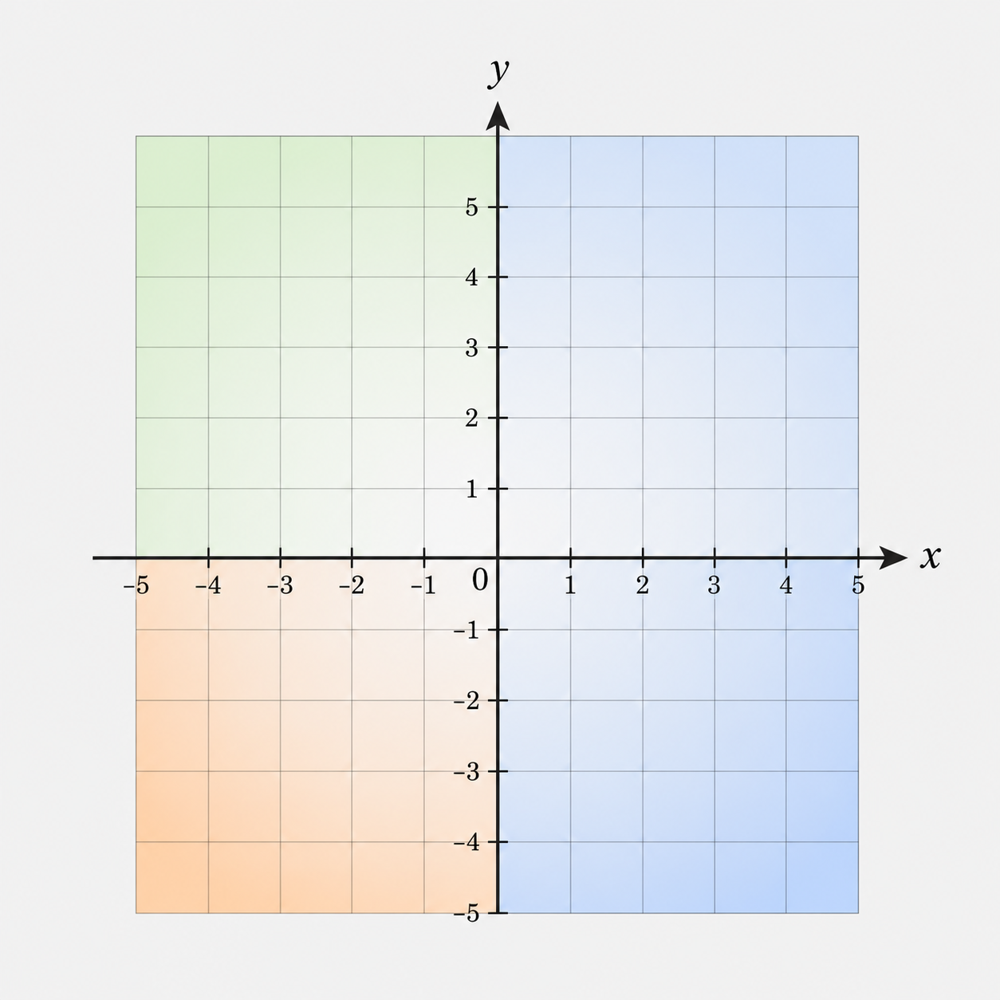
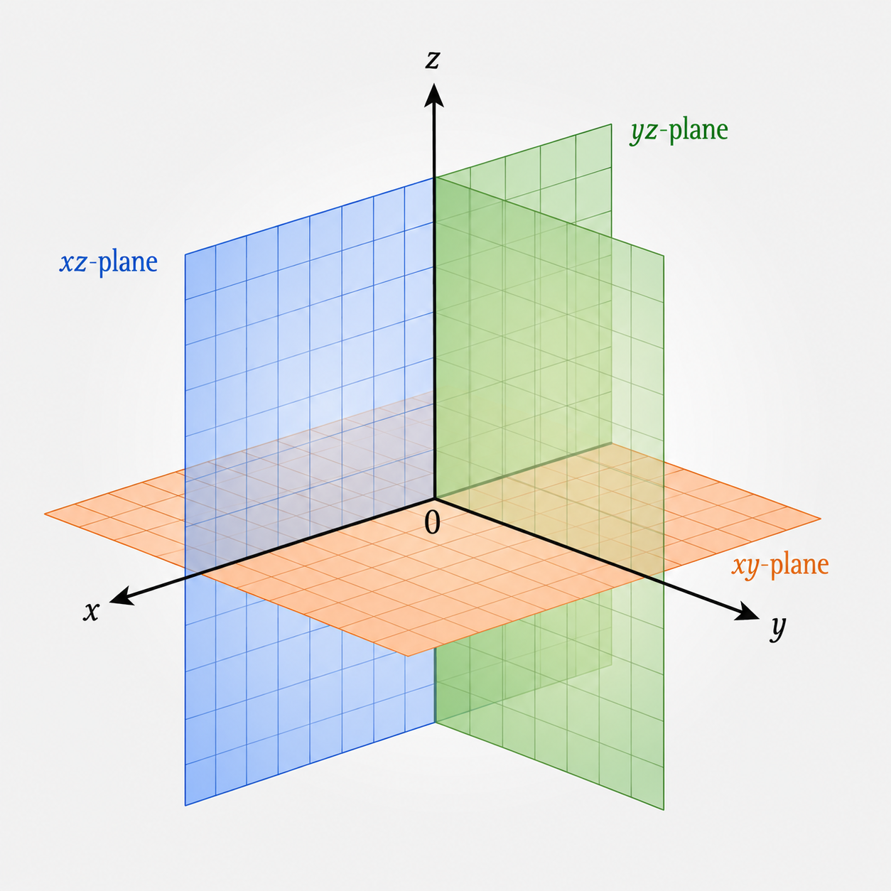
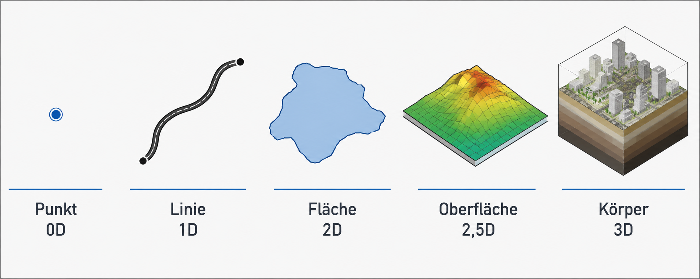
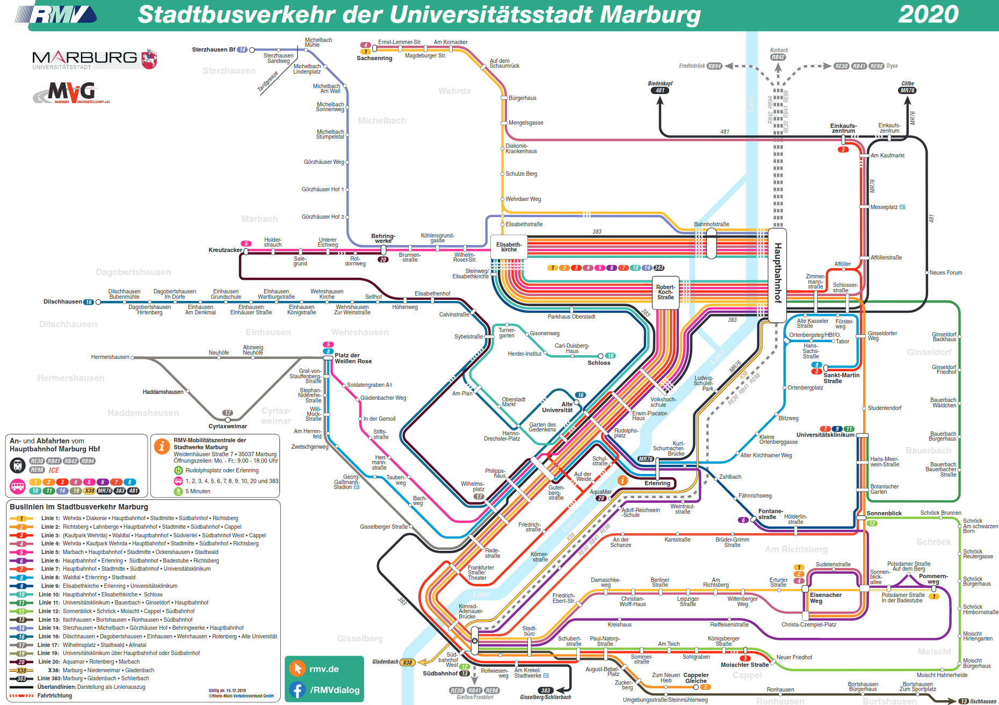
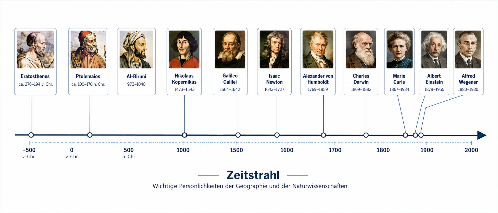
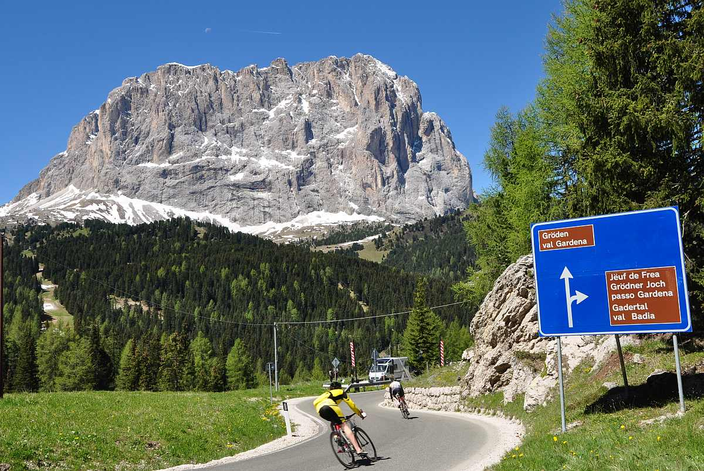
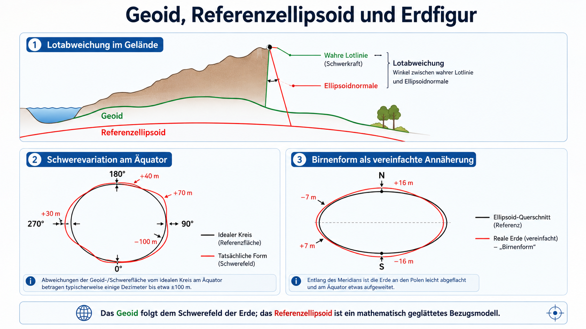
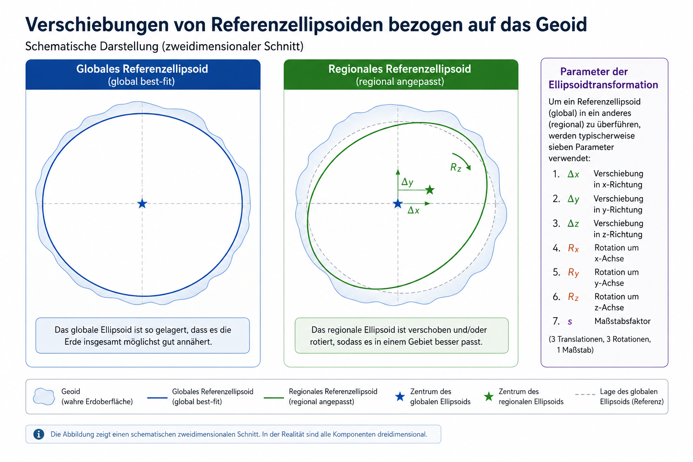
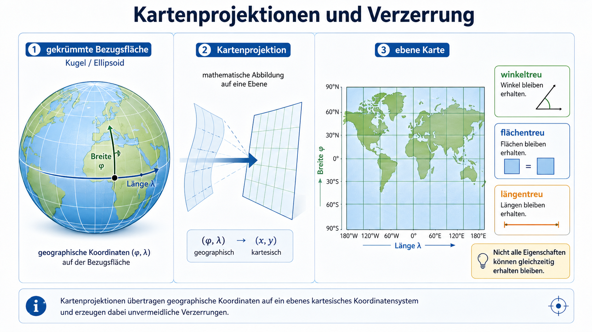

## Leitfrage der Sitzung

GIS bildet nicht einfach „die Welt“ ab.

GIS übersetzt Ausschnitte der realen Welt in **Modelle**, **Datenstrukturen** und **Koordinatenbezüge**.

```text
Realwelt → Abstraktion → Datenmodell → Koordinatenbezug → Analyse
```

Der Kern der Sitzung ist deshalb nicht ein einzelnes Werkzeug, sondern die Frage:

> Wie wird Raum so codiert, dass er digital gespeichert, kombiniert, gemessen und analysiert werden kann?

## Lernziele

Nach der Sitzung sollten Sie erklären können,

- warum Geodaten immer Repräsentationen und nicht die reale Welt selbst sind,
- wie diskrete Geoobjekte und kontinuierliche Raumphänomene unterschieden werden,
- welche Rolle Geometrie, Dimension und Topologie in GIS spielen,
- wie Raster- und Vektordatenmodelle Raum unterschiedlich codieren,
- warum Koordinaten nur mit Bezugssystem, Datum und Projektion eindeutig interpretierbar sind.

## Abstraktion: von der Realwelt zum Modell

Wenn wir reale Welt in Karten oder GI-Systemen abbilden, müssen wir auswählen und vereinfachen.

Ein Modell ist dabei keine Verfälschung, sondern eine **zweckgebundene Repräsentation**.

```text
Was interessiert uns?
Welche Eigenschaften brauchen wir?
Welche Details dürfen wir weglassen?
Welche Datenstruktur kann das abbilden?
```

## Modellierung heißt: Zielgerichtet reduzieren

::: {layout-ncol="2" layout-valign="center"}

{width="95%"}

::: {.fragment}
Eine reale Situation kann als Vektormodell, Rastermodell oder Kombination aus beiden repräsentiert werden.

Die Wahl hängt nicht nur vom Objekt ab, sondern von der Fragestellung.
:::

:::

## Diskrete Objekte und Raumkontinua

GIS muss zwei Grundformen räumlicher Phänomene abbilden:

::: {layout-ncol="2"}

### Diskrete Geoobjekte

Straßen, Gebäude, Messstationen, Schutzgebiete.

Sie werden häufig als Punkte, Linien oder Flächen modelliert.

### Raumkontinua

Höhe, Temperatur, Niederschlag, Strahlung, Schadstoffkonzentration.

Sie werden häufig als Raster oder kontinuierliche Felder modelliert.

:::

## Raum im GIS: Koordinaten

Der Raum in GIS wird für viele Operationen als euklidischer Raum behandelt.

Positionen werden über Koordinaten bestimmbar:

::: {layout-ncol="2" layout-valign="bottom"}

{width="90%"}

{width="90%"}

:::

## Dimensionen von Geoobjekten

::: {layout-ncol="2" layout-valign="center"}

{width="95%"}

::: {.fragment}

- **0D:** Punkte, z. B. Messstationen
- **1D:** Linien, z. B. Straßen oder Flüsse
- **2D:** Flächen, z. B. Stadtgebiete
- **3D:** Körper, z. B. Gebäude oder Grundwasserkörper

Zusätzlich kommen Attribute und Zeit als weitere Informationsdimensionen hinzu.

:::

:::

## Topologie: relative Lage statt exakter Form

Topologie beschreibt räumliche Beziehungen unabhängig von exakter metrischer Form.

Beispiele:

```text
verbunden | benachbart | innerhalb | berührt | schneidet | getrennt
```

::: {layout-ncol="2" layout-valign="center"}

{width="85%"}

::: {.fragment}
Ein Liniennetzplan ist topologisch nützlich, obwohl er geometrisch nicht maßstäblich ist.

Für Routing zählt nicht nur „wo“, sondern auch „was ist womit verbunden?“
:::

:::

## Geometrie, Dimension und Topologie gehören zusammen

Eine Kreuzung in der Karte ist nicht automatisch eine Verbindung im Netzwerk.

Eine Brücke kann geometrisch wie eine Kreuzung aussehen, topologisch aber keine Verbindung sein.

```text
Geometrie: Wo liegt etwas?
Dimension: Welche räumliche Ordnung hat es?
Topologie: Wie ist es mit anderen Objekten verbunden?
```

## Datenmodelle als technische Raumkonzepte

Datenmodelle übersetzen geographische Abstraktion in digitale Struktur.

Sie legen fest,

- welche Objekte oder Felder gespeichert werden,
- welche Geometrie verwendet wird,
- wie Attribute zugeordnet werden,
- welche Operationen sinnvoll möglich sind.

## Vektordatenmodell

::: {layout-ncol="2" layout-valign="center"}

{width="95%"}

::: {.fragment}
Im Vektormodell wird Raum aus Punkten, Linien und Polygonen aufgebaut.

Es eignet sich besonders für diskrete Geoobjekte: Gebäude, Straßen, Flurstücke, Schutzgebiete.
:::

:::

## Rasterdatenmodell

::: {layout-ncol="2" layout-valign="center"}

{width="80%"}

::: {.fragment}
Im Rastermodell wird Raum in regelmäßige Zellen zerlegt.

Jede Zelle trägt einen Wert.

Das eignet sich besonders für kontinuierliche Phänomene: Höhe, Temperatur, Niederschlag, Landoberfläche.
:::

:::

## Raster: impliziter und expliziter Raumbezug

::: {layout-ncol="2" layout-valign="center"}

{width="95%"}

::: {.fragment}
Rasterzellen besitzen zunächst einen impliziten Raumbezug über Zeile und Spalte.

Geographisch nutzbar werden sie erst durch explizite Georeferenzierung: Ursprung, Zellgröße, Koordinatensystem und Projektion.
:::

:::

## Raum-Zeit-Kodierung

GIS-Daten verknüpfen mindestens drei Ebenen:

```text
Ort + Zeit + Attribut
```

Beispiel:

```text
Messstation A
am 15.06.2026 um 14:00 Uhr
Temperatur = 31,2 °C
```

Ohne Ort ist der Messwert nicht räumlich analysierbar. Ohne Zeit ist er nicht dynamisch interpretierbar. Ohne Attribut gibt es nichts zu analysieren.

## Zeit als Ordnungssystem

::: {layout-valign="center"}

{width="95%"}

:::

Zeit wird in GIS meist linear codiert: Zeitpunkte, Zeitintervalle, Zeitreihen.

## Orte können unterschiedlich codiert werden

Nicht jede räumliche Referenz ist eine Koordinate.

::: {layout-ncol="2"}

### Semantische Referenzierung

Ortsnamen, Adressen, Verwaltungseinheiten.

### Metrische Referenzierung

Koordinaten, lineare Referenzierung, Katastergeometrien.

:::

Die Genauigkeit und Nutzbarkeit hängt vom Zweck ab.

## Namen und Orte

::: {layout-ncol="2" layout-valign="center"}

{width="80%"}

::: {.fragment}
Ortsnamen sind verständlich, aber nicht eindeutig genug für viele GIS-Analysen.

Gleiche Namen, mehrsprachige Namen, historische Namen oder lokale Schreibweisen können unterschiedliche Orte bezeichnen.
:::

:::

## Lineare Referenzierung

::: {layout-ncol="2" layout-valign="center"}

{width="95%"}

::: {.fragment}
Eine Position kann auch entlang einer Linie codiert werden:

```text
Straße A7, Kilometer 213,4
Fluss Lahn, Pegel bei km 124
```

Das ist für Verkehrs- und Leitungsnetze oft sinnvoller als reine x/y-Koordinaten.
:::

:::

## Kataster und geometrisch exakte Lage

::: {layout-ncol="2" layout-valign="center"}

{width="70%"}

::: {.fragment}
Katasterpläne codieren Eigentum, Grenzen und Flurstücke geometrisch und administrativ.

Sie sind nicht nur Kartenbilder, sondern rechtlich und technisch strukturierte Raumdaten.
:::

:::

## Geographische Koordinaten

Geographische Koordinaten beschreiben Positionen auf einer gekrümmten Bezugsfläche.

```text
Breite = Winkel nördlich/südlich des Äquators
Länge  = Winkel östlich/westlich des Nullmeridians
```

::: {layout-ncol="2" layout-valign="center"}

{width="80%"}

{width="80%"}

:::

## Ellipsoid, Geoid und Datum

Koordinaten sind nie einfach nur Zahlen.

Sie beziehen sich auf ein geodätisches Modell der Erde.

::: {layout-ncol="2" layout-valign="center"}

{width="95%"}

::: {.fragment}

- **Ellipsoid:** mathematisch geglättete Bezugsfläche
- **Geoid:** physikalische Höhen- und Schwerereferenz
- **Datum / Referenzsystem:** legt Bezug und Lagerung fest

:::

:::

## Globales und regionales Bezugssystem

::: {layout-ncol="2" layout-valign="center"}

{width="95%"}

::: {.fragment}
Ein globales Referenzsystem passt die Erde insgesamt an.

Ein regionales Datum kann für ein Gebiet besser passen.

Deshalb können ähnliche Koordinaten in unterschiedlichen Bezugssystemen verschiedene Orte meinen.
:::

:::

## Projektionen: von der Erde zur Karte

Geographische Koordinaten liegen auf einer gekrümmten Bezugsfläche.

Viele GIS-Analysen brauchen aber ebene x/y-Koordinaten.

```text
Datum / Referenzsystem → Ellipsoid → Projektion → Rechtswert / Hochwert
```

## Kartenprojektionen erzeugen immer Verzerrungen

::: {layout-ncol="2" layout-valign="center"}

{width="95%"}

::: {.fragment}
Keine Projektion ist gleichzeitig überall längentreu, flächentreu und winkeltreu.

Die passende Projektion hängt von der Fragestellung ab.
:::

:::

## Warum das in QGIS wichtig ist

QGIS kann Layer mit unterschiedlichen Bezugssystemen oft gemeinsam anzeigen.

Das heißt aber nicht automatisch, dass Messungen und Analysen korrekt sind.

```text
WGS 84
= Breite/Länge in Grad

ETRS89 / UTM Zone 32N
= Rechtswert/Hochwert in Metern
```

Für Distanzen, Flächen und Rasteranalysen sind metrische Projektionen meist notwendig.

## Grad oder Meter?

::: {layout-ncol="2"}

### Geographische Koordinaten

```text
50.81, 8.77
Einheit: Grad
typisch: GPS, Webdaten
```

### Projizierte Koordinaten

```text
477000, 5630000
Einheit: Meter
typisch: lokale Analyse
```

:::

Die Zahlenform allein reicht nicht. Entscheidend ist der vollständige CRS-Bezug.

## Abschluss: kontrollierte Raumcodierung

GIS-Arbeit bedeutet kontrollierte Übersetzung:

```text
Realwelt
→ Modell
→ Datenmodell
→ Geometrie / Topologie / Dimension
→ Koordinatenbezug
→ Projektion
→ Analyse
→ Interpretation
```

Der zentrale Satz:

> Geodaten sind nicht einfach Daten über Raum. Sie sind technisch und fachlich codierte Raumrepräsentationen.

## Arbeitsauftrag

Wählen Sie ein Ihnen bekanntes Beispiel aus QGIS oder einer Webkarte.

Beschreiben Sie kurz:

- Welches Phänomen wird repräsentiert?
- Handelt es sich eher um diskrete Geoobjekte oder ein Raumkontinuum?
- Welches Datenmodell liegt nahe: Raster oder Vektor?
- Welche Rolle spielen Koordinaten, Projektion und Topologie?
- Welche Information geht durch die Abstraktion verloren?

