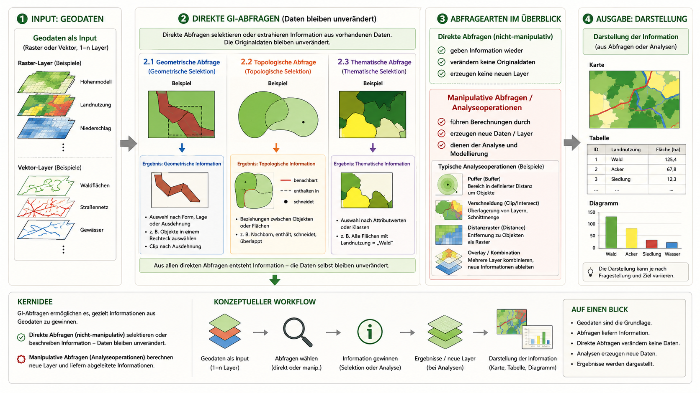
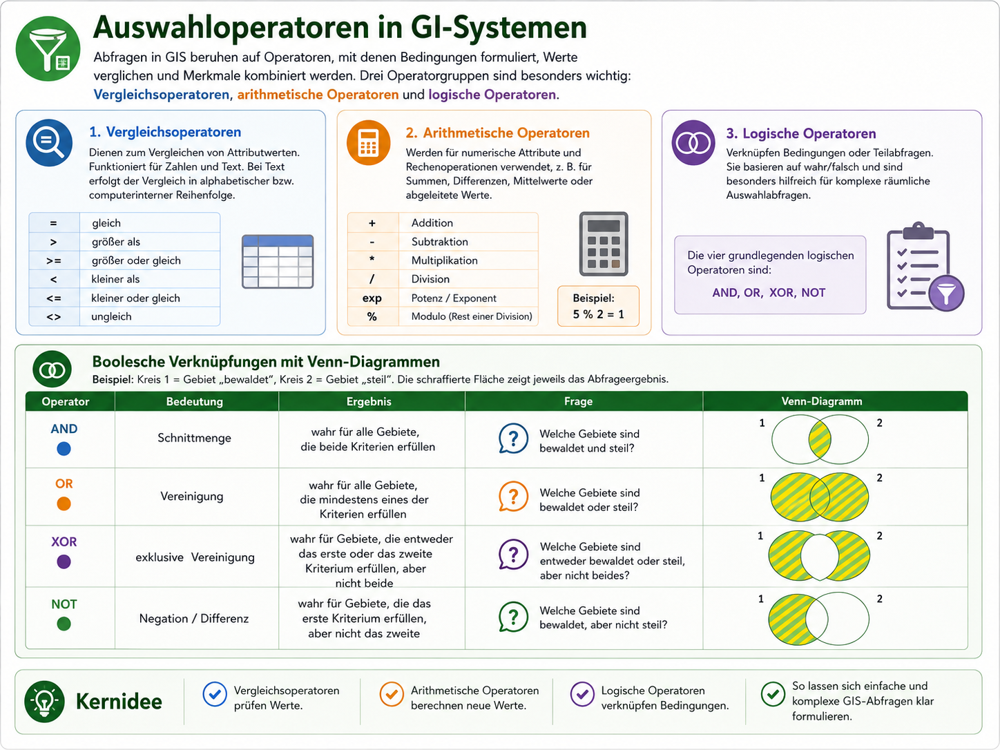
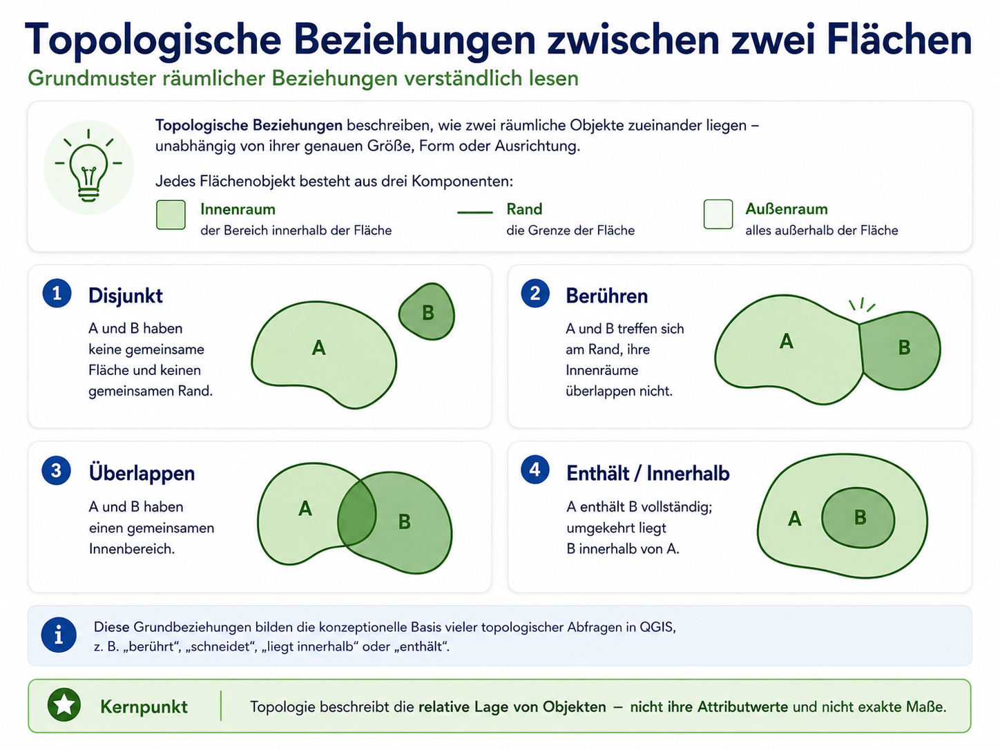
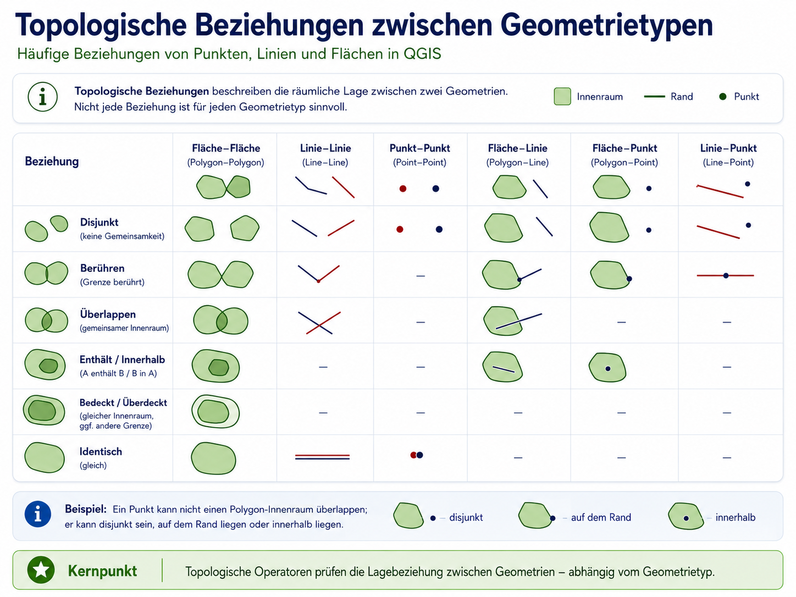
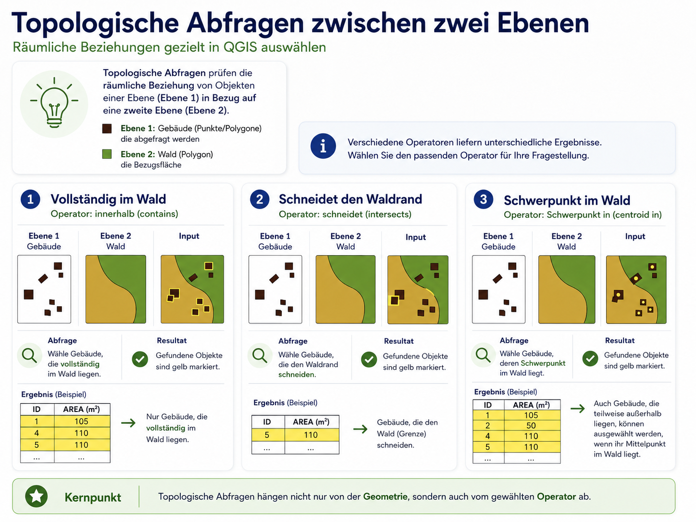
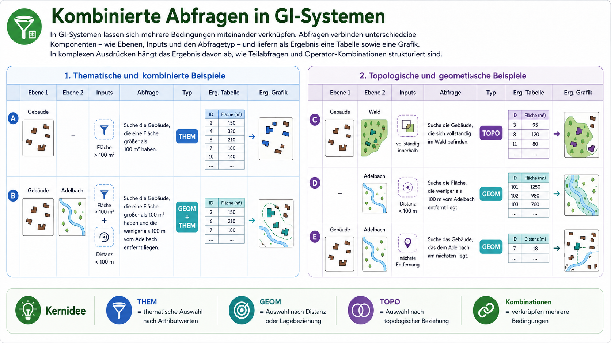
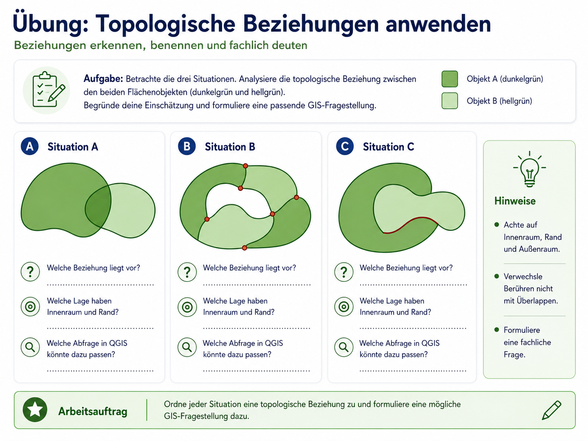

## Leitfrage der Sitzung

GIS-Abfragen sind keine reinen Werkzeugklicks.

Sie übersetzen eine fachliche Frage in Bedingungen, Operatoren und räumliche Beziehungen.

```text
Fachliche Frage → Datenmodell → Attribute / Geometrie / Topologie → Auswahl → Interpretation
```

Der Kern der Sitzung ist deshalb:

> Wie formuliere ich eine räumliche Frage so, dass ein GIS sie nachvollziehbar auswerten kann?

## Lernziele

Nach der Sitzung sollten Sie erklären können,

- wie thematische, geometrische und topologische Abfragen unterschieden werden,
- warum Attributtabelle und Geometrie in GIS gemeinsam ausgewertet werden,
- wie Vergleichs-, arithmetische und logische Operatoren Bedingungen formulieren,
- warum Distanz, Fläche und Puffer vom Datenmodell abhängen,
- wie topologische Operatoren fachliche Lagebeziehungen übersetzen,
- weshalb Abfrageergebnisse immer geprüft und interpretiert werden müssen.

## Abfragen beginnen mit Relationen

GIS-Daten bestehen im Vektormodell aus Geometrie und Attributen.

Die Attributtabelle organisiert die semantische Information in Feldern, Datensätzen und Werten.

```text
Objektgeometrie + Attributwerte → Abfragefähige Relation
```

Eine Abfrage prüft also nicht „die Welt“, sondern die modellierten Daten.

## Drei Grundtypen von Abfragen

::: {layout-ncol="2" layout-valign="center"}

{width="96%"}

::: {.fragment}

**Thematisch**  
Welche Objekte erfüllen Attributbedingungen?

**Geometrisch**  
Welche Objekte erfüllen Messbedingungen: Distanz, Fläche, Länge, Puffer?

**Topologisch**  
Welche Objekte stehen in einer bestimmten Lagebeziehung?

:::

:::

## Direkte Abfrage oder neue Datenebene?

Eine Auswahl verändert die Ausgangsdaten zunächst nicht.

Sie markiert, filtert oder zeigt nur bestimmte Objekte.

Eine neue Datenebene entsteht erst, wenn das Ergebnis gespeichert, gepuffert, verschnitten, rasterisiert oder weiterverarbeitet wird.

```text
Auswahl → Information
Analyseoperation → neuer Layer / neues Raster
```

## Operatoren: die Sprache der Abfrage

Operatoren legen fest, wie Bedingungen formuliert werden.

```text
Baumart = 'Lärche'
Vorrat_m3_ha > 110
Baumart = 'Lärche' AND Vorrat_m3_ha > 110
```

::: {.fragment}

- Vergleichsoperatoren prüfen Werte.
- Arithmetische Operatoren berechnen neue Kennwerte.
- Logische Operatoren verknüpfen Bedingungen.

:::

## Auswahloperatoren im Überblick

{width="94%"}

## Thematische Abfragen

Thematische Abfragen wählen Objekte anhand ihrer Attributwerte aus.

Die Geometrie bleibt erhalten, aber nur Objekte mit passenden Attributen werden ausgewählt.

::: {layout-ncol="2" layout-valign="center"}

{width="96%"}

::: {.fragment}

Beispiele:

```text
"Baumart" = 'Fichte'
"Bodentyp" = 'Redzina'
"Vorrat_m3_ha" > 120
```

Die Auswahl muss in Karte und Tabelle konsistent sein.

:::

:::

## Von der fachlichen Frage zur QGIS-Abfrage

Eine gute Abfrage beginnt nicht mit Syntax, sondern mit Übersetzung.

```text
Was möchte ich wissen?
→ Welche Attribute brauche ich?
→ Welche Bedingungen passen?
→ Wie lautet der QGIS-Ausdruck?
→ Welche Objekte werden ausgewählt?
→ Was bedeutet das Ergebnis?
```

## Fachliche Frage → Ausdruck

{width="92%"}

## Logische Operatoren in QGIS

::: {layout-ncol="2" layout-valign="center"}

{width="98%"}

::: {.fragment}

`AND` verengt die Auswahl.  
`OR` erweitert die Auswahl.  
`NOT` schließt Bedingungstreffer aus.  
`XOR` erlaubt genau eine von zwei Bedingungen.

Klammern legen fest, welche Bedingungen zusammengehören.

:::

:::

## Klammern sind fachlich relevant

Zwei Ausdrücke können dieselben Bedingungen enthalten und trotzdem unterschiedliche Ergebnisse liefern.

```text
Baumart = 'Lärche' AND Vorrat > 110 OR Bodentyp = 'Podzol'
```

ist nicht dasselbe wie:

```text
Baumart = 'Lärche' AND (Vorrat > 110 OR Bodentyp = 'Podzol')
```

::: {.fragment}

Ohne Klammern entscheidet die Operatorpriorität. Mit Klammern entscheiden Sie bewusst.

:::

## Geometrische Abfragen

Geometrische Abfragen messen Eigenschaften oder Distanzen von Geometrien.

Sie beantworten Fragen wie:

```text
Wie weit ist Objekt A von Objekt B entfernt?
Wie groß ist eine Fläche?
Wie lang ist eine Linie?
Welche Objekte liegen innerhalb eines Puffers?
```

## Geometrische Abfragen in QGIS

{width="92%"}

## Distanz und Ausdehnung hängen vom Datenmodell ab

::: {layout-ncol="2" layout-valign="center"}

{width="96%"}

::: {.fragment}

Im Vektormodell werden Geometrien direkt gemessen.

Im Rastermodell hängt das Ergebnis von Zellgröße, Nachbarschaftsregel und Klassifikation ab.

Eine Distanz ist deshalb nicht nur eine Zahl, sondern auch eine Modellentscheidung.

:::

:::

## Puffer und Distanzzonen

Puffer übersetzen Nähe in eine Fläche.

```text
Objekt → Abstandswert → Distanzzone
```

Im Vektormodell entsteht eine Puffergeometrie.  
Im Rastermodell entsteht meist ein Distanzwert pro Zelle.

## Distanzzonen und Puffer

{width="92%"}

## Geometrische Abfragen prüfen

Geometrische Ergebnisse wirken oft eindeutig, sind aber abhängig von Parametern.

Zu prüfen sind insbesondere:

```text
Welches Koordinatensystem?
Welche Einheit?
Welche Zellgröße?
Welche Pufferdistanz?
Einseitig oder beidseitig?
Vektor- oder Rasterlogik?
```

## Topologische Abfragen

Topologische Abfragen prüfen Lagebeziehungen zwischen Geometrien.

Sie fragen nicht: „Wie weit?“  
Sondern: „Wie liegt etwas zu etwas anderem?“

```text
innerhalb | berührt | schneidet | überlappt | enthält | getrennt
```

## Grundmuster topologischer Beziehungen

{width="82%"}

## Topologie ist geometrietypabhängig

Ein Punkt kann in einer Fläche liegen oder auf deren Rand liegen.

Eine Linie kann eine Fläche schneiden oder vollständig innerhalb verlaufen.

Zwei Flächen können getrennt sein, sich berühren, überlappen oder ineinander enthalten sein.

## Beziehungen zwischen Geometrietypen

{width="92%"}

## Topologische Abfragen in QGIS

::: {layout-ncol="2" layout-valign="center"}

{width="96%"}

::: {.fragment}

Dieselben Eingangsdaten können je nach Operator unterschiedliche Objekte auswählen.

```text
vollständig im Wald
schneidet den Waldrand
Schwerpunkt im Wald
```

Das sind verschiedene fachliche Aussagen.

:::

:::

## Operator fachlich wählen

Der häufigste Fehler ist, `intersects` als Allzwecklösung zu verwenden.

```text
„liegt vollständig innerhalb“ ≠ „schneidet irgendwie“
```

Wer wissen will, ob Gebäude vollständig im Wald liegen, braucht einen strengeren Operator als für Gebäude, die den Waldrand schneiden.

## Geometrisch oder topologisch?

::: {layout-ncol="2"}

### Geometrisch

```text
Wie weit liegt ein Gebäude vom Wald entfernt?
Wie groß ist ein Flurstück?
Wie lang ist ein Gewässerabschnitt?
```

### Topologisch

```text
Liegt ein Gebäude im Wald?
Berührt ein Flurstück eine Straße?
Schneidet ein Gewässer ein Schutzgebiet?
```

:::

## Kombinierte GIS-Abfragen

Komplexe GIS-Fragen verbinden häufig mehrere Abfragetypen.

```text
Attributbedingung
+ Distanzbedingung
+ topologische Lagebeziehung
```

Beispiel:

> Welche Waldflächen liegen innerhalb des Untersuchungsgebiets, sind größer als 2 ha und weniger als 200 m von einer Straße entfernt?

## Kombinierte Abfragen als Workflow

{width="92%"}

## Übung: geometrische Abfragen

{width="86%"}

## Übung: topologische Beziehungen

{width="86%"}

## Arbeitsauftrag

Formulieren Sie für eine eigene kleine GIS-Frage:

1. eine thematische Bedingung,
2. eine geometrische Bedingung,
3. eine topologische Bedingung,
4. einen kombinierten QGIS-Ausdruck oder Workflow.

::: {.fragment}

Entscheidend ist nicht die Länge des Ausdrucks, sondern ob die Bedingungen zur fachlichen Frage passen.

:::

## Kernpunkt

GIS-Abfragen sind die Übersetzung fachlicher Fragen in Datenbedingungen.

```text
Attributwert → thematische Abfrage
Distanz / Fläche / Länge → geometrische Abfrage
Lagebeziehung → topologische Abfrage
```

Eine korrekte Abfrage ist deshalb nicht nur syntaktisch gültig, sondern fachlich passend.

