```{=html}
<style>
.reveal .slides section { text-align: left; }
.reveal h2 { letter-spacing: -0.02em; }
.reveal .big { font-size: 1.35em; line-height: 1.25; }
.reveal .small { font-size: .74em; color: #475569; }
.reveal .center { text-align: center; }
.reveal .r-stretch { max-width: 100%; max-height: 78vh; object-fit: contain; }
.reveal .fullfig { display: block; margin: 0 auto; width: 100%; max-height: 82vh; object-fit: contain; }
.reveal .fulliframe { width: 100%; height: 78vh; border: 0; border-radius: 14px; overflow: hidden; background: #f7f3ea; }
.reveal .overlay-note {
  position: absolute;
  left: 4%;
  bottom: 5%;
  width: 52%;
  background: rgba(255,255,255,.92);
  border-left: 8px solid #2e7d32;
  padding: .6em .8em;
  font-size: .72em;
  box-shadow: 0 8px 28px rgba(0,0,0,.18);
}
.reveal .overlay-note.right { left: auto; right: 4%; }
.reveal .overlay-note.wide { width: 72%; }
.reveal .keyline {
  border-left: 8px solid #1f6f5b;
  padding-left: .8em;
  margin-top: .8em;
}
.reveal code { font-size: .88em; }
</style>
```

## Leitfrage der Sitzung

Räumliche Analyse beginnt dort, wo aus vorhandenen Daten **neue räumliche Informationen** abgeleitet werden.

```text
Daten → Annahmen → Operationen → neue räumliche Information → Interpretation
```

Der Kern der Sitzung ist deshalb:

> Wie werden aus Punktmessungen, Höhenrastern und Modellannahmen nachvollziehbare räumliche Ableitungen?

## Lernziele

Nach der Sitzung sollten Sie erklären können,

- warum räumliche Analyse mehr ist als eine Abfrage,
- wie aus Punktdaten flächenhafte Schätzungen entstehen,
- warum Interpolation immer eine Modellentscheidung ist,
- wie aus Höhenrastern lokale und gerichtete Geländeinformationen abgeleitet werden,
- wie Sichtbarkeit und Reliefhydrologie aus Höhenmodellen berechnet werden,
- warum jedes Analyseergebnis über Datenbasis, Maßstab, Parameter und Annahmen interpretiert werden muss.

## Von der Abfrage zur Analyse

Eine Abfrage fragt meist:

> Welche vorhandenen Objekte erfüllen eine Bedingung?

Eine räumliche Analyse fragt dagegen:

> Welche neue räumliche Information kann aus vorhandenen Daten, Annahmen und Regeln erzeugt werden?

::: {.fragment}

```text
Auswahl → markiert vorhandene Daten
Analyse → erzeugt neue Datenebenen oder Rasterwerte
```

:::

## Räumliche Analyse ist begründete Transformation

Aus räumlichen Daten werden neue Informationen:

```text
Punktmessungen → Interpolationsfläche
Höhenwerte → Neigung, Sichtfeld, Fließrichtung
Distanzen → Nähezonen oder Kostenoberflächen
Kriterien → Eignungs- oder Konfliktkarte
```

::: {.fragment .keyline}
Entscheidend ist nicht nur, welches Werkzeug verwendet wurde, sondern welche Annahme damit in die Analyse eingebaut wird.
:::

## Zwei Richtungen räumlicher Analyse

::: {layout-ncol="2"}

### Räumliche Ableitung

Aus vorhandenen Daten entstehen neue räumliche Informationen.

Beispiele: Voronoi-Flächen, Interpolation, Reliefparameter, Sichtfelder, Flow Accumulation.

### Räumliche Bewertung

Mehrere räumliche Informationen werden standardisiert, gewichtet und kombiniert.

Beispiele: Eignungskarten, Multikriterienanalyse, Kostenoberflächen.

:::

## Räumliche Analyse in der Geographie

Räumliche Analyse ist älter als GIS-Software.

Viele Verfahren der quantitativen Raumanalyse und räumlichen Statistik wurden entwickelt, bevor digitale GI-Systeme breit verfügbar waren [vgl. @berry1968].

::: {.fragment}
Mit GIS wurden diese Verfahren praktisch integrierbar: Datenerfassung, Datenverwaltung, Analyse und Visualisierung liegen in einer gemeinsamen Arbeitsumgebung.
:::

::: {.fragment .keyline}
Eine Karte ist nicht deshalb aussagekräftig, weil sie mit GIS erzeugt wurde. Aussagekräftig wird sie erst durch begründete Daten, Methode, Maßstab und Interpretation.
:::

## Rasterbasierte Ableitungen

Rasterdaten beschreiben den Raum als regelmäßiges Zellgitter.

Jede Zelle enthält einen Wert:

```text
Höhe | Temperatur | Landbedeckung | Entfernung | Eignung
```

::: {.fragment}
Rasteranalyse verändert, kombiniert oder interpretiert diese Zellwerte und erzeugt daraus neue räumliche Informationen.
:::

## Voronoi-Polygone als Nähemodell

Voronoi-Polygone teilen einen Raum so auf, dass jede Fläche genau einem Ausgangspunkt zugeordnet wird.

Innerhalb einer Fläche liegt jeder Ort näher am zugehörigen Punkt als an jedem anderen Punkt.

::: {.fragment .keyline}
Voronoi ist ein geometrisches Nullmodell: gleichförmiger Raum, keine Barrieren, keine Topographie, keine Wegkosten, keine Prozessinformation.
:::

## Voronoi-Konstruktion

```{=html}
<iframe src="../assets/images/unit04/voronoi_konstruktion_svg_animation.html" class="fulliframe" loading="lazy"></iframe>
```

::: {.fragment .overlay-note}
Die Grenzen liegen dort, wo zwei benachbarte Punkte gleich weit entfernt sind. So wird aus Punktlage eine flächige Zuordnung.
:::

## Voronoi: Schweiz-Beispiel

```{=html}
<iframe src="../assets/images/unit04/suisse1.html" class="fulliframe" loading="lazy"></iframe>
```

::: {.fragment .overlay-note .wide}
Jede Fläche wird der nächstgelegenen Niederschlagsstation zugeordnet. Das ist keine klimatologische Modellierung, sondern eine Zuordnung nach euklidischer Distanz.
:::

## Interpolation: Punktmessungen zur Fläche

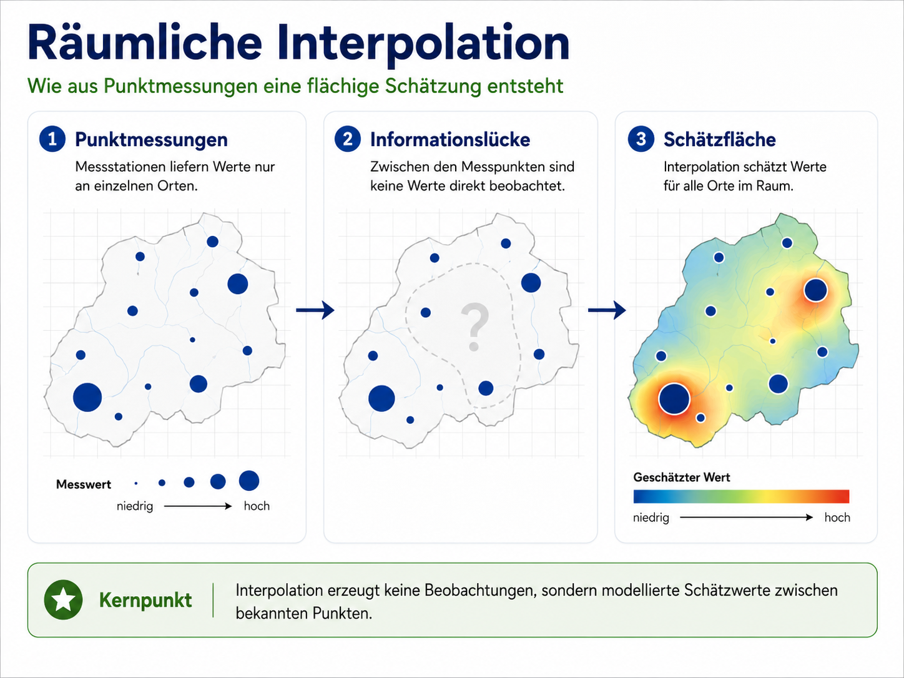{.fullfig}

::: {.fragment .overlay-note}
Interpolation schätzt Werte zwischen bekannten Messpunkten. Die Fläche ist kein Messwert, sondern ein Modellprodukt.
:::

## Was Interpolation voraussetzt

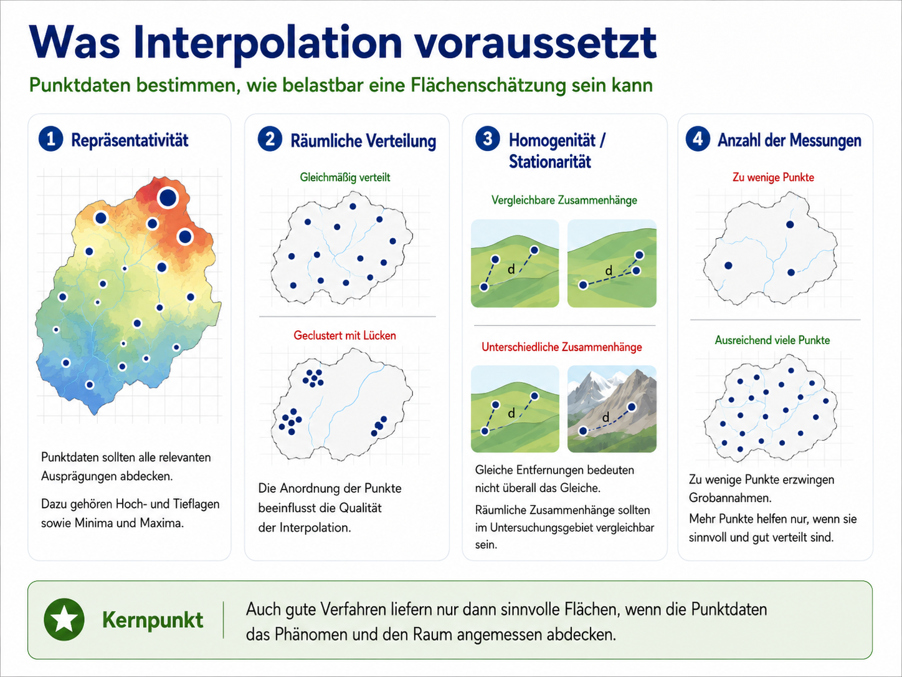{.fullfig}

::: {.fragment .overlay-note .right}
Entscheidend sind nicht nur Methode und Software, sondern Repräsentativität, räumliche Verteilung, Homogenität und Anzahl der Messpunkte.
:::

## Interpolation als Modellentscheidung

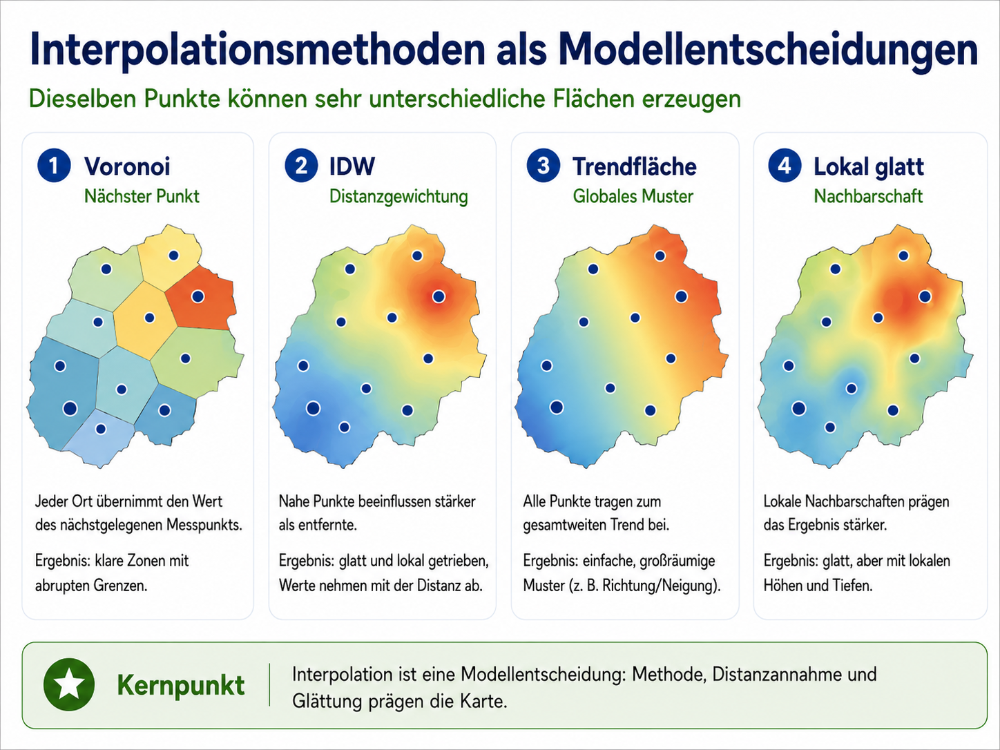{.fullfig}

::: {.fragment .overlay-note}
Dieselben Punktdaten können unterschiedliche Flächen erzeugen. Jede Methode übersetzt Nähe, Glättung und räumliche Abhängigkeit anders.
:::

## Globale und lokale Interpolation

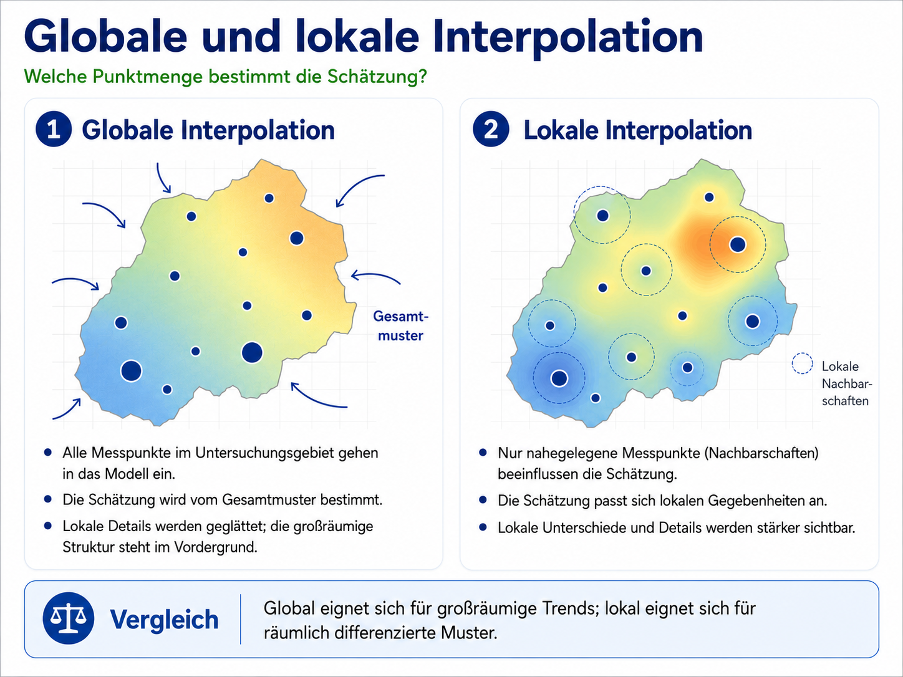{.fullfig}

::: {.fragment .overlay-note .right}
Globale Verfahren betonen großräumige Trends. Lokale Verfahren reagieren stärker auf Nachbarschaften und Punktverteilung.
:::

## Exakt und nicht-exakt

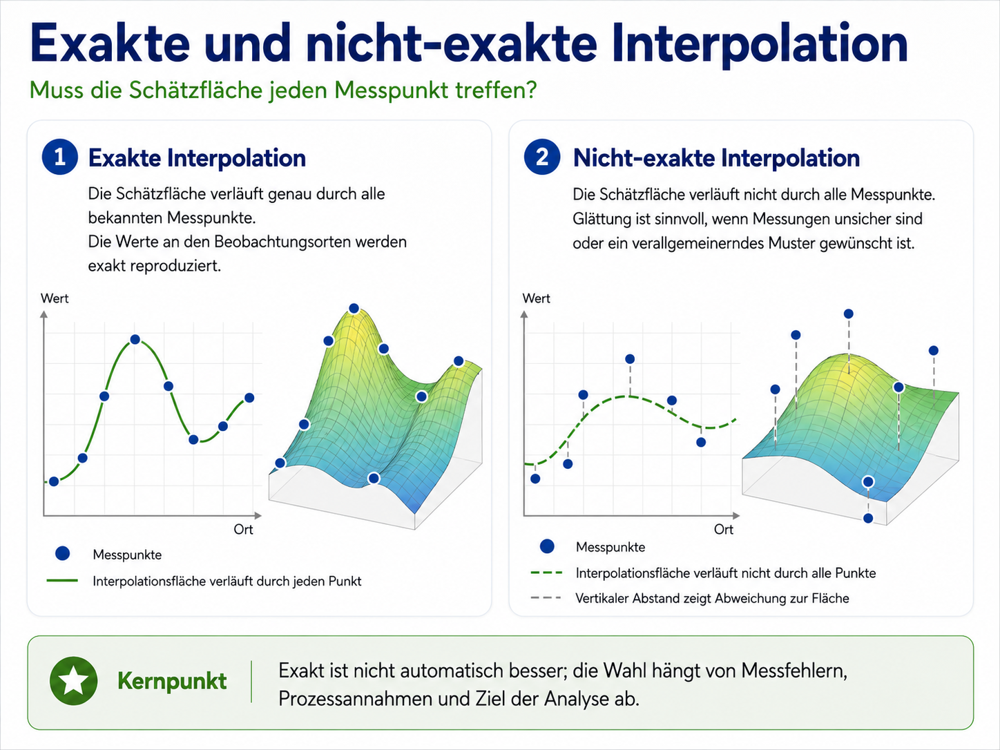{.fullfig}

::: {.fragment .overlay-note}
Exakt bedeutet: Die Oberfläche trifft die Messpunkte. Nicht-exakt bedeutet: Die Oberfläche glättet und kann Unsicherheit berücksichtigen.
:::

## Niederschlagsflächen vergleichen

```{=html}
<iframe src="../assets/images/unit04/suisse4.html" class="fulliframe" loading="lazy"></iframe>
```

::: {.fragment .overlay-note .wide}
Bei Niederschlag muss die Topographie mitgelesen werden: Höhe, Luv/Lee, Täler und Stationsverteilung entscheiden, ob eine Fläche plausibel wirkt.
:::

## Digitale Geländemodelle

Ein DGM speichert zunächst nur Höhe.

Räumliche Analyse beginnt, wenn aus Höhenwerten neue Informationen abgeleitet werden:

```text
Höhe → Neigung → Exposition → Kurvatur → Profil → Falllinie → Einzugsgebiet
```

::: {.fragment}
Das DGM ist damit kein Endprodukt, sondern ein Ausgangspunkt für Geländeinterpretation.
:::

## DGM: von Höhe zu Information

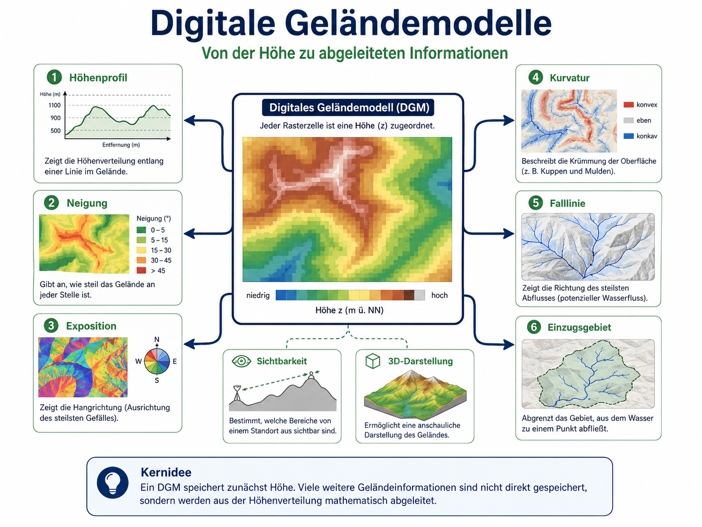{.fullfig}

::: {.fragment .overlay-note}
Aus derselben Höhenoberfläche entstehen unterschiedliche Ableitungen: lokale Geländeparameter, Linieninformationen und flächenhafte Einheiten.
:::

## Lokale Geländeparameter

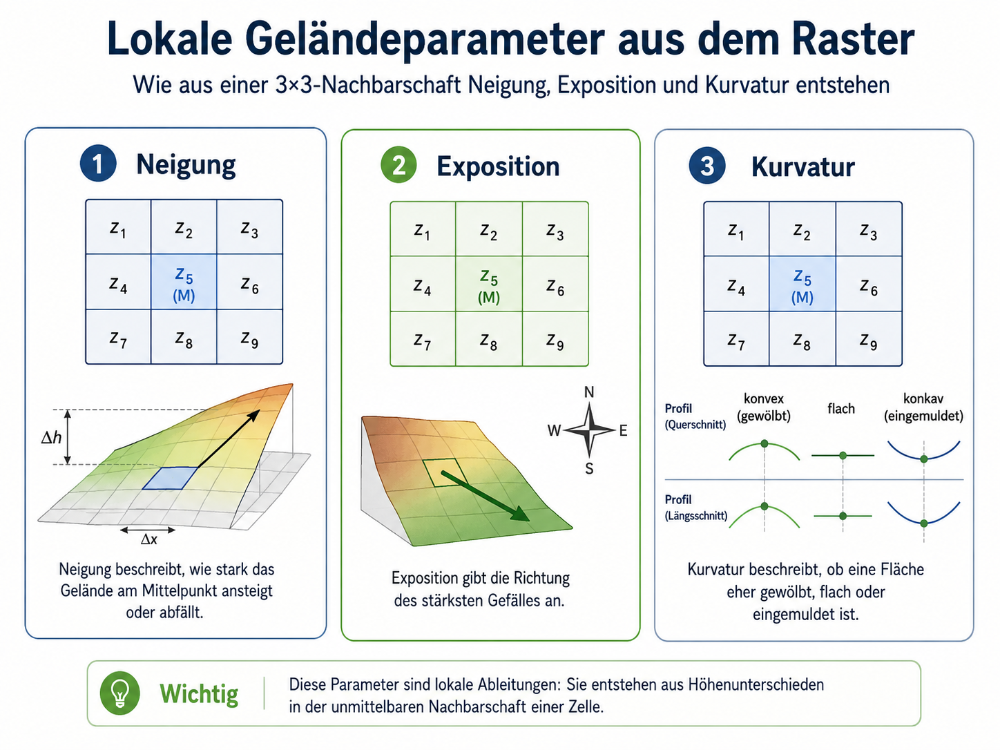{.fullfig}

::: {.fragment .overlay-note .right}
Neigung, Exposition und Kurvatur entstehen aus Höhenunterschieden in der Nachbarschaft einer Rasterzelle.
:::

## Profile, Pauschalgefälle und Falllinien

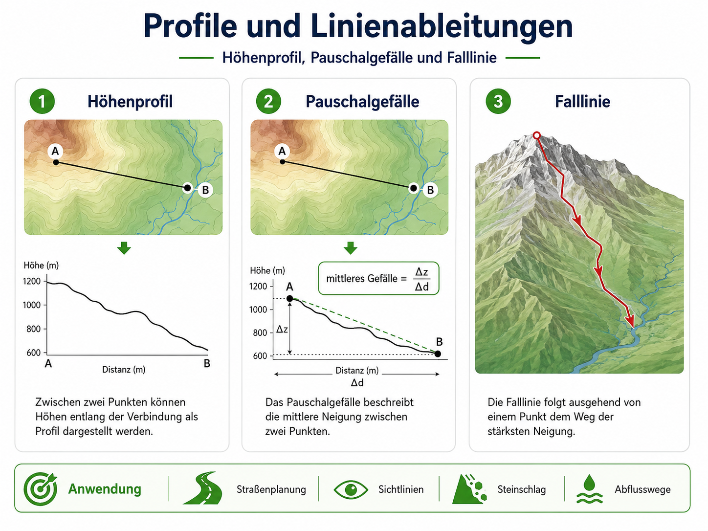{.fullfig}

::: {.fragment .overlay-note}
Profile beschreiben Höhenverläufe, Pauschalgefälle mittlere Neigung, Falllinien gerichtete Pfade entlang des stärksten Gefälles.
:::

## Anwendungen geomorphometrischer Ableitungen

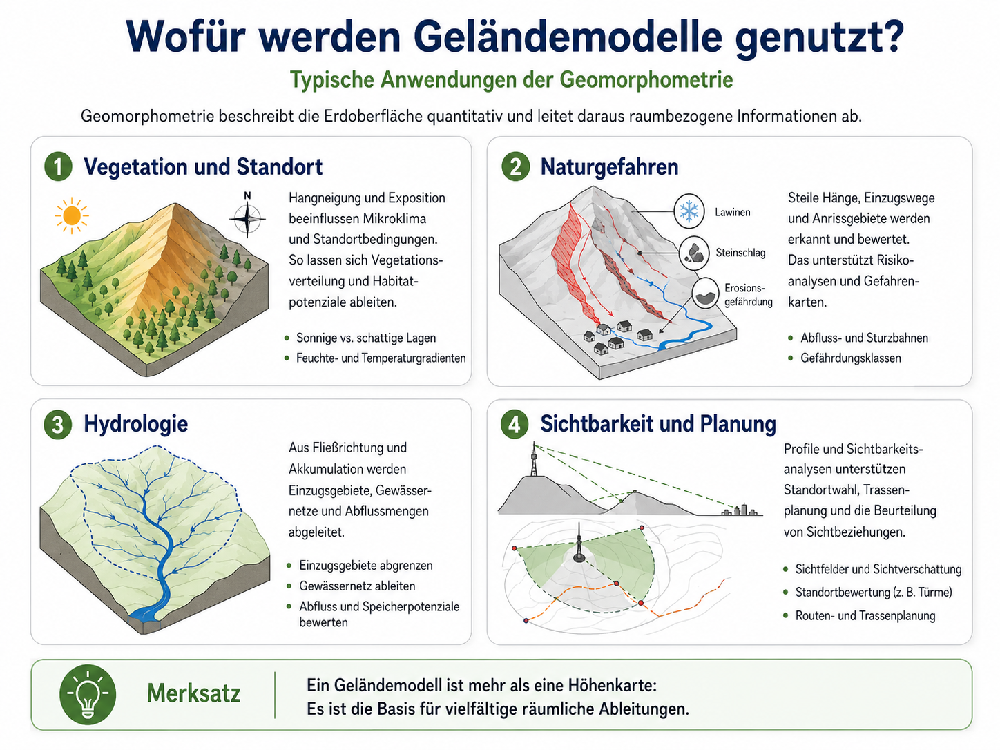{.fullfig}

::: {.fragment .overlay-note .right}
Geomorphometrische Ableitungen sind keine bloßen Zusatzkarten. Sie übersetzen Höhe in planungs-, prozess- und standortbezogene Information.
:::

## Anschluss: Sichtbarkeit und Reliefhydrologie

Die DGM-Ableitungen führen in zwei Richtungen weiter:

::: {layout-ncol="2"}

### Sichtbarkeit

Höhenprofil und Sichtlinie entscheiden, ob ein Zielpunkt sichtbar ist.

Viele Sichtlinien ergeben ein Sichtfeld.

### Reliefhydrologie

Lokale Gefälle werden zu Fließrichtungen.

Aus Richtungen entstehen Akkumulations- und Indexraster.

:::

## Sichtbarkeit als Ableitung

Sichtbarkeit ist keine Eigenschaft eines Punktes allein.

Sie ist eine Beziehung zwischen:

```text
Beobachtungspunkt + Zielpunkt + Gelände dazwischen
```

::: {.fragment}
Ein Ziel ist sichtbar, wenn die Sichtlinie nicht durch Gelände blockiert wird.
:::

## Grundprinzip der Sichtbarkeitsanalyse

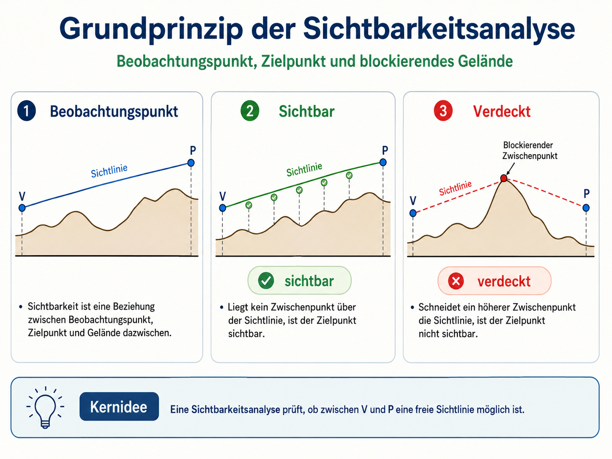{.fullfig}

::: {.fragment .overlay-note}
Sichtbarkeit wird entlang einer Sichtlinie geprüft: Wird die Linie vom Gelände geschnitten, ist der Zielpunkt verdeckt.
:::

## Geländeprofil und Horizont

{.fullfig}

::: {.fragment .overlay-note .right}
Ein Punkt ist sichtbar, wenn sein Vertikalwinkel über dem bisher gespeicherten Horizont liegt.
:::

## Vom Zielpunkt zum Sichtfeld

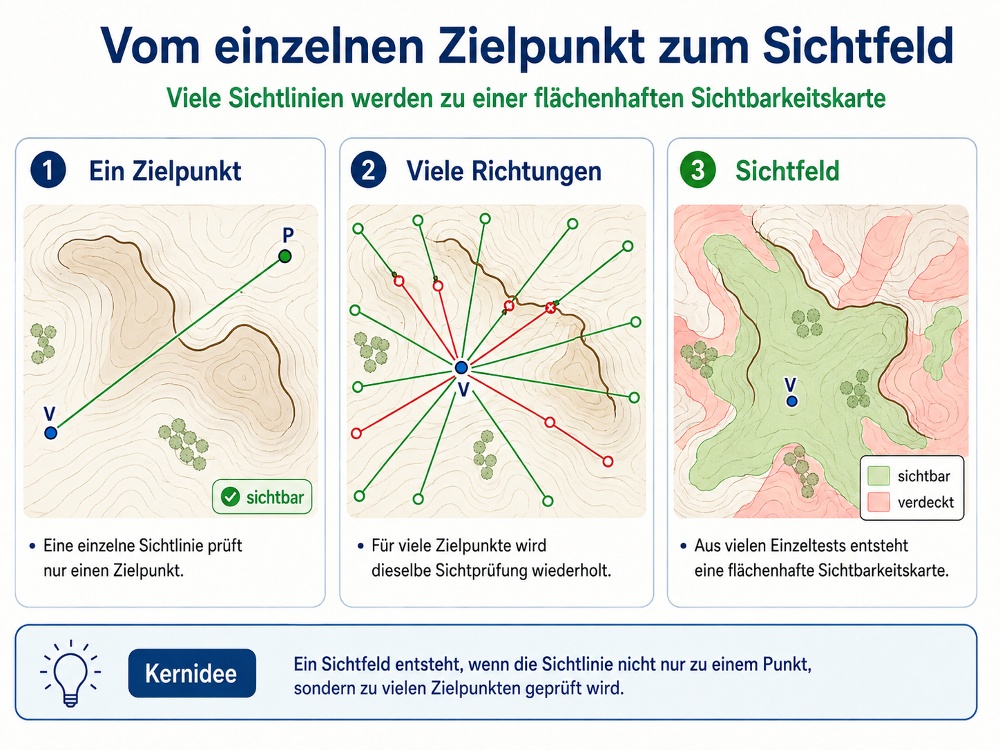{.fullfig}

::: {.fragment .overlay-note}
Ein Sichtfeld entsteht, wenn der Sichtlinientest für viele Zielpunkte oder Rasterzellen wiederholt wird.
:::

## Raster, TIN und Profilgewinnung

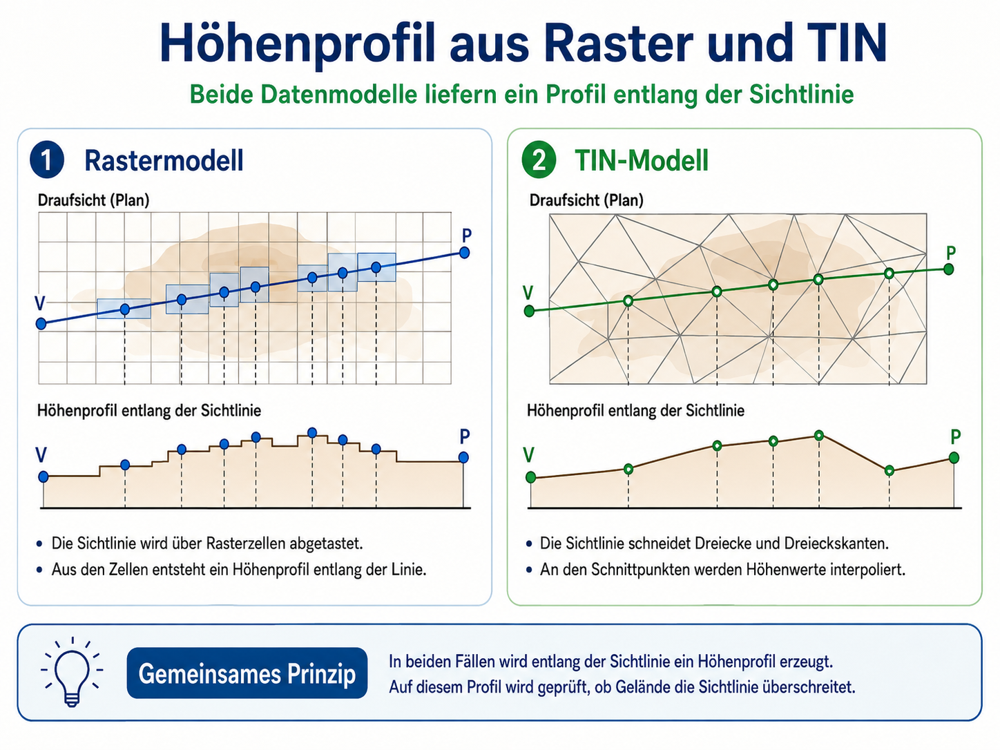{.fullfig}

::: {.fragment .overlay-note .right}
Raster und TIN unterscheiden sich in der Profilgewinnung. Der Sichtlinientest bleibt konzeptionell gleich.
:::

## Grenzen der Sichtbarkeitsanalyse

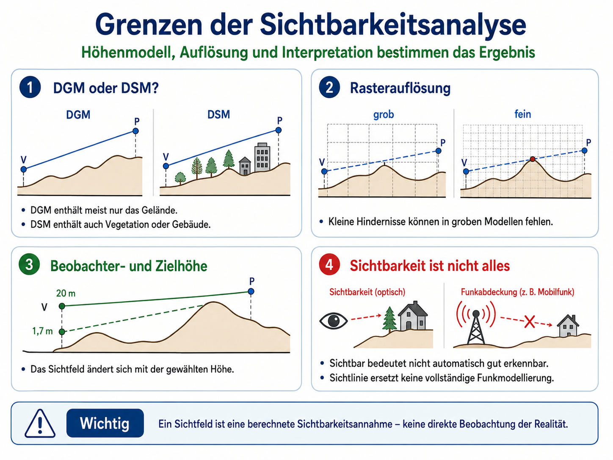{.fullfig}

::: {.fragment .overlay-note}
Das Ergebnis hängt von DGM/DSM, Auflösung, Beobachterhöhe, Zielhöhe und realen Hindernissen ab.
:::

## Sichtbarkeit ist nicht Wahrnehmung

Ein Sichtfeld zeigt berechnete geometrische Sichtbarkeit.

Es zeigt nicht automatisch:

```text
Erkennbarkeit | Aufmerksamkeit | Vegetationsdeckung | Funkabdeckung | atmosphärische Sicht
```

::: {.fragment .keyline}
Ein Sichtfeld ist eine berechnete Sichtbarkeitsannahme, keine direkte Beobachtung.
:::

## Prozessbasierte Ableitungen aus Höhenrastern

Reliefhydrologische Ableitungen nutzen eine einfache Annahme:

> Wasser folgt dem lokalen Gefälle.

::: {.fragment}
Daraus entstehen Fließrichtungsraster, Akkumulationsraster, potenzielle Gerinne und hydrologische Indexraster.
:::

## D8: lokale Fließrichtung

{.fullfig}

::: {.fragment .overlay-note}
D8 ordnet jeder Rasterzelle genau eine lokale Abflussrichtung zu. Das Ergebnis ist ein Richtungsraster, kein Gewässernetz.
:::

## D8-Gefälleformel

Für jede Nachbarzelle wird das lokale Gefälle berechnet:

$$
\tan(\beta) = \frac{\Delta z}{d}
$$

bzw.

$$
\beta = \arctan\left(\frac{\Delta z}{d}\right)
$$

::: {.fragment}
Direkte Nachbarn haben die Distanz $$d=a$$, diagonale Nachbarn $$d=a\sqrt{2}$$.
:::

## Flow Accumulation als Rasterwert

{.fullfig}

::: {.fragment .overlay-note .right}
Flow Accumulation ist ein Zellwert-Raster. Hohe Werte erscheinen als intensivere Rasterzellen, nicht als dicker werdende Flusslinien.
:::

## Akkumulation: rekursive Logik

Der akkumulierte Wert einer Zelle setzt sich aus Eigenbeitrag und oberliegenden Beiträgen zusammen:

$$
S(c_i) = s(c_i) + \sum_u S(c_u)
$$

::: {.fragment}
Gerinne entstehen erst durch Schwellenwertbildung auf diesem Raster, nicht als Primäroutput des Algorithmus.
:::

## Topographischer Feuchteindex

{.fullfig}

::: {.fragment .overlay-note}
Der TWI kombiniert beitragende Fläche und Hangneigung. Er zeigt potenziell feuchtere Reliefpositionen, keinen gemessenen Bodenwassergehalt.
:::

## TWI-Formel

$$
TWI = \ln\left(\frac{A_s}{\tan \beta}\right)
$$

::: {.fragment}
Der Index wird größer bei viel oberliegender beitragender Fläche und geringer lokaler Hangneigung.
:::

## SPI und STI

{.fullfig}

::: {.fragment .overlay-note .right}
SPI und STI nutzen Zufluss und Hangneigung, gewichten sie aber anders. Beide sind Indexraster, keine beobachteten Erosionskarten.
:::

## SPI und STI: Formeln

$$
SPI = A_s \cdot \tan \beta
$$

$$
STI =
\left(\frac{A_s}{22.13}\right)^{0.6}
\cdot
\left(\frac{\sin \beta}{0.0896}\right)^{1.3}
$$

::: {.fragment}
Ähnliche Muster entstehen, weil beide Indizes stark von beitragender Fläche und konzentriertem Abfluss geprägt werden.
:::

## Maximale Fließweglänge

{.fullfig}

::: {.fragment .overlay-note}
Gespeichert wird der längste flussaufwärts gelegene Weg bis zu einer Zelle, nicht die Summe aller Fließwege.
:::

## Gemeinsame Logik der Einheit

Alle Beispiele folgen derselben Grundstruktur:

```text
Primärdaten → Modellannahme → Operation → neues räumliches Produkt → Interpretation
```

::: {.fragment}
Voronoi: Punktlage → Näheannahme → Zuordnungsflächen  
Interpolation: Punktwerte → Schätzmodell → Oberfläche  
DGM: Höhe → lokale Ableitung → Geländeparameter  
Sichtbarkeit: Höhe → Sichtlinie → Sichtfeld  
Reliefhydrologie: Höhe → Gefälle → Prozessraster
:::

## Prüfregel für räumliche Ableitungen

Bei jeder räumlichen Ableitung muss gefragt werden:

```text
Welche Ausgangsdaten?
Welche Annahme?
Welche Operation?
Welche Parameter?
Welches Ergebnisprodukt?
Welche Aussagegrenze?
```

::: {.fragment .keyline}
Eine GIS-Analyse ist erst fachlich belastbar, wenn genau diese Kette transparent bleibt.
:::

## Übung: Ableitungen vergleichen

Wählen Sie drei Beispiele aus der Einheit und vergleichen Sie:

```text
Voronoi | Interpolation | DGM-Parameter | Sichtfeld | Flow Accumulation | TWI/SPI/STI
```

Beschreiben Sie jeweils:

- welche Ausgangsdaten verwendet werden,
- welche Annahme die Methode trifft,
- welches neue räumliche Produkt entsteht,
- welche Grenze die Interpretation hat.

## Abschluss

Räumliche Analyse erzeugt keine automatische Wahrheit.

Sie erzeugt nachvollziehbare, aber annahmenabhängige räumliche Ableitungen.

::: {.fragment .big .keyline}
Der fachliche Kern liegt nicht im Werkzeug, sondern in der begründeten Übersetzung von Frage, Daten, Operation und Interpretation.
:::
