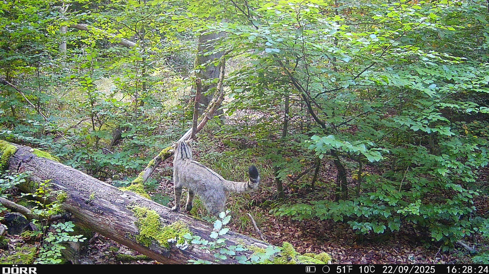
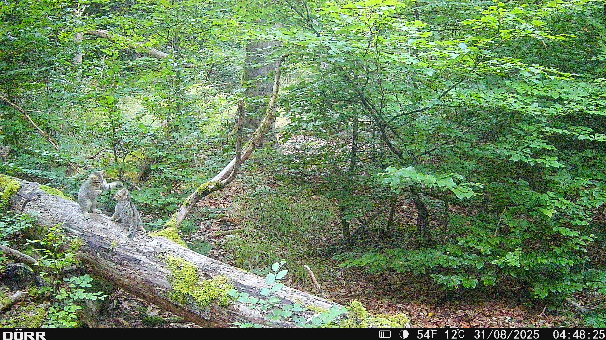
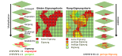
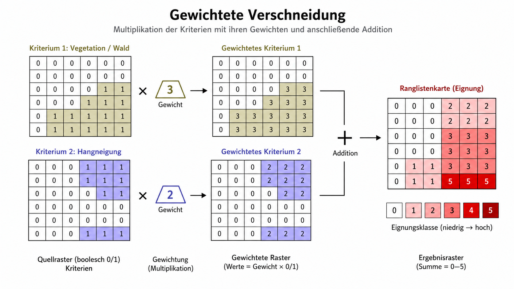
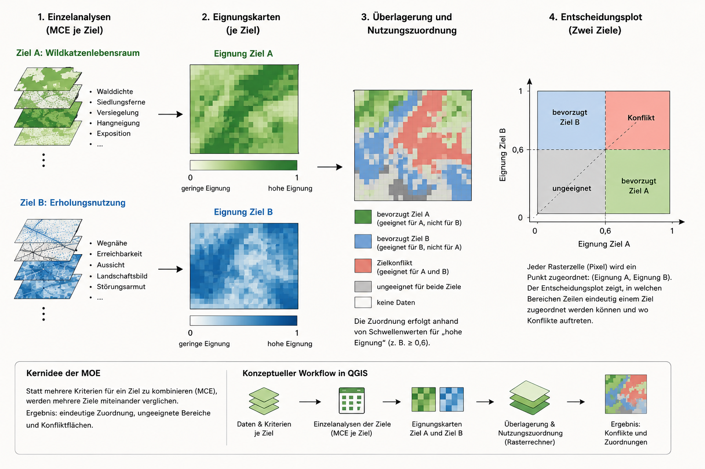
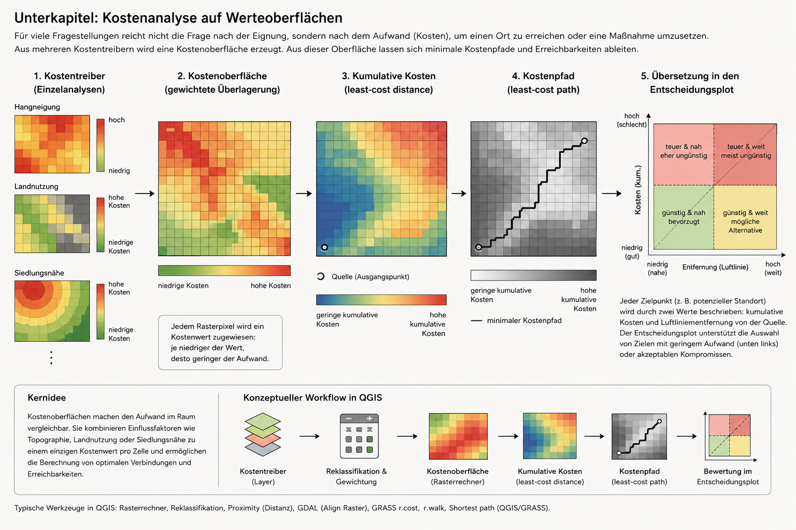

```{=html}
<style>
.reveal .slides section { text-align: left; }
.reveal h2 { letter-spacing: -0.02em; }
.reveal .big { font-size: 1.35em; line-height: 1.25; }
.reveal .small { font-size: .74em; color: #475569; }
.reveal .center { text-align: center; }
.reveal .r-stretch { max-width: 100%; max-height: 78vh; object-fit: contain; }
.reveal .fullfig { display: block; margin: 0 auto; width: 100%; max-height: 82vh; object-fit: contain; }
.reveal .fullfig-tall { display: block; margin: 0 auto; width: auto; max-width: 100%; height: 82vh; object-fit: contain; }
.reveal .photo-pair img { height: 68vh; width: 48%; object-fit: cover; border-radius: 14px; box-shadow: 0 8px 26px rgba(0,0,0,.22); }
.reveal .overlay-note {
  position: absolute;
  left: 4%;
  bottom: 5%;
  width: 52%;
  background: rgba(255,255,255,.92);
  border-left: 8px solid #2e7d32;
  padding: .6em .8em;
  font-size: .72em;
  box-shadow: 0 8px 28px rgba(0,0,0,.18);
}
.reveal .overlay-note.right { left: auto; right: 4%; }
.reveal .overlay-note.top { bottom: auto; top: 13%; }
.reveal .overlay-note.wide { width: 72%; }
.reveal .overlay-note.narrow { width: 40%; }
.reveal .keyline {
  border-left: 8px solid #1f6f5b;
  padding-left: .8em;
  margin-top: .8em;
}
.reveal .flow {
  font-family: ui-monospace, SFMono-Regular, Menlo, Consolas, monospace;
  font-size: .82em;
  line-height: 1.55;
  background: #f8fafc;
  border: 1px solid #d9e2ef;
  border-radius: 12px;
  padding: .85em 1em;
}
.reveal .card {
  background: #fff;
  border: 1px solid #d9e2ef;
  border-radius: 16px;
  padding: .8em .95em;
  box-shadow: 0 6px 18px rgba(15,23,42,.08);
}
.reveal code { font-size: .88em; }
.reveal pre code { max-height: 62vh; }
</style>
```

## Leitfrage der Sitzung

Räumliche Entscheidungsfindung beginnt dort, wo mehrere räumliche Kriterien nicht nur analysiert, sondern **bewertet, gewichtet und miteinander kombiniert** werden.

```text
räumliche Frage → Kriterien → Standardisierung → Gewichtung → Kombination → Interpretation
```

::: {.fragment .keyline}
Die Karte ist dabei kein neutrales Ergebnis. Sie ist die räumliche Form einer begründeten Bewertungslogik.
:::

## Lernziele

Nach der Sitzung sollten Sie erklären können,

- warum Eignungs- und Kostenkarten Entscheidungsmodelle sind,
- wie räumliche Kriterien operationalisiert und standardisiert werden,
- wie boolesche und gewichtete Verschneidungen funktionieren,
- warum Gewichte fachliche Annahmen sichtbar machen,
- wie aus einer Eignungskarte Zielkonflikte und Kostenfragen entstehen,
- welche Aussagegrenzen solche Karten besitzen.

## Warum räumliche Entscheidung?

Viele Planungsfragen sind räumlich und konfliktgeladen:

> Wo ist eine Fläche geeignet, ohne andere Ziele stark zu verletzen?

::: {.fragment}
Ein GIS kann solche Entscheidungen nicht ersetzen. Es kann aber Kriterien, Annahmen und Zielkonflikte räumlich sichtbar machen.
:::

::: {.fragment .keyline}
Entscheidend ist nicht nur, welche Karte entsteht, sondern welche Annahmen in der Karte stecken.
:::

## Von Analyse zu Bewertung

In Unit04 ging es vor allem um Ableitungen:

```text
Punktdaten → Interpolationsfläche
Höhenraster → Sichtfeld oder Fließrichtung
Distanzen → Nähe- oder Kostenoberflächen
```

::: {.fragment}
In Unit05 werden diese Ableitungen bewertet:

```text
Nähe → günstig oder ungünstig?
Hangneigung → geeignet oder problematisch?
Landnutzung → Kriterium, Ausschluss oder Widerstand?
```
:::

## Eignungsanalyse

Eine Eignungsanalyse sucht Räume, die eine Kombination bestimmter Eigenschaften erfüllen.

::: {.fragment .flow}
Waldnähe + Siedlungsferne + geringe Versiegelung + geeignete Reliefbedingungen
→ potenzielle Eignung
:::

::: {.fragment .keyline}
Eine Eignungskarte zeigt nicht „die Wahrheit“, sondern das Ergebnis einer räumlichen Bewertungsregel.
:::

## Eignung und Vulnerabilität

::: {layout-ncol="2"}

### Eignung

Hohe Werte bedeuten meist:

> hier passt die Fläche gut zum Ziel.

Beispiel: potenziell geeigneter Standort, Habitat, Nutzung, Korridor.

### Vulnerabilität / Gefahr

Hohe Werte bedeuten meist:

> hier ist die Fläche stärker betroffen oder gefährdet.

Beispiel: Lawinengefahr, Überflutungsrisiko, Erosionsanfälligkeit.

:::

::: {.fragment .keyline}
Die Richtung der Skala muss vor der Kombination eindeutig sein.
:::

## Wildkatzen im Marburger Uniwald

<div class="photo-pair">


</div>

::: {.fragment .overlay-note .wide}
Die Beobachtungen begründen das Beispiel. Die folgende Eignungsanalyse ist trotzdem keine Nachweiskarte und kein validiertes Habitatmodell.
:::

## Ausgangsfrage Wildkatze

Die fachliche Frage lautet nicht:

> Wo wurde eine Wildkatze fotografiert?

sondern:

> Wo könnten innerhalb des Untersuchungsraums Flächen liegen, die nach ausgewählten Kriterien eher geeignet oder eher ungeeignet sind?

::: {.fragment .keyline}
Aus Beobachtung wird Modellfrage. Aus Modellfrage wird Kriterienlogik.
:::

## Kriterienmodell

Für das Beispiel werden Kriterien als Proxys genutzt:

::: {layout-ncol="2"}

### Günstig

Walddichte / Deckung  
Siedlungsferne  
geeignete Reliefbedingungen

### Ausschluss oder Abwertung

versiegelte Flächen  
stark bebaute Bereiche  
störungsnahe Bereiche

:::

::: {.fragment .keyline}
Die Kriterien sind bewusst vereinfacht. Sie zeigen die GIS-Logik, nicht die vollständige Autoökologie der Wildkatze.
:::

## Von Kriterium zu Rasterwert

Eine Multikriterienanalyse braucht gemeinsame Skalen.

::: {.fragment .flow}
Rohdaten → räumlicher Parameter → Reklassifikation → standardisierter Kriterienwert
:::

Beispiel:

```text
Siedlungen → Distanz zur nächsten Siedlung → Störungsklassen → Eignungswert 0…1
```

::: {.fragment}
Erst dadurch können unterschiedliche Kriterien miteinander verrechnet werden.
:::

## Boolesche Verschneidung

{.fullfig}

::: {.fragment .overlay-note}
Bei boolescher Verschneidung gilt oft: Ein Ausschlusskriterium reicht, um eine Fläche aus dem Ergebnis zu entfernen.
:::

## Boolesche Logik

Wenn zwei Kriterien nur `0` oder `1` annehmen, kann Eignung als harte Bedingung formuliert werden:

$$
E = K_1 \times K_2
$$

::: {.fragment}
Nur wenn beide Kriterien erfüllt sind, bleibt die Fläche geeignet.
:::

::: {.fragment .keyline}
Vorteil: klar und transparent. Nachteil: hart, unempfindlich gegenüber Abstufungen.
:::

## Ranglisten statt Ausschluss

Statt harte Ausschlüsse zu erzeugen, können Kriterienwerte addiert werden:

$$
R = K_1 + K_2
$$

::: {.fragment}
Das Ergebnis ist keine Ja/Nein-Karte mehr, sondern eine einfache Rangfolge.
:::

::: {.fragment .keyline}
Damit beginnt der Übergang zur gewichteten Eignungsschätzung.
:::

## Von boolesch zu gewichtet

Viele räumliche Entscheidungen sind nicht hart binär.

Eine Fläche kann gering, mittel oder hoch geeignet sein. Dann werden Kriterien standardisiert und gewichtet kombiniert.

$$
E = \sum_i w_i \cdot K_i
$$

mit

$$
\sum_i w_i = 1
$$

## Gewichtete Kriterienaddition

{.fullfig}

::: {.fragment .overlay-note .right}
Gewichtung macht eine fachliche Entscheidung sichtbar: Nicht jedes Kriterium zählt gleich stark.
:::

## Beispielgewichte

Für das Wildkatzenbeispiel könnte eine einfache Gewichtung lauten:

```text
Walddichte        0.40
Siedlungsdistanz 0.30
Hangneigung      0.20
Exposition       0.10
```

::: {.fragment}
Die Gewichte ergeben zusammen 1 und können direkt im Rasterrechner verwendet werden.
:::

::: {.fragment .keyline}
Wichtig ist nicht, dass diese Gewichte „objektiv wahr“ sind. Wichtig ist, dass sie begründet und dokumentiert werden.
:::

## Rasterrechner als Modellformel

```qgis
(
  "walddichte_idx@1" * 0.40 +
  "siedlungsdistanz_idx@1" * 0.30 +
  "hangneigung_idx@1" * 0.20 +
  "exposition_idx@1" * 0.10
)
*
"einschraenkung_mask@1"
```

::: {.fragment .keyline}
Der Ausdruck ist die technische Form der Bewertungslogik.
:::

## Einschränkungsmaske

Eine Maske entscheidet, welche Flächen überhaupt bewertbar bleiben.

```text
1 = Fläche bleibt im Modell
0 = Fläche wird ausgeschlossen
```

::: {.fragment}
Beispiele: versiegelte Flächen, Gebäude, Wasserflächen, rechtliche Ausschlussgebiete.
:::

::: {.fragment .keyline}
Eine Maske ist keine Gewichtung. Sie verändert den Möglichkeitsraum des Modells.
:::

## Interpretation der Eignungskarte

Eine Eignungskarte muss doppelt gelesen werden:

::: {layout-ncol="2"}

### Was sie zeigt

räumliche Verteilung der modellierten Eignung  
relative Unterschiede zwischen Flächen  
Folgen der gewählten Kriterien und Gewichte

### Was sie nicht zeigt

tatsächliche Wildkatzenpräsenz  
validierte Habitatqualität  
vollständige ökologische Realität

:::

## AHP: Gewichte systematischer herleiten

Der Analytic Hierarchy Process ersetzt keine fachliche Entscheidung.

Er macht sie strukturierter:

```text
Kriterien paarweise vergleichen
→ Vergleichsmatrix erzeugen
→ Gewichte berechnen
→ Konsistenz prüfen
```

::: {.fragment .keyline}
AHP hilft bei der Dokumentation von Gewichtungen, macht aber unsichere Kriterien nicht automatisch belastbar.
:::

## Paarvergleich

Beispielhafte Frage im AHP:

> Ist Walddichte wichtiger als Siedlungsnähe?

::: {.fragment}
Bewertungsskala:

```text
1 = gleich wichtig
3 = etwas wichtiger
5 = deutlich wichtiger
7 = sehr stark wichtiger
9 = extrem wichtiger
```
:::

::: {.fragment}
Aus vielen Paarvergleichen entsteht eine Gewichtung.
:::

## Von MCE zu MOE

Eine Multi Criteria Evaluation bewertet mehrere Kriterien für **ein Ziel**.

```text
Ziel: Wildkatzenhabitat
Kriterien: Walddichte, Siedlungsferne, Hangneigung, Exposition
→ eine Eignungskarte
```

::: {.fragment}
Eine Multi Objective Evaluation vergleicht mehrere Ziele.

```text
Wildkatzenhabitat | Erholung | Forstwirtschaft
→ mehrere Eignungskarten und mögliche Zielkonflikte
```
:::

## Multi-Objective Evaluation

{.fullfig}

::: {.fragment .overlay-note .wide}
MOE macht sichtbar, wo Flächen eindeutig einem Ziel zugeordnet werden können und wo konkurrierende Eignungen auftreten.
:::

## Zielkonflikte als Ergebnis

Ein Konflikt ist kein Modellfehler.

::: {.fragment .flow}
hohe Eignung für Wildkatze + hohe Eignung für Erholung
→ planerischer Zielkonflikt
:::

::: {.fragment .keyline}
Gerade Konfliktflächen sind relevant, weil dort fachliche oder politische Abwägung notwendig wird.
:::

## Von Eignung zu Kosten

Eignung fragt:

> Wo ist etwas geeignet?

Kostenanalyse fragt:

> Wie aufwendig ist es, ein Ziel zu erreichen oder eine Verbindung herzustellen?

::: {.fragment}
Beide arbeiten mit Rasteroberflächen, aber die Bedeutung der Werte ist umgekehrt.
:::

## Kostenanalyse auf Werteoberflächen

{.fullfig}

::: {.fragment .overlay-note}
Hohe Werte bedeuten hier nicht „gut“, sondern hohen Aufwand, Widerstand oder geringe Durchlässigkeit.
:::

## Kostenoberfläche

Eine Kostenoberfläche kombiniert mehrere Kostentreiber:

$$
K = K_1 \cdot w_1 + K_2 \cdot w_2 + K_3 \cdot w_3 + \dots + K_n \cdot w_n
$$

::: {.fragment}
Beispiel:

$$
K = \text{Hangneigung} \cdot 0.4 + \text{Landnutzung} \cdot 0.4 + \text{Siedlungsnähe} \cdot 0.2
$$
:::

## Kumulative Kosten

Auf einer Kostenoberfläche zählt nicht die Luftlinie, sondern der aufsummierte Aufwand entlang eines Pfades.

$$
C_{\text{Pfad}} = \sum_i K_i
$$

::: {.fragment}
Der minimale Kostenpfad ist der Pfad mit der geringsten aufsummierten Kostenlast:

$$
C_{\text{min}} = \min \left( \sum_i K_i \right)
$$
:::

## Wildkatze: Eignung und Verbindung

Für das Wildkatzenbeispiel verschiebt die Kostenanalyse die Frage:

```text
Eignungskarte:
Wo liegen potenziell geeignete Lebensräume?

Kostenoberfläche:
Wie gut sind diese Lebensräume miteinander verbunden?
```

::: {.fragment .keyline}
Eine Fläche kann geeignet sein, aber durch Barrieren schlecht erreichbar oder stark isoliert.
:::

## Konzeptuelle Umsetzung in QGIS

Der Workflow bleibt eine Modellkette:

```text
Kostentreiber auswählen
→ Daten auf Raster bringen
→ Werte in Kosten übersetzen
→ Kostenraster gewichten und kombinieren
→ kumulative Kosten oder Kostenpfade berechnen
→ Ergebnis interpretieren
```

::: {.fragment}
Typische Werkzeuge: Rasterisieren, Hangneigung, Rasterdistanz, Reklassifikation, Rasterrechner, `r.cost`, `r.walk`, Least-cost path.
:::

## Zentrale Unterscheidung

::: {layout-ncol="2"}

### Eignung

hoher Wert = gut geeignet  
Frage: Wo passt die Fläche zum Ziel?

### Kosten

hoher Wert = hoher Widerstand  
Frage: Wie aufwendig ist Bewegung oder Verbindung?

:::

::: {.fragment .keyline}
Vor jeder Kombination muss klar sein, welche Richtung die Werte haben.
:::

## Ergebnis und Aussagegrenze

Eignungs- und Kostenkarten sind Entscheidungsunterstützung.

Sie liefern keine automatische Entscheidung.

::: {.fragment}
Sie zeigen:

```text
Daten + Kriterien + Gewichtung + Ausschlussregeln + Modellannahmen
```

als räumliches Ergebnis.
:::

::: {.fragment .keyline}
Eine gute Karte macht Annahmen sichtbar, statt sie zu verstecken.
:::

## Zusammenfassung

Unit05 verbindet vier Ebenen:

```text
Eignung
→ Welche Flächen passen zu einem Ziel?

Gewichtung
→ Welche Kriterien zählen stärker?

Zielkonflikt
→ Wo konkurrieren mehrere Ziele?

Kosten
→ Wie durchlässig oder widerständig ist der Raum?
```

## Arbeitsauftrag

Wählen Sie für ein kleines GIS-Projekt eine räumliche Entscheidungsfrage.

Formulieren Sie dazu:

```text
Ziel
Kriterien
Skalenrichtung
Gewichtung oder Ausschlusslogik
erwartete Karte
zentrale Aussagegrenze
```

::: {.fragment .keyline}
Der wichtigste Satz der Dokumentation lautet: Warum führt genau diese Kriterienlogik zu genau dieser Karte?
:::
