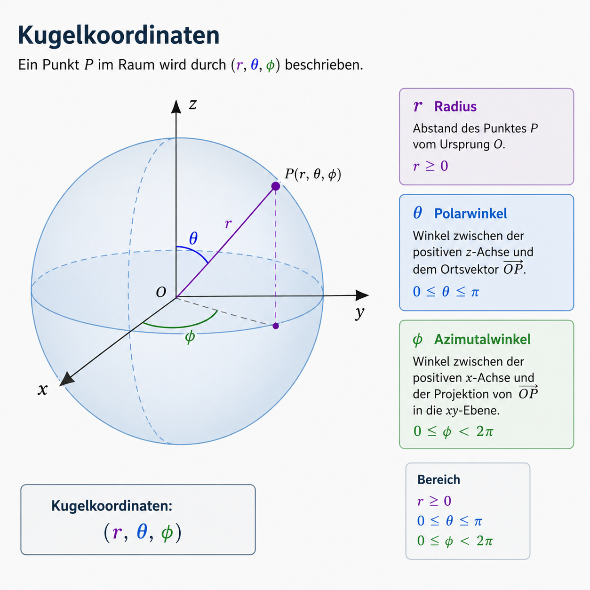
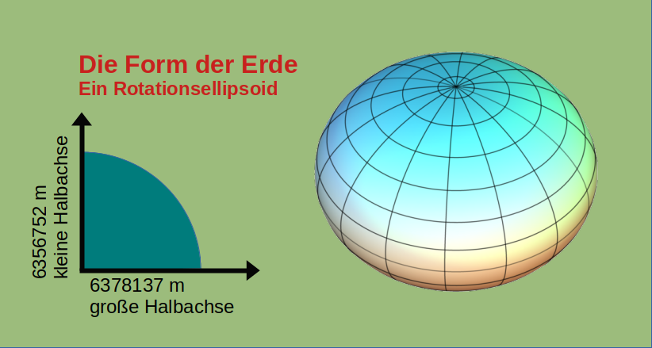

---
title: Die Vermessung der Welt - Geographische Koordinaten und Projektionen
title-block-banner: ../assets/images/01-splash.jpg
title-block-banner-color: black
format:
  html:
    other-links:
      - text: "Splash Source: Snow (1855):"
        href: https://w.wiki/QtV
bibliography: ../assets/geoinfo.bib

lang: de
comments: false
---

::: {.banner-credit}
Titelbild: Quelle nach [@snow].
:::


# Geographische Koordinaten 

Die vorstehenden Beispiele zeigen, wie mühsam und fehleranfällig die Orientierung an Objekten und ihren Namen ist. Sie zeigen auch, dass messbare, d.h. geometrisch maßstäbliche Bezugssysteme nicht unbedingt geographisch lokalisierbar sein müssen. Im Kapitel über Raumrepräsentationen wurde der Bogen von der abstrakten Definition des Raumes und seiner Objekte bis hin zur Repräsentation geographischer Informationen in spezifischen Datenobjekten gespannt. Nun geht es darum, diese beiden Konzepte zusammenzuführen.

Ein leistungsfähiges System zur Referenzierung von geographischen Räumen sollte unbedingt die folgenden grundlegenden Eigenschaften vereinen:

  - Skalenunabhängige Identifikation jedes Punktes auf der Erdoberfläche
  - Messbarkeit, d.h. mathematische Berechnungsvorschriften für alle geometrischen Operationen
  - Zuweisung aller beliebig skalierten Attribute (z.B. Name, Temperatur, Qualität)

Die Erde ist in erster Näherung eine Kugel. Daher ist es naheliegend, Punkte auf der Oberfläche durch Kugelkoordinaten zu definieren. Da die Oberfläche einer Kugel bekannt ist, genügen zur Bestimmung eines Punktes die beiden Winkel für den Azimut (geographische Länge) Lambda und den Zenit (geographische Breite) Phi (Abb. 03-07).





 
Überträgt man das Konzept der Kugelkoordinaten auf die Erde, so ergeben sich eine Reihe von Problemen. Das augenfälligste ist die Abplattung der Erde an den Polen, die durch die Erdrotation verursacht wird. Für die Längenbestimmung ist die Tatsache, dass die Erde ein Rotationsellipsoid mit großen und kleinen Halbachsen ist, unerheblich. Anders verhält es sich bei der Bestimmung der geographischen Breite, da sich die Halbachsen der Erde um ca. 21,4 km unterscheiden (Abb. 03-08).




Die Abbildung zeigt das Rotationsellipsoid der Erde mit kreisförmigen Breitenkreisen (in der Äquatorebene Radius der großen Halbachse) und Längenkreisen (kleine Halbachse an den Polen). Das daraus resultierende Maß für die Exzentrizität von ca. 1:298 gibt die Abplattung der Erde und damit die Streckenverschiebung bei der Bestimmung der sphärischen Koordinaten an. Das zentrale Problem der exakten Bestimmung der Erdoberfläche (im Sinne einer homogenen Oberfläche für die Berechnung der sphärischen Koordinaten) liegt nun in der Entscheidung, welche mathematische Darstellung eines Ellipsoids als geeignetes Modell für das reale Rotationsellipsoid der Erde verwendet wird.

Da es sich immer nur um eine Annäherung an die ideale Erdform bezogen auf ein bestimmtes Erdgebiet handelt, ist die Eignung des gewählten Ellipsoids als Referenz (Bezugsellipsoid) für die Berechnung der Vermessungsnetze (Koordinatensysteme) und der daraus abgeleiteten Projektionssysteme von entscheidender Bedeutung


# Ellipsoide und Bezugssysteme
 

In den letzten zwei Jahrhunderten wurden sehr unterschiedliche Referenzellipsoide entwickelt. Vor allem um regionale oder nationale Kartenwerke genauer erstellen zu können. Heute ist die Annäherung der Erdfigur an die geometrische Figur eines Ellipsoids relativ einfach durchzuführen. Um eine möglichst genaue Lage zu erhalten, werden alle gemessenen Punkte senkrecht auf das gewählte Bezugsellipsoid projiziert. Für kleinräumige Betrachtungen ist die erreichbare Genauigkeit völlig ausreichend. Besuchen Sie die offizielle [Online Datenbank für Bezugssysteme] (http://www.epsg.org). Navigieren Sie zum [EPSG Geodetic Parameter Set](http://www.epsg-registry.org) und suchen Sie nacheinander nach den Begriffen **Bessel**, **Clarke**, **Krassowski** und **WGS84**. Klicken Sie auf den View Link und vergleichen Sie die verfügbaren Parameter.

# Das geodätische Datum

Für kleinräumige Betrachtungen reicht es meist aus, Positionen auf ein Referenzellipsoid zu beziehen. Das Referenzellipsoid ist ein mathematisch geglättetes Erdmodell. Es beschreibt die Erde nicht in allen lokalen Schwere- und Höhenunterschieden, ist aber als Bezugsfläche für Koordinaten und Kartenprojektionen gut handhabbar.

Zu einem Ellipsoid gehört an jedem Punkt eine gedachte Senkrechte auf diese Bezugsfläche. Diese Senkrechte heißt **Ellipsoidnormale**. Sie ist die geometrisch definierte Normalrichtung des Referenzellipsoids und damit eine rein mathematische Richtung.

In der realen Erde fällt diese geometrische Senkrechte jedoch nicht immer mit der physikalischen Lotrichtung zusammen. Die tatsächliche Lotrichtung folgt dem lokalen Schwerefeld der Erde. Sie zeigt also in die Richtung, in der ein Lot unter dem Einfluss der Schwerkraft ausgerichtet wäre. Der Winkel zwischen der Ellipsoidnormalen und dieser wahren Lotrichtung heißt **Lotabweichung**.

Die Lotabweichung entsteht, weil die Masseverteilung der Erde räumlich ungleichmäßig ist. Gebirge, Tiefseegräben, Dichteunterschiede im Erdinneren und regionale Schwereanomalien beeinflussen die Richtung der Schwerkraft. Für einfache Karten und kleinräumige Anwendungen ist dieser Effekt meist vernachlässigbar. Für sehr genaue Vermessung, Satellitengeodäsie, Navigation oder geodynamische Fragestellungen muss er berücksichtigt werden.

Die physikalische Bezugsfläche des Erdschwerefeldes ist das **Geoid**. Es kann vereinfacht als die Fläche verstanden werden, auf der das Schwerepotential der Erde konstant ist und die ungefähr dem mittleren Meeresspiegel entspricht. Das Geoid folgt also dem Schwerefeld der Erde, während das Referenzellipsoid eine mathematisch geglättete Bezugsfläche ist.

![Abb. 03-10: Geoid, Referenzellipsoid und vereinfachte Erdfigur. Oben: Die Ellipsoidnormale steht senkrecht auf dem Referenzellipsoid. Die wahre Lotlinie folgt dagegen dem lokalen Schwerefeld. Der Winkel zwischen beiden Richtungen heißt Lotabweichung. Unten links: Schwerevariationen am Äquator führen zu Abweichungen zwischen idealisierter Referenzfläche und tatsächlicher Schwerefläche. Unten rechts: Die sogenannte Birnenform veranschaulicht stark vereinfacht, dass die reale Erdfigur vom glatten Ellipsoid abweicht. @gisma](../assets/images/unit01/geodesy_overview_geoid_and_ellipsoid_dynamics.png)

Das Geoid ist keine sichtbare Geländeoberfläche und auch keine realistische Form der Erde. Es ist eine Bezugsfläche des Schwerefeldes. Häufig wird es stark überhöht dargestellt, um die Abweichungen vom mathematisch geglätteten Erdmodell sichtbar zu machen. Die bekannte Darstellung als „Potsdamer Kartoffel“ zeigt daher nicht die tatsächliche Erdform, sondern visualisiert Geoidundulationen und Schwereanomalien.

{width="35%"}

Für genaue Koordinatenbestimmung müssen daher zwei Ebenen unterschieden werden. Das **Ellipsoid** liefert die mathematische Bezugsfläche für Lagekoordinaten und Kartenprojektionen. Das **Geoid** beschreibt die physikalische Höhen- und Schwerereferenz. Beide Bezugskörper sind nicht identisch. Genau aus dieser Differenz entstehen Korrekturen, die in der höheren Geodäsie, bei präziser Vermessung, Satellitengeodäsie, Navigation oder geodynamischen Fragestellungen berücksichtigt werden müssen.

In der klassischen Vermessung wurde ein Referenzellipsoid häufig so gelagert, dass es für ein bestimmtes Gebiet möglichst gut zur realen Erdfigur passte. Dazu wurde ein **Fundamentalpunkt** festgelegt. Dieser Punkt definiert, wie das Ellipsoid relativ zur Erde positioniert und orientiert wird. Die Kombination aus Referenzellipsoid, Lagerung und Fundamentalpunkt bildet das **geodätische Datum**.

Ein geodätisches Datum ist damit nicht einfach „ein Koordinatensystem“. Es legt fest, auf welchen Bezugskörper sich Koordinaten beziehen und wie dieser Bezugskörper zur realen Erde gelagert ist. Erst dadurch werden Koordinaten eindeutig interpretierbar.


## Vom geodätischen Datum zum geodätischen Referenzsystem

Ein geodätisches Datum legt fest, wie ein Referenzellipsoid zur realen Erde gelagert ist. Historisch wurden solche Datums häufig regional optimiert. Das Ellipsoid wurde also so verschoben und orientiert, dass es in einem bestimmten Gebiet möglichst gut zur dort relevanten Erdfigur passte. Dadurch konnten lokale und regionale Vermessungen sehr genau sein, auch wenn das Ellipsoid global nicht optimal zur gesamten Erde passte.

Mit satellitengestützter Vermessung änderte sich diese Logik. Globale Navigations- und Vermessungssysteme benötigen keinen regional eingepassten Bezugskörper, sondern ein weltweit einheitliches Bezugssystem. Deshalb spricht man heute häufig nicht nur von einem geodätischen Datum, sondern von einem **geodätischen Referenzsystem**.

Das bekannteste Beispiel ist **WGS 84**. Es ist ein globales geodätisches Bezugssystem und bildet die Grundlage vieler GPS-Positionsangaben. Im Unterschied zu älteren regionalen Datums ist WGS 84 global konstruiert: Das Referenzellipsoid ist so gewählt und gelagert, dass es die Erde insgesamt möglichst gut annähert.


Die Abbildung zeigt den Kern des Problems: Es reicht nicht, nur die Form des Ellipsoids zu kennen. Entscheidend ist auch, **wo** dieses Ellipsoid relativ zur Erde liegt und **wie** es orientiert ist. Für die Umrechnung zwischen unterschiedlichen Bezugssystemen werden Transformationsparameter benötigt. Dazu gehören Verschiebungen entlang der Raumachsen, Rotationen und gegebenenfalls ein Maßstabsfaktor.

In der Praxis bedeutet das: Zwei Koordinaten können numerisch ähnlich aussehen, aber auf unterschiedlichen Bezugssystemen beruhen. Dann bezeichnen sie nicht zwingend exakt denselben Ort. Deshalb ist bei Geodaten nicht nur die Projektion wichtig, sondern auch das zugrunde liegende geodätische Datum beziehungsweise Referenzsystem.

## Übergang zu Kartenprojektionen

Erst wenn der geodätische Bezug geklärt ist, kann sinnvoll projiziert werden. Das geodätische Datum oder Referenzsystem beantwortet die Frage, **auf welchen Bezugskörper sich Koordinaten beziehen**. Die Kartenprojektion beantwortet dagegen eine andere Frage: **Wie wird die gekrümmte Bezugsfläche in eine ebene Karte übertragen?**

Damit sind Datum und Projektion zwei verschiedene Ebenen derselben Georeferenzierung. Das Datum legt den räumlichen Bezug zur Erde fest. Die Projektion legt fest, wie dieser Bezug in einem ebenen Koordinatensystem dargestellt und berechnet wird.

# Kartenprojektionen in GI-Systemen

Geographische Längen- und Breitengrade beschreiben Positionen auf einer gekrümmten Bezugsfläche der Erde. Diese Bezugsfläche ist je nach Modell eine Kugel oder genauer ein Referenzellipsoid. Die Lage eines Punktes wird dabei nicht durch ebene x- und y-Werte angegeben, sondern durch Winkel: geographische Länge und geographische Breite.

Für viele Anwendungen in GI-Systemen reicht diese Form der Positionsangabe allein nicht aus. Analysen, Kartenlayouts, Rasterdaten, Luftbilder, Satellitenbilder und viele Distanz- oder Flächenberechnungen arbeiten in einer zweidimensionalen Ebene. Deshalb müssen geographische Koordinaten häufig in ein ebenes kartesisches Koordinatensystem übertragen werden.

Eine **Kartenprojektion** ist das mathematische Verfahren, mit dem Positionen von der gekrümmten Erdoberfläche auf eine ebene Karte übertragen werden. Vereinfacht geschieht dies in zwei Schritten:

1. Auswahl eines geeigneten geodätischen Bezugsmodells, also Datum beziehungsweise Referenzsystem und Ellipsoid.
2. Transformation der geographischen Koordinaten in ebene Koordinaten, zum Beispiel Rechtswert und Hochwert.

Im ebenen Koordinatensystem wird ein Punkt durch x- und y-Koordinaten lokalisiert. In der amtlichen Vermessung und in vielen GI-Systemen spricht man häufig von **Rechtswert** und **Hochwert**. Erst dadurch lassen sich viele Operationen praktisch durchführen, etwa Distanzmessungen, Flächenberechnungen, Rasteranalysen oder kartographische Darstellungen.

Kartenprojektionen sind immer mit Verzerrungen verbunden. Es gibt keine verzerrungsfreie Übertragung der gekrümmten Erdoberfläche in eine zweidimensionale Karte. Je nach Projektion werden bestimmte Eigenschaften erhalten und andere verzerrt.

Wichtige Abbildungseigenschaften sind:

* **längentreu**: bestimmte Entfernungen werden maßstäblich richtig dargestellt,
* **flächentreu**: Flächeninhalte bleiben im Maßstab erhalten,
* **winkeltreu**: Winkel und lokale Formen werden korrekt dargestellt,
* **vermittelnd**: Kompromiss zwischen mehreren Verzerrungseigenschaften.


Keine Projektion kann gleichzeitig überall längentreu, flächentreu und winkeltreu sein. Deshalb hängt die Wahl der Projektion immer von der Fragestellung ab. Für Flächenvergleiche ist eine flächentreue Projektion sinnvoll. Für Navigation oder lokale Richtungen kann Winkeltreue entscheidend sein. Für kleinräumige Analysen wird häufig eine Projektion gewählt, die im Untersuchungsgebiet möglichst geringe Verzerrungen erzeugt.

::: {.callout-tip icon="false" appearance="simple"}
Die Wahl der Projektion hängt vom Ziel der Analyse ab. Für räumliche Analysen muss eine Projektion gewählt werden, deren Verzerrungen zur Fragestellung passen. Es reicht nicht, dass die Karte „richtig aussieht“.
:::


## Warum das in QGIS wichtig ist

In QGIS treffen häufig Daten aus unterschiedlichen Quellen aufeinander. Diese Daten können auf unterschiedlichen geodätischen Bezugssystemen beruhen und zusätzlich in unterschiedlichen Projektionen gespeichert sein. QGIS kann solche Layer oft trotzdem gemeinsam anzeigen. Diese gemeinsame Anzeige bedeutet aber nicht automatisch, dass Messungen, Flächenberechnungen oder Rasteranalysen fachlich korrekt sind.

Der vorherige Abschnitt hat gezeigt: Koordinaten beziehen sich nie einfach auf „die Erde an sich“. Sie beziehen sich auf ein festgelegtes Referenzellipsoid. Dieses Ellipsoid ist eine mathematisch vereinfachte Erdform. Ein geodätisches Datum beziehungsweise Referenzsystem legt fest, welches Ellipsoid verwendet wird und wie es relativ zur realen Erde positioniert und ausgerichtet ist. Die Begriffe lassen sich daher als Kette lesen:

>reale Erde
→ geodätisches Bezugssystem / Datum
→ Referenzellipsoid
→ Projektion
→ ebene Kartenkoordinaten


| Schritt | Was wird festgelegt? | Beispiel |
|---|---|---|
| Referenzellipsoid | vereinfachte mathematische Erdform, auf der Länge und Breite berechnet werden können | WGS84-Ellipsoid, GRS80 |
| geodätisches Datum / Referenzsystem | welches Referenzellipsoid für die Koordinaten verwendet wird und wie es zur realen Erde ausgerichtet ist | WGS 84, ETRS89 |
| Projektion | wie die gekrümmte Ellipsoidfläche in eine ebene Karte übertragen wird | UTM, Gauß-Krüger, Lambert |
| ebene Kartenkoordinaten | wie Punkte in der Karte als x/y-Werte angegeben werden | Rechtswert / Hochwert |

Beispiel:

```text
ETRS89 / UTM Zone 32N
= Referenzsystem: ETRS89
+ Ellipsoid: GRS80
+ Projektion: UTM Zone 32N
+ Koordinaten: Rechtswert / Hochwert in Metern
```

Dagegen liegen viele GPS-Daten zunächst als geographische Koordinaten vor:

```text
WGS 84
= geodätisches Referenzsystem: WGS 84
+ Referenzellipsoid: WGS84-Ellipsoid
+ Koordinatenform: geographische Länge / Breite
+ Einheit: Grad
+ keine ebene Kartenprojektion
```

Das bedeutet: Ein GPS-Punkt (Marburg) mit den Werten `50.81, 8.77` ist keine Position in Metern auf einer Karte. Die Werte sind Winkelangaben auf dem WGS84-Ellipsoid: Breite und Länge in Grad. Für eine reine Positionsangabe reicht das aus. Für viele GIS-Operationen wie Flächenberechnung, Distanzmessung, Rasteranalyse oder lokale Kartendarstellung werden diese Koordinaten aber häufig in ein projiziertes Koordinatensystem umgerechnet.

Für Marburg wäre ein typischer Arbeitsschritt daher:

```text
WGS 84 Länge / Breite in Grad
→ Umprojektion nach ETRS89 / UTM Zone 32N
→ Rechtswert / Hochwert in Metern
```

Der Unterschied ist also:

| Koordinatenform           |     Beispielwerte | Einheit | Typische Nutzung                                    |
| ------------------------- | ----------------: | ------- | --------------------------------------------------- |
| geographische Koordinaten |     `50.81, 8.77` | Grad    | globale Positionsangabe, GPS, Webdaten              |
| projizierte Koordinaten   | `477000, 5630000` | Meter   | lokale Analyse, Messen, Flächen, Rasterverarbeitung |

Wichtig ist: `WGS 84` bedeutet zunächst ein geodätisches Referenzsystem. Es kann mit geographischen Koordinaten in Grad verwendet werden. Es kann aber auch in Projektionen eingebunden werden, zum Beispiel Web Mercator. Deshalb sollte man nicht nur auf den Namen des Bezugssystems schauen, sondern prüfen, ob der Layer in **Grad** oder in **Meterkoordinaten** vorliegt.


## Übung

::: {.callout-tip icon="false" appearance="simple"}

Besuchen Sie die folgende interaktive Webseite [Kartenprojektionen](https://map-projections.net/compare.php) und machen Sie sich interaktiv ein Bild von den Eigenschaften und Auswirkungen der verschiedenen Kartenprojektionen. Betrachten Sie zumindest die folgenden Netzprojektionen:

  * Lambert-konforme Schnittkegelprojektion
  * Lambert'sche Azimutalprojektion
  * Normale und transversale Mercator-Projektion
  * Mollweide-Projektion
  * Robinson-Projektion

:::