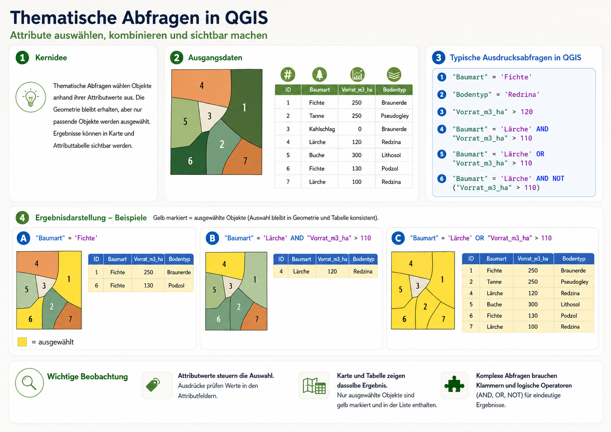
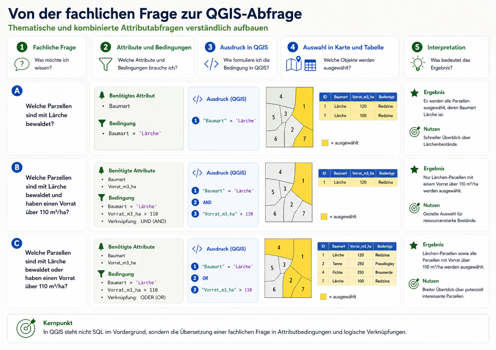
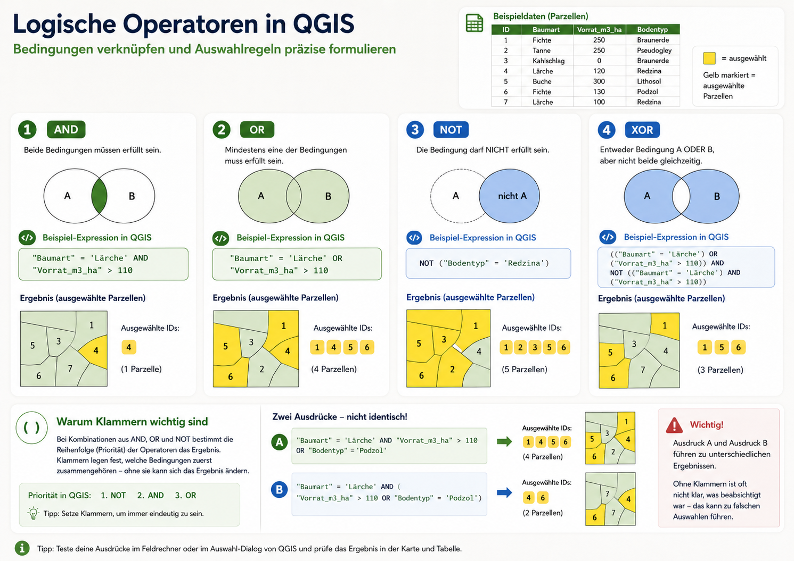

Thematische Abfragen führen zu einer Auswahl von Geoobjekten auf Grundlage ihrer **Attributwerte**. Es handelt sich also um **nicht raumbezogene** Abfragen, bei denen nicht die Lage, sondern die in der Attributtabelle gespeicherten Eigenschaften der Objekte ausgewertet werden. Typische Fragen sind zum Beispiel: *Welche Parzellen sind mit Lärche bewaldet?* oder *Welche Parzellen haben einen Vorrat über 110 m³/ha?*

In QGIS werden solche Abfragen in der Regel nicht über klassisches SQL, sondern über den **Ausdruckseditor** formuliert. Dabei werden Attributfelder, Vergleichsoperatoren und logische Verknüpfungen kombiniert. Die Ergebnisse erscheinen konsistent in **Karte und Attributtabelle**.

## Grundprinzip thematischer Abfragen

Die folgenden Beispiele beziehen sich auf einen kleinen Beispieldatensatz aus Parzellengeometrie und Attributtabelle. Die Abfragen prüfen jeweils bestimmte Attributwerte und markieren diejenigen Objekte, die die formulierte Bedingung erfüllen.

## Von der fachlichen Frage zur QGIS-Abfrage

Der zentrale Schritt besteht darin, eine fachliche Frage in eine **formale Bedingung** zu übersetzen. Dazu müssen zunächst die relevanten Attribute identifiziert werden. Anschließend wird daraus ein passender Ausdruck formuliert.

Beispielsweise wird aus der Frage *Welche Parzellen sind mit Lärche bewaldet?* die Bedingung:

`"Baumart" = 'Lärche'`

Eine komplexere Frage wie *Welche Parzellen sind mit Lärche bewaldet und haben einen Vorrat über 110 m³/ha?* erfordert dagegen zwei Bedingungen und eine logische Verknüpfung:

`"Baumart" = 'Lärche' AND "Vorrat_m3_ha" > 110`

Die folgende Abbildung zeigt diesen Weg systematisch – von der fachlichen Frage über die benötigten Attribute und Bedingungen bis zur eigentlichen Auswahl in Karte und Tabelle.

## Vergleichsoperatoren

Vergleichsoperatoren prüfen einzelne Attributwerte. Sie bilden die Grundlage jeder thematischen Abfrage.

Typische Vergleichsoperatoren in QGIS sind:

- `=` gleich
- `<>` ungleich
- `>` größer als
- `<` kleiner als
- `>=` größer oder gleich
- `<=` kleiner oder gleich

Beispiele:

- `"Baumart" = 'Fichte'`
- `"Bodentyp" = 'Redzina'`
- `"Vorrat_m3_ha" > 120`

Mit diesen Operatoren lassen sich einfache thematische Abfragen direkt formulieren. Sie prüfen immer genau eine Bedingung.

## Logische Operatoren

Sobald mehrere Bedingungen gemeinsam ausgewertet werden sollen, kommen **logische Operatoren** ins Spiel. Sie verknüpfen einzelne Aussagen zu komplexeren Auswahlregeln.

### AND

`AND` bedeutet: **Beide Bedingungen müssen erfüllt sein.**

Beispiel:

`"Baumart" = 'Lärche' AND "Vorrat_m3_ha" > 110`

Diese Abfrage wählt nur solche Parzellen aus, die **gleichzeitig** Lärchenbestände sind und einen Vorrat über 110 m³/ha haben.

### OR

`OR` bedeutet: **Mindestens eine der Bedingungen muss erfüllt sein.**

Beispiel:

`"Baumart" = 'Lärche' OR "Vorrat_m3_ha" > 110`

Damit werden alle Parzellen ausgewählt, die entweder Lärche tragen oder einen Vorrat über 110 m³/ha besitzen.

### NOT

`NOT` negiert eine Bedingung.

Beispiel:

`NOT ("Bodentyp" = 'Redzina')`

Diese Abfrage wählt alle Parzellen aus, deren Bodentyp **nicht** Redzina ist.

### XOR

`XOR` bedeutet: **Genau eine** der beiden Bedingungen ist erfüllt, aber **nicht beide gleichzeitig**.

Beispiel:

`(("Baumart" = 'Lärche') OR ("Vorrat_m3_ha" > 110)) AND NOT (("Baumart" = 'Lärche') AND ("Vorrat_m3_ha" > 110))`

Didaktisch ist XOR nützlich, um exklusive Auswahlregeln zu verdeutlichen. In der Praxis wird häufiger mit Kombinationen aus `AND`, `OR` und `NOT` gearbeitet.

Die folgende Abbildung fasst die wichtigsten logischen Operatoren in QGIS zusammen und zeigt ihre Wirkung auf die Auswahl.

## Klammern und Prioritäten

Bei komplexeren Abfragen ist die **Reihenfolge der Auswertung** entscheidend. Klammern legen fest, welche Bedingungen zuerst zusammengefasst werden. Ohne Klammern kann derselbe Ausdruck zu einem anderen Ergebnis führen.

In QGIS gilt für logische Operatoren in der Regel folgende Priorität:

1. `NOT`
2. `AND`
3. `OR`

Deshalb sollte bei kombinierten Ausdrücken mit mehreren logischen Operatoren möglichst immer mit **Klammern** gearbeitet werden.

Beispiel:

- Ohne Klammern:  
  `"Baumart" = 'Lärche' AND "Vorrat_m3_ha" > 110 OR "Bodentyp" = 'Podzol'`

- Mit Klammern:  
  `"Baumart" = 'Lärche' AND ("Vorrat_m3_ha" > 110 OR "Bodentyp" = 'Podzol')`

Beide Ausdrücke sehen ähnlich aus, führen aber nicht zwingend zur selben Auswahl.

## Kernpunkt

Thematische Abfragen in QGIS bestehen nicht einfach aus „Befehlen“, sondern aus der **Übersetzung fachlicher Fragen in Attributbedingungen und logische Verknüpfungen**. Entscheidend ist daher, die Abfrage inhaltlich sauber zu formulieren und das Ergebnis anschließend in Karte und Tabelle zu kontrollieren.

## Übung

::: {.callout-tip icon="false" appearance="simple"}
Betrachten Sie den folgenden QGIS-Ausdruck:

`("Überschirmung" > 80 AND "Vorrat_m3_ha" > 110) OR "Baumart" = 'Lärche'`

- Wie viele **Vergleichsoperatoren** können Sie identifizieren?
- Wie viele **logische Operatoren** kommen vor?
- Formulieren Sie den Ausdruck in eine normale fachliche Frage um.
- Welche Objekte würden ausgewählt: nur sehr dichte Bestände, nur Lärchenbestände oder eine Kombination aus beidem?
- Wie würde sich das Ergebnis ändern, wenn zusätzliche Klammern gesetzt würden?
:::

