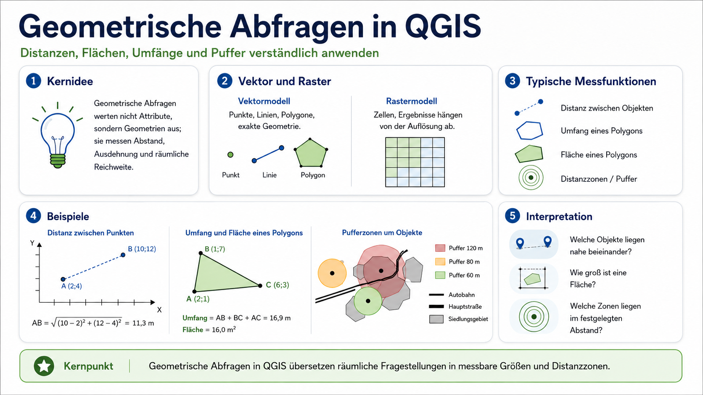
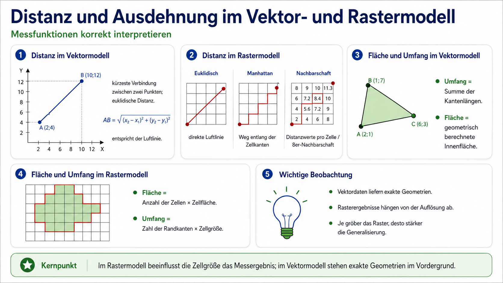
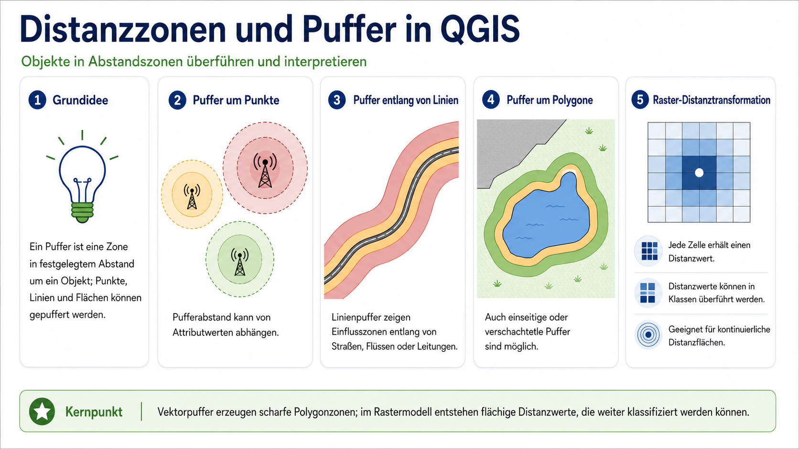
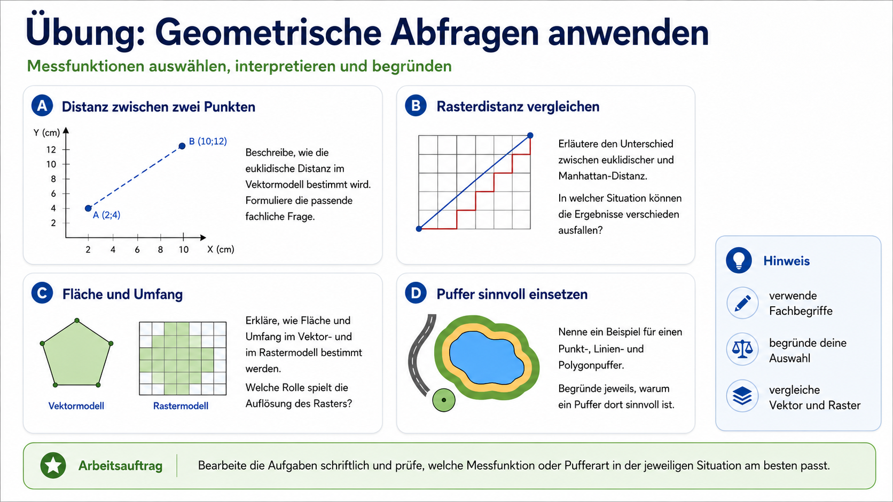

Geometrische Abfragen werten nicht die Attributwerte eines Geoobjekts aus, sondern seine Geometrie. Sie messen zum Beispiel Abstände zwischen Objekten, die Länge einer Linie, den Umfang einer Fläche, die Fläche eines Polygons oder die räumliche Reichweite um ein Objekt.

Damit unterscheiden sich geometrische Abfragen deutlich von thematischen Abfragen. Bei einer thematischen Abfrage lautet die Frage zum Beispiel: *Welche Parzellen haben die Baumart Lärche?* Bei einer geometrischen Abfrage lautet die Frage eher: *Wie weit liegen zwei Objekte auseinander?*, *Wie groß ist eine Fläche?* oder *Welche Bereiche liegen innerhalb von 100 m Abstand zu einer Straße?*

Wichtig ist dabei die Unterscheidung zwischen Vektor- und Rasterdaten. Im Vektormodell werden Punkte, Linien und Polygone als geometrische Objekte beschrieben. Im Rastermodell wird der Raum dagegen in Zellen zerlegt. Dadurch hängen Messergebnisse im Rastermodell immer auch von der Zellgröße ab.



## Distanz und Ausdehnung

Geometrische Messungen können im Vektormodell und im Rastermodell unterschiedlich funktionieren. Im Vektormodell stehen die exakten Koordinaten der Geometrien im Vordergrund. Im Rastermodell werden dagegen Zellen ausgewertet. Dadurch können sich Messergebnisse je nach Rasterauflösung unterscheiden.

Für metrische Distanzen und Flächen muss in QGIS ein geeignetes projiziertes Koordinatensystem verwendet werden. Liegen Daten nur in geographischen Koordinaten vor, also in Längen- und Breitengraden, sind die Werte nicht direkt als Meter oder Quadratmeter interpretierbar.



### Distanz im Vektormodell

Im Vektormodell wird die Distanz zwischen zwei Punkten als kürzeste Verbindung zwischen diesen Punkten berechnet. Diese kürzeste Verbindung entspricht der euklidischen Distanz, also der direkten Luftlinie.

Für zwei Punkte mit den Koordinaten $$A(x_1, y_1)$$ und $$B(x_2, y_2)$$ ergibt sich die Distanz aus:

$$
AB = \sqrt{(x_2 - x_1)^2 + (y_2 - y_1)^2}
$$

In QGIS kann eine solche Distanz zum Beispiel über Messwerkzeuge, Geometrieausdrücke oder Analysewerkzeuge bestimmt werden. Fachlich geht es dabei immer um die Frage, wie weit zwei Objekte im Raum voneinander entfernt liegen.

### Distanz im Rastermodell

Im Rastermodell wird Distanz nicht zwischen frei liegenden Koordinatenpunkten gemessen, sondern über Rasterzellen angenähert. Dafür gibt es verschiedene Metriken.

Die euklidische Distanz beschreibt die direkte Luftlinie zwischen zwei Positionen. Die Manhattan-Distanz folgt dagegen nur den Zellkanten, also horizontalen und vertikalen Schritten. Nachbarschaftsbasierte Distanzen berücksichtigen zusätzlich, welche Zellen direkt oder diagonal benachbart sind.

Diese Unterschiede sind nicht nur rechnerisch. Sie verändern auch die fachliche Interpretation. Eine Luftliniendistanz passt gut für direkte Reichweiten, zum Beispiel Sichtbarkeit oder theoretische Nähe. Eine Manhattan-Distanz passt eher zu Bewegungen entlang rechtwinkliger Strukturen, etwa in einem Straßengitter. Nachbarschaftsdistanzen sind besonders relevant, wenn Ausbreitungen zellweise modelliert werden.

### Fläche und Umfang im Vektormodell

Im Vektormodell wird der Umfang eines Polygons aus der Summe seiner Kantenlängen berechnet. Die Fläche ergibt sich aus der geometrisch umschlossenen Innenfläche.

In QGIS können solche Werte zum Beispiel über den Feldrechner erzeugt werden. Typische Ausdrücke sind:

```qgis
$area
```

für die Fläche eines Polygons,

```qgis
$perimeter
```

für den Umfang eines Polygons und

```qgis
$length
```

für die Länge einer Liniengeometrie.

Die Werte sind nur dann sinnvoll interpretierbar, wenn das Projekt beziehungsweise der Layer in einem passenden metrischen Koordinatensystem vorliegt.

### Fläche und Umfang im Rastermodell

Im Rastermodell wird Fläche über die Anzahl der beteiligten Zellen berechnet. Wenn eine Zelle zum Beispiel eine Fläche von 25 m² repräsentiert und ein Objekt aus 40 Zellen besteht, ergibt sich eine Rasterfläche von 1000 m².

Allgemein gilt:

$$
A_\text{Raster} = n_\text{Zellen} \cdot A_\text{Zelle}
$$

Der Umfang wird im Rastermodell über Randkanten angenähert. Dabei wird gezählt, wie viele Zellkanten das Objekt nach außen begrenzen. Diese Anzahl wird mit der Zellgröße multipliziert:

$$
U_\text{Raster} = n_\text{Randkanten} \cdot s_\text{Zelle}
$$

Dadurch ist der Umfang im Rastermodell meist stärker von der Auflösung abhängig als im Vektormodell. Grobe Raster können kleine Einbuchtungen, schmale Formen oder gekrümmte Grenzen nur vereinfacht abbilden.

## Distanzzonen und Puffer

Eine wichtige Anwendung geometrischer Abfragen ist die Bildung von Distanzzonen. Dabei wird gefragt, welche Bereiche innerhalb eines bestimmten Abstands zu einem Objekt liegen.

Im Vektormodell wird dafür meist der Begriff **Puffer** verwendet. Ein Puffer erzeugt eine neue Polygonfläche in einem festgelegten Abstand um ein Ausgangsobjekt. Dieses Ausgangsobjekt kann ein Punkt, eine Linie oder ein Polygon sein.



### Puffer um Punkte

Ein Punktpuffer erzeugt eine Kreisfläche um einen Punkt. Das ist zum Beispiel sinnvoll, wenn Reichweiten oder Einzugsbereiche modelliert werden sollen.

Beispiele sind:

* Einzugsbereiche um Haltestellen
* Reichweiten um Mobilfunkantennen
* Suchbereiche um Fundpunkte
* Mindestabstände um Gefahrenpunkte

Der Pufferabstand kann konstant sein oder von einem Attributwert abhängen. Eine Antenne mit höherer Sendeleistung kann zum Beispiel einen größeren Puffer erhalten als eine Antenne mit niedrigerer Sendeleistung.

### Puffer entlang von Linien

Ein Linienpuffer erzeugt eine Zone entlang einer Linie. Das ist typisch für Straßen, Flüsse, Leitungen oder Wege.

Beispiele sind:

* Lärmbereiche entlang von Straßen
* Schutzstreifen entlang von Gewässern
* Einzugsbereiche entlang von Wegen
* Sicherheitsabstände entlang von Leitungen

Dabei muss klar bleiben: Ein Puffer ist zunächst nur eine geometrische Abstandzone. Er ist noch kein vollständiges Wirkungsmodell. Ein Lärmpuffer zeigt zum Beispiel eine angenommene Zone um eine Straße, ersetzt aber keine vollständige Ausbreitungsrechnung mit Gelände, Bebauung, Verkehrsdichte und Abschirmung.

### Puffer um Polygone

Auch Flächen können gepuffert werden. Ein Polygonpuffer erzeugt eine Zone innerhalb oder außerhalb einer bestehenden Fläche. Das ist zum Beispiel bei Schutzgebieten, Seen, Siedlungsflächen oder Baugebieten relevant.

Beispiele sind:

* Bauverbotszonen um ein Schutzgebiet
* Gewässerrandstreifen um einen See
* Abstandszonen um Siedlungsflächen
* Erweiterungsflächen um Planungsgebiete

Puffer können außerdem verschachtelt werden. Dadurch entstehen mehrere Abstandsklassen, etwa 0–50 m, 50–100 m und 100–250 m.

### Distanztransformation im Rastermodell

Im Rastermodell wird häufig nicht nur eine scharfe Pufferfläche erzeugt. Stattdessen kann jeder Rasterzelle ein Distanzwert zum nächstgelegenen Ausgangsobjekt zugewiesen werden. Daraus entsteht eine Distanzfläche.

Diese Distanzwerte können anschließend klassifiziert werden. Aus einer kontinuierlichen Distanzfläche entstehen dann zum Beispiel Klassen wie:

* 0–100 m
* 100–250 m
* 250–500 m
* über 500 m

Das Rastermodell ist deshalb besonders geeignet, wenn Distanzen flächendeckend ausgewertet oder mit weiteren Rasterdaten kombiniert werden sollen. Die Genauigkeit hängt aber direkt von der Zellgröße ab.

::: {.callout-warning icon="false" appearance="simple"}

## Wichtig

Ein Puffer beschreibt zunächst nur Abstand. Ob dieser Abstand fachlich eine Wirkung, eine Belastung, eine Erreichbarkeit oder eine Schutzfunktion bedeutet, muss zusätzlich begründet werden.
:::

## Typische Fragen für geometrische Abfragen

Geometrische Abfragen sind sinnvoll, wenn eine Fragestellung direkt an Lage, Entfernung, Länge oder Ausdehnung gebunden ist.

Typische Fragen sind:

* Wie weit liegt ein Gebäude von der nächsten Straße entfernt?
* Welche Flächen liegen innerhalb von 100 m Abstand zu einem Gewässer?
* Wie groß ist eine versiegelte Fläche?
* Wie lang ist ein Wegabschnitt?
* Welche Siedlungsbereiche liegen in einer angenommenen Lärmzone?
* Wie verändert sich ein Ergebnis, wenn statt Vektor- ein Rastermodell verwendet wird?

Der Kern ist immer gleich: Eine räumliche Frage wird in eine messbare geometrische Größe übersetzt.

## Übung



::: {.callout-tip icon="false" appearance="simple"}

## Arbeitsauftrag

Bearbeiten Sie die folgenden Aufgaben schriftlich. Verwenden Sie dabei die Begriffe **Distanz**, **euklidische Distanz**, **Manhattan-Distanz**, **Fläche**, **Umfang**, **Puffer**, **Vektormodell** und **Rastermodell** passend.

### A: Distanz zwischen zwei Punkten

Zwei Standorte liegen bei $$A(2,4)$$ und $$B(10,12)$$.

* Formulieren Sie eine fachliche Frage, die zu dieser Messung passt.
* Berechnen Sie die euklidische Distanz zwischen beiden Punkten.
* Erklären Sie, warum diese Distanz als Luftlinie interpretiert werden kann.

### B: Rasterdistanz vergleichen

Ein Raster bildet Wege zwischen zwei Punkten ab.

* Erklären Sie den Unterschied zwischen euklidischer Distanz und Manhattan-Distanz.
* Nennen Sie ein Beispiel, bei dem die Manhattan-Distanz fachlich sinnvoller ist als die Luftlinie.
* Beschreiben Sie, warum die Rasterauflösung das Ergebnis beeinflussen kann.

### C: Fläche und Umfang

Eine Grünfläche liegt einmal als Polygon und einmal als Rasterfläche vor.

* Erklären Sie, wie die Fläche im Vektormodell bestimmt wird.
* Erklären Sie, wie die Fläche im Rastermodell bestimmt wird.
* Erklären Sie, warum der Umfang im Rastermodell stärker von der Auflösung abhängt.

### D: Puffer anwenden

Für ein Planungsgebiet sollen Abstandszonen gebildet werden.

* Nennen Sie je ein sinnvolles Beispiel für einen Punktpuffer, einen Linienpuffer und einen Polygonpuffer.
* Begründen Sie jeweils, warum ein Puffer für diese Fragestellung geeignet ist.
* Erklären Sie, warum ein Puffer allein noch keine fachliche Wirkung nachweist.

:::
