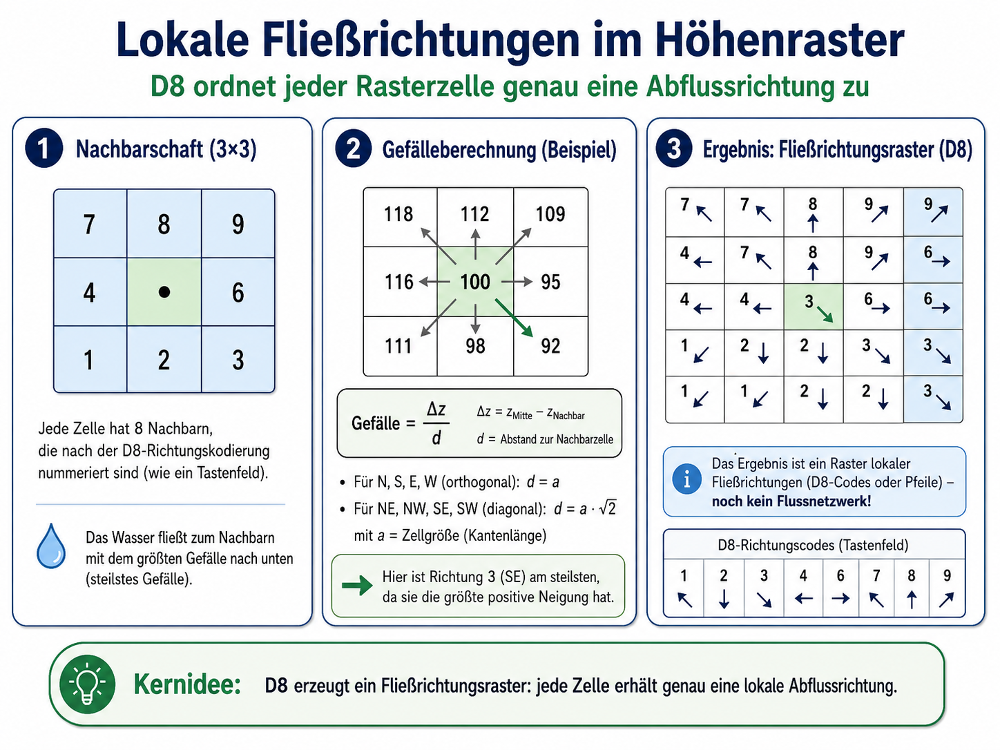
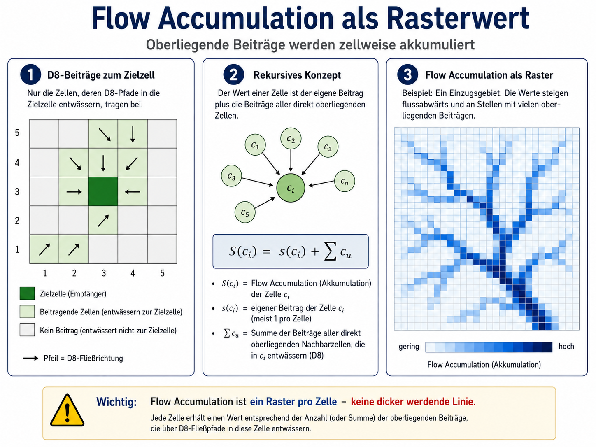
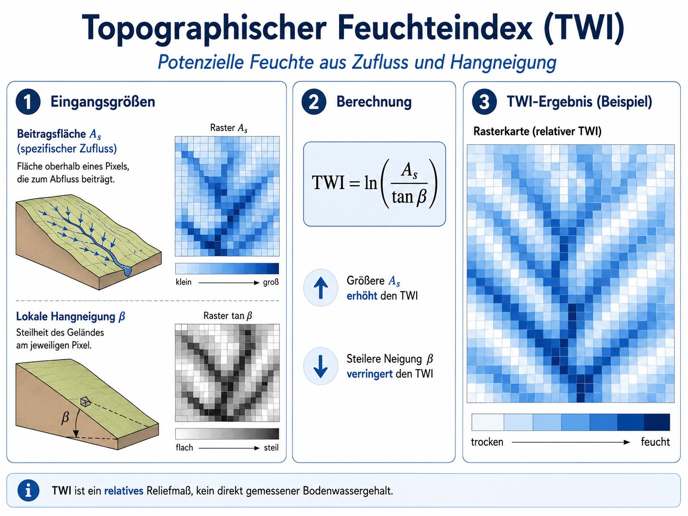
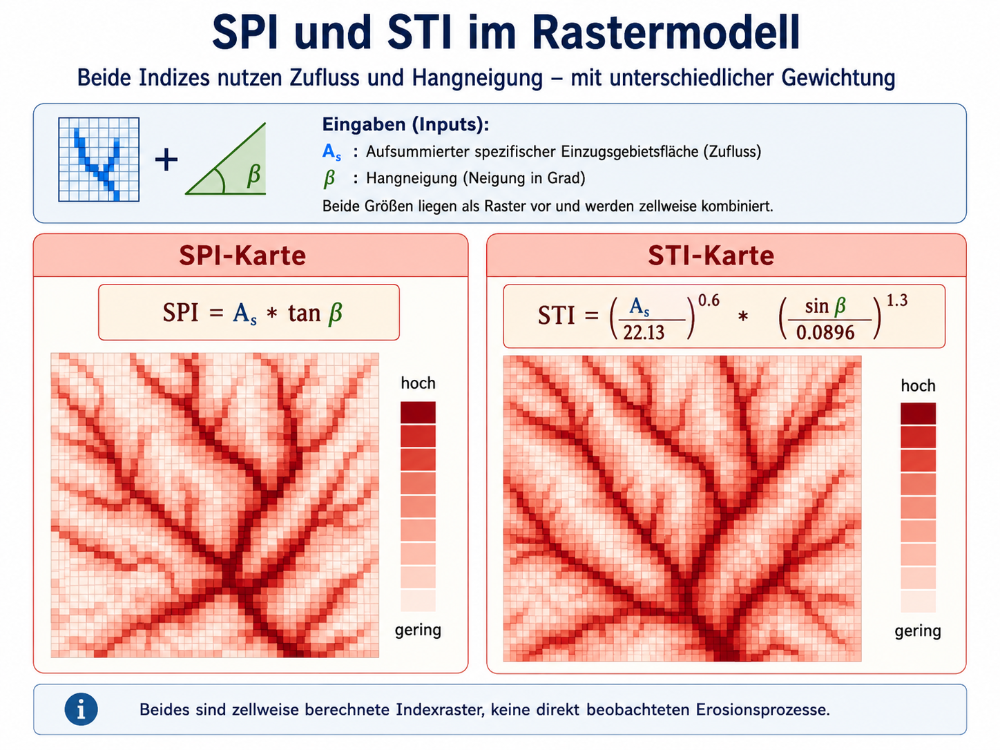
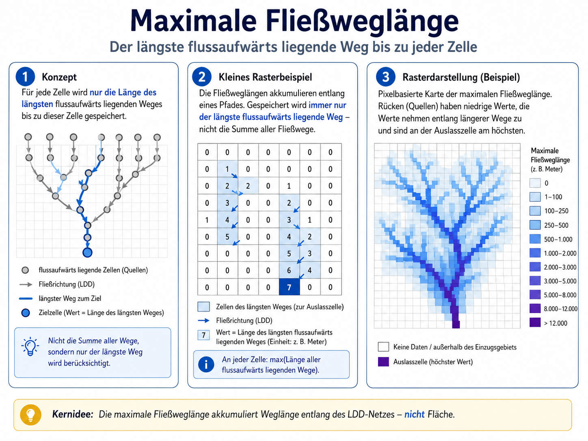

Viele hydrologische Kenngrößen lassen sich aus einem digitalen Geländemodell ableiten. Grundlage ist dabei zunächst kein bereits vorhandenes Gewässernetz, sondern ein Höhenraster. Aus den Höhenwerten werden zellweise lokale Gefälle, Fließrichtungen, oberliegende Beiträge und daraus weitere hydrologische Reliefindizes berechnet.

Der zentrale Gedanke lautet:

> Wenn für jede Rasterzelle bekannt ist, in welche Nachbarzelle Wasser aufgrund des Gefälles abfließen würde, lassen sich daraus Abflusswege, beitragende Flächen und hydrologische Indexraster ableiten.

Diese Ableitungen sind prozessbasiert, weil sie eine einfache Modellannahme über Oberflächenabfluss verwenden: Wasser folgt dem lokalen Gefälle. Sie sind aber keine vollständige hydrologische Simulation. Niederschlag, Infiltration, Boden, Vegetation, Verdunstung oder technische Entwässerung werden nur berücksichtigt, wenn sie ausdrücklich als zusätzliche Daten oder Gewichtungen eingebaut werden.

## Lokale Fließrichtungen im Höhenraster

Die lokalen Fließrichtungen in einem Raster können mit dem Ziffernblock einer Tastatur codiert werden. Ein Rasterpixel, von dem Wasser nach Südwesten abfließt, erhält den Wert `1`; ein Pixel mit Abflussrichtung nach Westen erhält den Wert `4`; ein Pixel mit Abflussrichtung nach Osten erhält den Wert `6`.

Entscheidend ist: Diese Codierung beschreibt eine **Richtung pro Rasterzelle**. Sie beschreibt noch kein reales Gewässernetz.



Eine Karte, die für jede Rasterzelle eine lokale Fließrichtung enthält, wird als lokales Fließrichtungsnetz bezeichnet. Häufig wird dafür der englische Begriff **local drain direction net** oder **LDD-Netz** verwendet @burrough1998. Es gibt verschiedene Algorithmen zur Berechnung solcher Netze. Sie unterscheiden sich darin, welche Annahmen über den Abfluss im Gelände getroffen werden.

## D8-Algorithmus

Der einfachste und bekannteste Ansatz ist der D8-Algorithmus. Er betrachtet für jede Rasterzelle die acht direkt benachbarten Zellen. Wasser wird genau derjenigen Nachbarzelle zugeordnet, zu der das stärkste Gefälle besteht.

Für jede Nachbarzelle wird das lokale Gefälle aus Höhenunterschied und horizontaler Entfernung berechnet:

$$
\tan(\beta) = \frac{\Delta z}{d}
$$

bzw.

$$
\beta = \arctan\left(\frac{\Delta z}{d}\right)
$$

Dabei ist $\Delta z$ der Höhenunterschied zwischen Ausgangszelle und Nachbarzelle. $d$ ist die horizontale Entfernung zwischen den Zellmittelpunkten.

In einem Raster mit Zellgröße $a$ gibt es zwei Fälle:

- Bei den direkten Nachbarn im Norden, Osten, Süden und Westen beträgt die Entfernung $d = a$.
- Bei den diagonalen Nachbarn beträgt die Entfernung $d = a\sqrt{2}$.

Der D8-Algorithmus erzeugt dadurch ein Fließrichtungsraster. Jede Zelle erhält genau eine lokale Abflussrichtung. Liegt keine tiefer liegende Nachbarzelle vor, entsteht eine Senke, ein Flachbereich oder ein Sonderfall, der je nach Software gesondert behandelt werden muss.

## Vom Fließrichtungsraster zur Akkumulation

Ein Fließrichtungsraster beschreibt zunächst nur direkte Ober- und Unterlieger. Für jede Zelle ist bekannt, wohin sie entwässert und welche Nachbarzellen in sie hinein entwässern.

Auf dieser Grundlage kann berechnet werden, welche Zellen oberhalb einer bestimmten Zielzelle liegen und über das Fließrichtungsraster in diese Zielzelle beitragen. Daraus entsteht die **Flow Accumulation**.

Flow Accumulation ist ein Rasterwert pro Zelle. Der Wert einer Zelle beschreibt, wie viele oberliegende Beiträge in diese Zelle entwässern. Je weiter flussabwärts Zellen liegen und je mehr Abflusswege dort zusammenkommen, desto höher werden die Akkumulationswerte.



Die rekursive Grundidee lautet:

$$
S(c_i) = s(c_i) + \sum_u S(c_u)
$$

Dabei ist $S(c_i)$ der akkumulierte Wert der Zelle $c_i$. $s(c_i)$ ist der Eigenbeitrag dieser Zelle, häufig einfach `1`. $S(c_u)$ sind die Beiträge der direkt oberliegenden Zellen, die in $c_i$ entwässern.

Die Beiträge können auch gewichtet werden. Statt jede Zelle gleich zu zählen, kann zum Beispiel Niederschlag, Versickerung, Abflussbeiwert oder Landbedeckung berücksichtigt werden. Das Ergebnis bleibt aber ein Raster: Jede Zelle erhält einen berechneten Akkumulationswert.

## Gerinne und Kämme

Aus einem Flow-Accumulation-Raster können potenzielle Gerinne abgeleitet werden. Dazu wird ein Schwellenwert gesetzt. Zellen, deren Akkumulationswert diesen Schwellenwert überschreitet, werden als potenzielles Gerinne klassifiziert.

Das ist eine Umklassifikation eines Rasterwertes, keine direkte Beobachtung eines realen Baches. Hohe Akkumulationswerte bilden häufig lineare Muster, weil sich viele Abflusswege entlang von Tiefenlinien konzentrieren. Diese Linien können einem Gewässernetz ähneln, sie bleiben aber eine Ableitung aus Höhenmodell, D8-Regel und Schwellenwert.

Kämme oder Quellbereiche können entsprechend über sehr niedrige oder fehlende oberliegende Beiträge identifiziert werden. Auch hier handelt es sich um eine rasterbasierte Ableitung, nicht um eine vollständige geomorphologische Kartierung.

Eine einfache Pseudoabfrage für potenzielle Gerinne könnte lauten:

```text
if(flow_accumulation >= threshold) then channel = true
else channel = false
```

Für Ausgangsbereiche oder Kämme könnte die Logik lauten:

```text
if(flow_accumulation == 0) then source_or_divide = true
else source_or_divide = false
```

Der Schwellenwert ist fachlich zu begründen. Er hängt von Rasterauflösung, DGM-Qualität, Relief, Maßstab und Fragestellung ab.

## Topographischer Feuchteindex

Der topographische Feuchteindex nutzt die beitragende Fläche und die lokale Hangneigung, um potenziell feuchtere und trockenere Reliefpositionen abzuschätzen. Er wird häufig auch als Wetness Index oder CTI bezeichnet.



Der Index wird zellweise berechnet:

$$
TWI = \ln\left(\frac{A_s}{\tan \beta}\right)
$$

Dabei ist $A_s$ die spezifische beitragende Fläche oberhalb einer Rasterzelle. $\beta$ ist die lokale Hangneigung.

Die Interpretation ist:

* Der TWI wird größer, wenn viel Fläche oberhalb in eine Zelle beiträgt.
* Der TWI wird größer, wenn die lokale Hangneigung gering ist.
* Der TWI wird kleiner auf Rücken, Kuppen und steilen Hängen.

Der TWI ist kein direkt gemessener Bodenwassergehalt. Er ist ein relatives Reliefmaß. Er zeigt, wo aufgrund von Zufluss und geringer Neigung potenziell feuchtere Standorte entstehen können.

## Stream Power Index und Sedimenttransportindex

Der Stream Power Index und der Sedimenttransportindex nutzen ähnliche Eingangsgrößen wie der TWI, verfolgen aber eine andere Fragestellung. Sie beschreiben nicht potenzielle Feuchte, sondern potenzielle Abtrags- und Transportwirksamkeit des Oberflächenabflusses.

Beide Indizes werden zellweise berechnet. Das Ergebnis ist jeweils ein Raster. Hohe Werte erscheinen als intensiver gefärbte Rasterzellen, häufig entlang konzentrierter Abflussbahnen.



Der Stream Power Index verbindet beitragende Fläche und Hangneigung:

$$
SPI = A_s \cdot \tan \beta
$$

Hohe SPI-Werte entstehen dort, wo viel Abfluss zusammenkommt und zugleich genügend Gefälle vorhanden ist. Deshalb ähnelt die Karte häufig einem Flow-Accumulation-Raster, wird aber zusätzlich durch die Hangneigung geprägt.

Der Sedimenttransportindex gewichtet Zufluss und Hangneigung anders:

$$
STI =
\left(\frac{A_s}{22.13}\right)^{0.6}
\cdot
\left(\frac{\sin \beta}{0.0896}\right)^{1.3}
$$

Auch der STI ist ein Indexraster. Er zeigt potenzielles Transportvermögen, keine direkt beobachtete Sedimentmenge. Wenn SPI- und STI-Karten ähnlich aussehen, liegt das daran, dass beide stark von beitragender Fläche und konzentriertem Abfluss geprägt werden. Unterschiedliche Gewichtungen können aber lokale Unterschiede betonen.

## Maximale Fließweglänge

Die maximale Fließweglänge beschreibt den längsten flussaufwärts gelegenen Weg bis zu einer Rasterzelle. Anders als bei der Flow Accumulation werden nicht alle oberliegenden Beiträge aufsummiert. Gespeichert wird nur der längste Weg entlang des Fließrichtungsnetzes.



Rücken und Quellbereiche besitzen niedrige Werte, weil dort kaum oberliegende Fließwege vorhanden sind. Entlang längerer Abflussbahnen steigen die Werte flussabwärts an. Auch hier gilt: Das Ergebnis ist ein Rasterwert pro Zelle. Die linienhafte Struktur entsteht dadurch, dass hohe Werte entlang zusammenhängender Abflusswege konzentriert sind.

## Übung

::: {.callout-tip icon="false" appearance="simple"}
Die beschriebenen Indizes beruhen auf lokalen Fließrichtungen und daraus abgeleiteten oberliegenden Beiträgen.

Bearbeiten Sie die folgenden Fragen:

1. Warum ist ein D8-Fließrichtungsraster noch kein Gewässernetz?
2. Worin besteht der Unterschied zwischen Flow Accumulation als Rasterwert und einer daraus abgeleiteten Gerinnelinie?
3. Warum darf ein hoher TWI-Wert nicht als gemessener Bodenwassergehalt interpretiert werden?
4. Warum können SPI, STI und Flow Accumulation ähnliche räumliche Muster zeigen?
5. Welche Rolle spielt ein Schwellenwert bei der Ableitung potenzieller Gerinne?

Zusatzfrage:

Wie könnte man mit einem vorhandenen Fließrichtungsraster und einem daraus abgeleiteten Gerinneraster die Entfernung von einer beliebigen Zelle bis zur nächsten Gerinnezelle abschätzen, ohne den D8-Algorithmus selbst zu verändern?
:::

